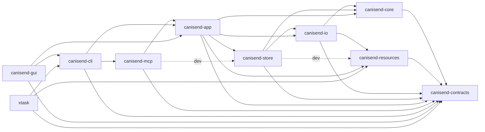
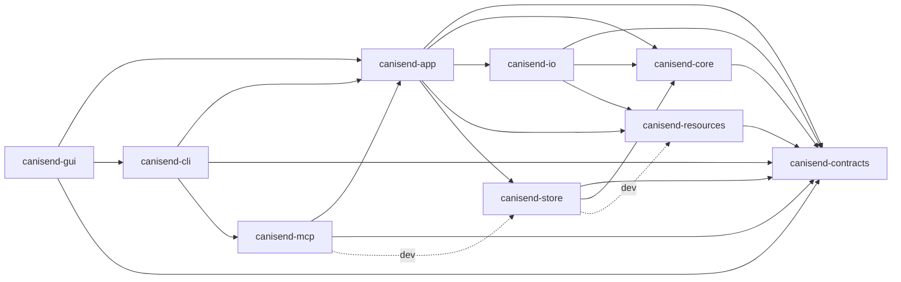

# ADR-RN-0019: Consolidate the current product and dependency graph

**Status:** Accepted

**Date:** 2026-08-03

**Decision owner:** CanISend maintainer

## Context

ADR-RN-0002 described the initial six-crate workspace. ADR-RN-0013 later added an egui desktop,
ADR-RN-0015 replaced it with Tauri/Svelte, ADR-RN-0016 unified the packaged macOS GUI and CLI
host, and ADR-RN-0018 changed the product from an academic-only workflow to a generic
evidence-application framework. All of those changes are implemented in source, but no accepted
ADR consolidated their resulting graph.

Cargo compilation alone is insufficient architecture enforcement. It accepts a new normal, dev,
build, target-specific, optional, or feature-enabled workspace edge even when that edge bypasses
the application facade or reverses an intended dependency direction. The current
`canisend-store -> canisend-io` rendering/projection edge also contradicts the original inward
graph and must be explicit and time-bounded rather than silently normalized.

## Decision

CanISend has nine product crates and one repository-automation crate:

| Crate | Owned boundary |
|---|---|
| `canisend-contracts` | Versioned public/domain types, schemas, operation identity, validation primitives |
| `canisend-core` | Pack compiler, stage graph, capability and domain rules without concrete storage or adapters |
| `canisend-resources` | Build-time embedded, digest-verified Packs, schemas, templates, fonts, examples, and Agent assets |
| `canisend-io` | Bounded local/network parsing, discovery adapters, PDF extraction, and in-process rendering |
| `canisend-store` | SQLite, immutable Blobs, revisions, transactions, audit, projections, migration, recovery |
| `canisend-app` | The only shared product use-case facade and adapter-neutral error/receipt boundary |
| `canisend-mcp` | Guarded MCP transport over `canisend-app`; no independent workflow engine |
| `canisend-cli` | Clap/process/output adapter plus the MCP stdio host entrypoint |
| `canisend-gui` | Tauri 2 command boundary and packaged unified host for the Svelte 5 desktop |
| `xtask` | Non-product repository, source-gate, and release automation |

The checked-in
[`workspace-dependency-policy-v1.json`](../workspace-dependency-policy-v1.json) is the
machine-readable authority for every internal workspace edge and its exact Cargo classification.
The source gate derives locked Cargo metadata and rejects additions, removals, kind changes,
target changes, optional/default-feature changes, feature-set changes, and dependency renames.

## Actual graph

The actual source graph includes normal edges as solid arrows and dev-only fixture edges as dotted
arrows. External crates and the Svelte build graph are not internal Cargo edges and are governed by
their lockfiles and dependency policies.

`canisend-gui -> canisend-cli` is intentional: ADR-RN-0016's unified host dispatches explicit CLI
and MCP invocations in-process and opens Tauri only for GUI launch modes. It does not shell out for
product behavior. `canisend-cli -> canisend-mcp` owns the stdio server entrypoint. Tauri commands
and MCP tools continue to call `canisend-app` for shared business operations.

## Target graph

The pre-Beta target removes concrete rendering/projection ownership from Store. The CLI's former
facade-bypassing direct Store/IO/Resources edges were removed by M1-ARCH-003; dev-only Store and MCP
fixture edges may remain because they do not become production adapter dependencies.

M1-ARCH-003 moved structured candidate parsing and private candidate-file projection behind
`canisend-app`, re-exported Agent skill presentation states through that facade, and rebuilt the CLI
performance fixture through application operations. The CLI now depends only on `canisend-app`,
`canisend-contracts`, and the ADR-approved `canisend-mcp` host boundary. The remaining actual/target
delta is the single Store→IO exception below.

## Temporary Store→IO exception

The current `canisend-store -> canisend-io` normal edge exists because Store-owned package,
projection, backup-rebuild, and migration paths invoke the deterministic renderer while holding
revision and transaction context. Removing it without first establishing an application-owned
prepare → render/project → revision-bound commit port could increase partial-write and stale-commit
risk.

- Owner: CanISend maintainer.
- Tracking: M1-ARCH-001 and M1-ARCH-002.
- Review by: 2026-08-10.
- Hard expiry: 2026-08-17.
- Removal condition: move rendering/projection orchestration behind an app-owned neutral port with
  stale, failure-atomicity, Blob-ledger, cleanup, and repair-convergence tests; otherwise accept a
  new explicitly reviewed exception before this one expires.

The source gate fails after the review date or expiry. Policy forbids renewing only the date; a
renewal requires an explicit architecture review and accepted ADR/policy update whose owner,
rationale, tracking item, removal condition, actual edge, and target absence remain consistent.

## Tauri, Svelte, and platform boundaries

- Tauri 2 owns the native window, capabilities, dialogs, and IPC command boundary.
- Svelte 5, TypeScript, Vite, and pnpm are build-time presentation dependencies. End-user packages
  embed static assets and require no Node.js runtime.
- The Svelte frontend never reads SQLite, `.canisend`, immutable Blobs, or private source files.
- The unified host chooses GUI, CLI, or MCP mode from explicit launch context; it does not create a
  second engine or parse shell commands.
- Five CLI targets remain the portable release unit. Desktop packaging is platform-qualified under
  the release matrix; Linux musl remains CLI-only unless a separately accepted window-system
  boundary is added.
- Target-specific and optional Cargo edges are first-class policy fields even when the current
  internal graph has none. Feature activation cannot silently introduce an internal edge.

## Supersession

- ADR-RN-0002 is superseded because its six-crate list is no longer the actual workspace.
- ADR-RN-0013 is superseded by ADR-RN-0015 because egui/eframe is no longer a supported or present
  desktop implementation.
- ADR-RN-0015, ADR-RN-0016, and ADR-RN-0018 remain accepted; this ADR consolidates their current
  dependency consequences without weakening their UI, unified-host, or generic-framework rules.

## Consequences

- A Cargo manifest change cannot silently alter the internal architecture.
- Dev, build, target, optional, feature, default-feature, and renamed dependency distinctions are
  reviewable rather than flattened into a crate-pair diagram.
- Current graph debt remains visible with exact owners and closure work rather than being rewritten
  as the target architecture.
- Updating a legitimate edge requires an intentional policy and ADR review in the same change.
