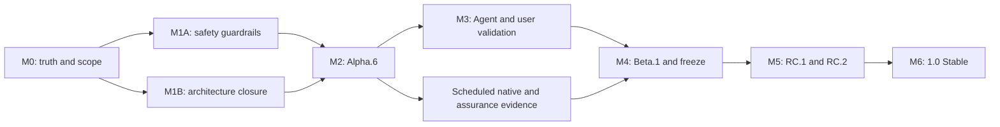

# CanISend 1.0 delivery roadmap

**Status:** Active — authoritative; M0 truth-and-scope reset is the current milestone

**Decision date:** 2026-07-25

**Rebased after repository audit:** 2026-08-02

**Planning authority:** This document is the sole top-level execution authority for the CanISend
1.0 line. The [plan registry](README.md) classifies every other roadmap and execution plan.

**Decision authority:** [ADR-RN-0014](../../architecture/rust-native/decisions/0014-start-the-unified-product-at-1.0-alpha.md)
starts the unified 1.0 line. Accepted ADRs remain authoritative for product and architecture
decisions.

**Machine authority:** `Cargo.toml`, `release/*.json`, `docs/contracts/*.json`, Git tags, and
the exact public release artifacts determine version, qualification, support, and contract facts.
This roadmap sequences work; it does not authorize a tag, release, stage transition, or support
claim.

**Audited source snapshot:** `cb2db0f772ff1931c84427becd4674c59acf9028`, reporting
`1.0.0-alpha.5`. This snapshot is 13 commits after the published Alpha.5 tag and has not been
qualified as that public release.

**Current public checkpoint:** [`v1.0.0-alpha.5`](https://github.com/jxpeng98/CanISend/releases/tag/v1.0.0-alpha.5)
at `aeb5b75b83b504d7cc6ef93f4b714420661ca0b5`, published 2026-08-01.

**Current machine stage:** Alpha / `pre-beta`; Beta pending, feature freeze planned, no RC
recorded, Stable not authorized.

**Feedback publication status:** Pending — separate from the plan classification above and
controlled by the body-free feedback snapshot and stage-transition tooling.

**Next intended checkpoint:** `v1.0.0-alpha.6`, containing the post-Alpha.5 source only after the
scope, safety, source, native, and exact-byte gates in this roadmap pass.

## 1. How to use this roadmap

This file answers four questions:

1. What CanISend 1.0 promises and explicitly does not promise.
2. Which work is on the critical path and in what order it may be executed.
3. What evidence is required before a milestone can be marked complete.
4. Which machine-readable record authorizes a release-stage claim.

The words **must**, **must not**, **should**, and **may** are normative. A checked task means its
deliverable and verification evidence are committed or linked; intent, a local experiment, or an
uninspected workflow run is not completion evidence.

Roadmap changes follow these rules:

- update a task and its evidence in the same commit where practical;
- never rewrite historical release identifiers or evidence to make current state appear aligned;
- use a dated note under `docs/notes/rust-native/` for a material phase decision or completed
  qualification slice;
- keep only this file marked `Active — authoritative`;
- classify bounded unfinished work as `In progress — supporting` and link it back here;
- create a new ADR when product scope, trust, architecture, or platform support changes; and
- require explicit maintainer authorization for Beta, RC, and Stable transitions.

## 2. Product target

CanISend 1.0 is a local-first, evidence-constrained, recoverable, and auditable academic
application workbench. A user can start from a supplied job URL, text, text-based PDF, or local
file; confirm their own evidence; review criteria, fit, and strategy; collaborate with Codex or
Claude through explicit consent and versioned contracts; prepare and review four application
documents; render PDFs; export an application package; and back up and restore the workspace.

CanISend never signs in to a recruitment portal, uploads an application, or submits it.

### 2.1 Primary user

The supported 1.0 persona is an academic job applicant preparing applications on their own
computer. General professional-job compatibility may remain best-effort, but it is not a 1.0
support promise unless a later ADR expands the scope.

### 2.2 Supported 1.0 surface

| Surface | 1.0 commitment | Evidence boundary |
|---|---|---|
| macOS Apple Silicon GUI | Publicly supported | Exact ZIP/DMG, launch, lifecycle, accessibility, and retention evidence |
| Five standalone CLI targets | Publicly supported | `release/targets.json`, signed/integrity-bound archives, install and uninstall evidence |
| Codex and Claude | Supported external hosts | Real-provider new/resume/approval/failure-recovery dogfood |
| URL, Markdown, text, JSON, CSV, and text-PDF intake | Supported within existing bounded policies | Malformed-input, destination-policy, size, consent, and no-mutation regressions |
| Evidence, criteria, match, plan, documents, review, render, export | Supported end-to-end | Typed application operations plus semantic adapter parity |
| Backup, restore, check, and projection repair | Supported | Fresh-path restore and failure-cleanup evidence |
| English and Simplified Chinese | Supported for the principal GUI journey | Keyboard, screen reader, scale, locale restart, and copy review |
| Windows/Linux GUI packages | Nonpublishing candidates | Scheduled qualification only; no 1.0 public support claim |

The five CLI targets remain:

- `aarch64-apple-darwin`;
- `x86_64-apple-darwin`;
- `x86_64-pc-windows-msvc`;
- `x86_64-unknown-linux-gnu`; and
- `x86_64-unknown-linux-musl`.

### 2.3 Explicit non-goals for 1.0

- automatic portal login, upload, or submission;
- cloud sync, hosted storage, telemetry, or collaborative editing;
- OCR for scanned PDFs;
- public Windows or Linux GUI support;
- Linux ARM packages;
- arbitrary external Typst packages or user fonts;
- ownership of Agent conversations, provider credentials, plugins, or search sessions; and
- becoming a general-purpose AI client or a generic recruitment platform.

### 2.4 Product and engineering invariants

- SQLite plus immutable content-addressed blobs remain authoritative; Markdown, Typst, PDF, and
  Agent packs are projections or exports.
- A factual application claim must trace to user-confirmed evidence.
- An unsupported claim must be blocked before readiness or export.
- Source changes invalidate only dependent downstream state.
- Agents do not write `.canisend` directly and cannot bypass preview, approval, revision, or
  consent boundaries.
- Routine diagnostics, release evidence, update checks, and handoffs remain body-free.
- Workspace deletion, registry removal, CLI uninstall, and App uninstall do not delete an external
  workspace.
- Restore writes to a new path unless the documented recovery policy explicitly allows otherwise.
- CLI, GUI, and MCP use the same application rules for shared operations.
- A release is promoted from already qualified candidate bytes without rebuilding.

## 3. Current position

### 3.1 Delivered foundation

| Checkpoint | Durable result |
|---|---|
| Alpha.1 | Activated the unified 1.0 Rust-native line and published the first GUI/CLI prerelease |
| Alpha.2 | Added workspace recovery and workflow-control coverage |
| Alpha.3 | Completed the original 35-operation GUI workflow and qualified five-target artifacts |
| Alpha.4 | Replaced egui with Tauri + Svelte and published the first Tauri macOS packages |
| Alpha.5 | Published an exact prerelease with the connected-Agent and skills work available at its tag |
| Post-Alpha.5 `main` | Reached 37/37 structural parity and added later PDF-preview, template, unified-host, and desktop-candidate work that still requires a new exact checkpoint |

The application facade already exists in `canisend-app`; the remaining work is boundary
hardening, semantic parity, release truth, and external validation, not creation of another
facade.

### 3.2 Open gaps that govern the critical path

| Gap | Priority | Why it blocks progress |
|---|---|---|
| README, release records, plan headers, and current checkpoint disagree | P0 | A passing source gate can still publish misleading state |
| Post-Alpha.5 source still reports Alpha.5 | P0 | Published Alpha.5 evidence does not qualify changed bytes |
| Real Codex and Claude dogfood is incomplete | P0 before Beta | Synthetic host tests do not prove real-host consent and recovery behavior |
| Target-user evidence is absent | P0 before Beta | Zero public issues is not evidence that users can complete the workflow |
| Preview stores have capacity bounds but no real TTL/replay model | P0 | Approval language promises an expiry invariant that is not implemented |
| Structural 37/37 parity lacks leaf-level semantic equivalence | P0 | Adapter drift can pass current manifests |
| The accepted crate graph and actual nine-crate graph disagree | P0 planning / P1 implementation | Architecture review and future dependency changes lack a truthful boundary |
| `canisend-store -> canisend-io` is undocumented coupling | P1 before freeze | Rendering and storage failure boundaries cannot be tested independently |
| Rust 1.92 is declared while CI pins 1.97 | P0 | The published MSRV is not continuously proven |
| Fast CI is macOS-heavy and omits the browser accessibility suite | P1 | Cross-platform core and UI regressions can reach the release workflow |
| Main and release tags have no repository ruleset | P1 | Direct or destructive changes can bypass otherwise strong release controls |

## 4. Authority and conflict resolution

| Fact | Authority | Projection or consumer |
|---|---|---|
| Product and architecture decision | Accepted ADR | Roadmap, README, CONTRIBUTING |
| Workspace/source version | Root `Cargo.toml` plus exact internal dependency declarations | Tauri/npm metadata and release workflows |
| Release stage and qualification | `release/qualification-ledger.json` | Roadmap status, README, release notes |
| Beta readiness | `release/beta-readiness.json` | Alpha-to-Beta transition |
| Supported targets | `release/targets.json` and support policy | Installation and support documentation |
| Signing/trust tier | `release/signing-policy.json` | Release notes and installation warnings |
| Public operation coverage | Contract/parity registries | CLI, Tauri, MCP, guides |
| Public artifact truth | Git tag, release manifest, checksums, attestations, and downloaded bytes | GitHub Release and package managers |
| Work ordering | This roadmap | GitHub milestones and child plans |
| Historical evidence | Archived records, tag-scoped source, and dated notes | Audit and regression context only |

When two sources disagree:

1. stop the affected stage or support claim;
2. determine which authority owns the fact;
3. correct projections rather than editing historical evidence;
4. add a regression check when the contradiction can be detected mechanically; and
5. record a dated note when the resolution changes an architectural or release assumption.

M0 must add a derived `xtask release status --json` view. It may aggregate existing authorities,
but it must not become another manually edited truth source.

## 5. Execution governance

### 5.1 Priorities

| Priority | Meaning | Scheduling rule |
|---|---|---|
| P0 | Data, privacy, evidence, release-truth, or stage-integrity blocker | Stop the affected milestone and resolve first |
| P1 | Required for Beta freeze, RC, supported usability, or maintainable architecture | Complete by the named exit gate |
| P2 | Valuable hardening or post-1.0 improvement | Must not displace a P0/P1 critical-path task |

### 5.2 Task states

- **Planned:** scoped here but prerequisites or owner evidence are incomplete.
- **Ready:** dependencies and acceptance tests are known.
- **In progress:** an implementation branch or bounded execution is active.
- **Blocked:** a named external dependency or repeated reproducible failure prevents progress.
- **Verified:** implementation and required evidence are committed or linked.
- **Deferred:** removed from the 1.0 path with a named later milestone.

Only `Verified` work may satisfy an exit gate. A successful local command, a green run that has
not been inspected, or an unchecked public artifact is not sufficient on its own.

### 5.3 Definition of ready

A task is Ready only when it has:

- one owner role, even when one maintainer fills every role;
- an explicit affected component and defensive invariant;
- a bounded implementation or evidence scope;
- acceptance tests or inspection steps;
- dependencies and rollback boundary; and
- no unresolved product decision hidden inside the implementation.

The milestone tables below are the planned backlog, not a substitute for work-item metadata.
Until M0-GOV creates a linked work item, a task remains Planned. Every GitHub Issue or equivalent
work item must carry:

| Field | Required content |
|---|---|
| Roadmap ID | Exact ID from this document |
| Owner role | Product, architecture, release, validation, or support owner |
| State | Planned, Ready, In progress, Blocked, Verified, or Deferred |
| Dependencies | Other roadmap IDs and external prerequisites |
| Issue | Stable Issue URL or number |
| Acceptance | Positive and negative verification |
| Evidence | Commit, test, run, artifact, or dated-note link |
| Rollback | Revert, migration, artifact, or stage-recovery boundary |

### 5.4 Definition of done

A task is Verified only when:

- focused tests and formatting pass;
- the smallest applicable source/native gate passes;
- documentation and machine contracts change in the same commit where required;
- negative and failure-path tests cover the protected invariant;
- evidence contains no credentials or private application bodies;
- the task's roadmap or Issue status is updated; and
- an exact release claim is backed by exact tag/run/artifact references.

### 5.5 Work-in-progress and change control

- Keep one critical-path milestone active at a time.
- At most two implementation workstreams may run beside it: one architecture/safety stream and
  one qualification/evidence stream.
- M1A safety gates must pass before Alpha.6.
- M1B may run in parallel with M1A, but every M1B decision and 1.0-bound product change must be
  resolved before the Alpha.6 candidate freeze.
- M3 real-user evidence starts only from a published Alpha.6.
- Feature freeze activates only after Beta.1 is published, independently verified, and recorded as
  qualified.
- After freeze, allowed changes are documentation, release evidence, and confirmed release
  blockers. Any new feature is deferred to 1.1 or requires an explicit exception that resets the
  affected evidence.

## 6. Critical path



| Milestone | Expected duration | Required predecessor | Exit artifact |
|---|---:|---|---|
| M0 — Truth and scope | 3–5 working days | Current audited source | Consistent authority, scope, plan registry, and drift gates |
| M1A — Safety guardrails | 4–6 working days | M0 | Approval, parity, MSRV, and source-gate protections |
| M1B — Architecture closure | 3–5 working days, may run beside M1A | M0 | Current ADR/graph plus store-render boundary decision |
| M2 — Alpha.6 | 3–5 working days plus native runners | M1A, M1B | Published and publicly reverified exact Alpha.6 |
| M3 — Agent and user validation | 2–4 calendar weeks | M2 | Body-free Agent/user evidence and closed blockers |
| M4 — Beta.1 and freeze | 2–3 working days plus native runners | M3 | Qualified Beta and committed freeze baseline |
| M5 — RC.1/RC.2 | 1–2 calendar weeks | M4 | Two distinct clean RC matrices and all Stable evidence classes |
| M6 — Stable | 2–3 working days | M5 | Publicly reverified `v1.0.0` and published support policy |

The expected solo-maintainer path is approximately 5–8 weeks if no major native, signing, or
data-integrity blocker appears. Trusted Developer ID/notarized distribution adds credential and
qualification lead time. Public Windows/Linux GUI support is not part of that estimate.

## 7. Workstreams

| Workstream | Scope | Principal evidence |
|---|---|---|
| W1 Product and governance | Scope, non-goals, prioritization, repository rules, Issue/Milestone hygiene | ADRs, protected-branch configuration, roadmap |
| W2 State and documentation | Derived current status, active/historical classification, user-facing truth | `release check`, link checks, generated status output |
| W3 Architecture and safety | Crate graph, app boundary, approval broker, semantic parity, failure atomicity | ADR, metadata graph, focused/contract tests |
| W4 Release integrity | Version transitions, native matrices, signing, SBOM, provenance, exact-byte promotion | Ledger, manifests, checksums, attestations, public reverify |
| W5 Agent and user validation | Real providers, fresh-machine workflow, accessibility, recovery, comprehension | Consented body-free evidence note and issue dispositions |
| W6 Distribution and support | Installation, update, rollback, uninstall, package managers, support boundary | Native lifecycle records and published support policy |

## 8. M0 — Truth, scope, and planning reset

**Objective:** Make every active status and planning surface tell the same current truth before
more product changes are accepted.

**Entry:** Published Alpha.5 exists; changed post-Alpha.5 source remains unqualified.

| ID | Priority | Deliverable | Verification |
|---|---|---|---|
| M0-SCOPE-001 | P0 | Approve the academic-applicant 1.0 target, supported workflow, and non-goals in this roadmap and README | Product wording is consistent with ADR-RN-0014 and repository instructions |
| M0-LICENSE-001 | P0 | Adopt `GPL-3.0-only` for CanISend-authored source and future releases while preserving the license facts of historical tags | Root and package metadata, dependency policy, release-channel rendering, bundled notices, and the desktop legal notice agree; pre-Alpha.6 candidates remain reproducible as MIT |
| M0-PLAT-001 | P0 | Record Apple Silicon GUI + five CLI targets as the 1.0 public scope; Windows/Linux GUI remain nonpublishing | Support policy, target manifest, roadmap, guide, and release notes do not imply broader support |
| M0-STATE-001 | P0 | Implement `xtask release status --json` as a derived view over Cargo, ledgers, contracts, tags, and policy | Fixture tests reject source/public/stage/platform disagreement without adding a manual truth file |
| M0-STATE-002 | P0 | Extend `release check` to validate the active README status block, this roadmap header, root release guide, Issue template version, operation count, and signing wording | Seeded stale-current fixtures fail; historical version fixtures pass |
| M0-STATE-003 | P0 | Generalize feedback refresh and Stable transition code to use `feedback-snapshot.next_roadmap.path` instead of the historical post-0.7 path | Alpha, RC-reviewed, and Stable-published fixtures update whichever next-roadmap path the snapshot declares |
| M0-REL-001 | P0 | Extend dry-run-first `release prepare-stage` to support clean-worktree sequential Alpha iteration, beginning with Alpha.6 | One plan atomically covers Cargo, internal pins, locks, Tauri/npm, package contract, workflow default, and active docs |
| M0-REL-002 | P0 | Define Alpha-iteration readiness semantics: Alpha.6 makes the Alpha.4 readiness/freeze baseline pending, then public Alpha.6 identity and `freeze-candidate` rebuild the exact baseline | Alpha.4 cannot authorize Beta from Alpha.6 source; refresh can bind tag, source, run, and URL to the new public Alpha |
| M0-REL-003 | P0 | Require the current RC to be recorded before sequential RC iteration and automate or document the post-freeze transition-exception commit | RC.1 cannot be skipped before RC.2; stage-version changes pass the freeze audit without an unverifiable self-referential commit |
| M0-WF-001 | P0 | Align release, upgrade, and package-manager workflow defaults with the active 1.0 stage and validate them in `release check` | Workflow dispatch cannot silently suggest Alpha.5 or 0.7 Beta/RC pairs |
| M0-FEEDBACK-001 | P0 | Bind final feedback to the latest recorded RC, not merely any valid RC tag | Preparing RC.3 invalidates RC.2 feedback and notes review until refreshed |
| M0-DOC-001 | P0 | Reconcile README, CHANGELOG, RELEASE, qualification guidance, known limitations, desktop guide, and stale 35/37 statements | Links and source gate pass; Alpha.5 history is preserved |
| M0-PLAN-001 | P0 | Keep this file as the only active top-level roadmap; add the plan registry and normalize child-plan headers | A repository scan finds one `Active — authoritative` roadmap |
| M0-GOV-001 | P1 | Create GitHub milestones and Issue labels for M0, Alpha.6, Beta, RC, and Stable | Every open critical-path task maps to one milestone and roadmap ID |
| M0-GOV-002 | P1 | Protect `main` and release tags: require fast CI, block force-push/delete, and do not require an unavailable second reviewer | A test branch cannot bypass required checks; solo maintenance remains possible |

### M0 exit gate

- [ ] Product and platform scope is approved and consistent across active surfaces.
- [ ] The derived status command reports source version, public checkpoint, stage, support, and
  drift without owning those facts.
- [ ] The source gate fails on a deliberately stale active document and ignores preserved history.
- [ ] Feedback tooling follows the snapshot-declared current or post-1.0 roadmap path through
  Alpha, RC review, and Stable publication.
- [ ] Sequential Alpha version planning is deterministic, dry-run-first, and clean-worktree
  guarded.
- [ ] Alpha iteration invalidates stale readiness/freeze evidence and can rebind it to the new
  public checkpoint.
- [ ] Sequential RC iteration requires the current RC evidence to be committed first.
- [ ] Post-freeze stage transitions have a deterministic, audited exception-recording path.
- [ ] Active workflow defaults and final-RC feedback identity are source-gated.
- [ ] This roadmap is the only active top-level plan.
- [ ] GitHub milestones exist and protected refs cannot silently bypass required CI.

**Rollback:** Revert only the M0 implementation/projection changes. Never edit tagged evidence,
archived 0.7 records, or published release metadata to make a check pass.

## 9. M1 — Architecture and safety guardrails

M1 is split so bounded safety work and the time-boxed architecture decision can run in parallel.
Both parts must be resolved before the Alpha.6 candidate freeze so M3 validates the same product
bytes intended for Beta.

### 9.1 M1A — Required before Alpha.6

| ID | Priority | Deliverable | Verification |
|---|---|---|---|
| M1-ADR-001 | P0 | Accept an ADR describing the current nine product crates, MCP adapter, Tauri/Svelte surface, unified host, and intentional platform boundaries; mark egui ADR-RN-0013 superseded by ADR-RN-0015 | ADR records actual and target graphs plus the temporary Store→IO exception/expiry; no contradictory Accepted presentation ADR remains |
| M1-GRAPH-001 | P0 | Add an allowed workspace-dependency graph check covering normal, dev, build, target-specific, optional, and feature-enabled edges | A new or reclassified unapproved crate edge fails the source gate |
| M1-OP-001 | P0 | Introduce typed leaf-level `OperationId` and validated `OperationStatus` registries; explicitly classify composite, wildcard alias, CLI, GUI, MCP, and adapter-only operations | Adding an operation/status without registry coverage fails compilation or contract tests |
| M1-OP-002 | P0 | Derive or verify surface mappings from Clap leaves, Tauri handlers, and the MCP router | A missing, duplicate, falsely shared, or adapter-only mapping fails the source gate |
| M1-OP-003 | P0 | Add semantic parity fixtures over canonical application outcomes, not transport envelopes | Every shared mutating leaf and preview/commit pair covers success, stale/replay, and no-mutation; every revision-bound leaf covers stale; every read family has a fixture; uncovered leaves are machine-listed |
| M1-APPR-001 | P0 | Replace duplicated pending-mutation stores with a shared approval/preview broker | MCP and desktop use the same expiry, binding, retry, capacity, and replay policy |
| M1-TEST-001 | P0 | Add broker unit tests, MCP job/task preview→commit tests, and migration tests for every desktop preview-store family | Success, stale, replay, wrong kind/context, validation, DB-busy/transient IO, permanent IO, capacity race, disposition, and no-mutation paths pass before Alpha.6 |
| M1-MSRV-001 | P0 | Align the declared MSRV with continuously tested reality; default decision is pinned Rust 1.97 unless Rust 1.92 receives required locked CI | Cargo, toolchain, README, CI, and status checks agree |
| M1-CI-001 | P1 | Add lightweight Ubuntu/Windows core-store-IO-CLI-MCP PR jobs and a Chromium keyboard/accessibility/key-visual job | A platform or UI regression fails before the release workflow |
| M1-CI-002 | P0 | Make the release source gate reuse or rerun required Svelte formatting, TypeScript, unit, production-build, and critical browser checks | A manual release dispatch cannot bypass UI source qualification |
| M1-DEP-001 | P1 | Run advisory/license checks on dependency changes and add owner, reachability, review date, expiry, removal condition, and upstream issue to every exception | Expired or unexplained exceptions fail policy checks |

The approval broker must prove all of the following:

- TTL uses an injectable monotonic clock; wall time is used only for a client-visible
  `expires_at`; the initial immutable lifetime is 10 minutes;
- token material comes from the operating system CSPRNG; collision never replaces an existing
  payload;
- tokens are bound to operation kind, complete workspace/job context, and source revision;
- preview responses expose `expires_at` or the remaining TTL;
- expiry, wrong kind, wrong context, stale revision, and replay cause no mutation;
- exactly one concurrent commit may succeed;
- an approval-specific `ApprovalDisposition::{Consume, RestoreSameApproval}` decides recovery;
  generic `ApplicationFailure.retryable` does not;
- Consume is the default for stale, validation, wrong-kind, wrong-context, and permanent IO
  failures; only explicitly classified transient failures restore the same approval without
  extending expiry;
- expired entries are swept before capacity decisions; a full store rejects a new preview rather
  than evicting a still-valid approval;
- periodic or deterministic sweep releases expired private payloads even when no later `take`
  occurs;
- total retained entries never exceed the configured bound; and
- process restart invalidates every in-memory token.

### M1A exit gate

- [ ] Current architecture and dependency graph agree.
- [ ] All public operations and statuses have typed leaf-level ownership and verified adapter
  mappings.
- [ ] Semantic parity meets the minimum per-leaf coverage matrix and reports no unclassified leaf.
- [ ] Approval/preview unit, MCP job/task, desktop migration, expiry, collision, clock rollback,
  idle sweep, cross-workspace, single-commit, and capacity tests pass.
- [ ] MSRV claims are proven by CI.
- [ ] Fast PR gates cover macOS plus lightweight Linux, Windows, and browser accessibility paths.
- [ ] Release source qualification includes the required UI source gates.
- [ ] Advisory/license checks pass and every exception is current, reachable-scope reviewed, and
  time-bounded.
- [ ] `cargo run -p xtask --locked -- release check` and fast CI pass.

### 9.2 M1B — Required before the Alpha.6 candidate freeze

| ID | Priority | Deliverable | Verification |
|---|---|---|---|
| M1-ARCH-001 | P1 | Resolve the undocumented `canisend-store -> canisend-io` dependency through a neutral render/projection port, or accept a narrowly documented temporary exception after a time-boxed review | The selected path, expiry/removal condition, graph, and ADR agree; no implicit exception remains |
| M1-ARCH-002 | P1 | Implement the selected path: decoupling uses app-owned prepare → render/project → revision-bound commit and fake ports; an exception uses named compensating render/projection failure tests | DB heads, artifact rows, and audit events remain unchanged on failure/stale; any new unreferenced CAS blob is auditable and safely recoverable |
| M1-ARCH-003 | P1 | Complete facade hygiene and remove unused adapter-to-store dependencies | Production adapters use `canisend-app` for shared business operations except ADR-approved parsing/host boundaries |
| M1-ARCH-004 | P1 | Cover renderer and projector failure boundaries, CAS cleanup, symlink/path conflicts, partial writes, `RepairRequired`, and repair convergence | Cleanup never deletes a pre-existing or shared digest; projection recovery converges without changing authoritative content |

If the Store→IO refactor produces a higher data-integrity risk than the existing edge, stop the
refactor, record the bounded exception and removal condition in the ADR, and retain failure
atomicity tests. Do not preserve an untruthful architecture diagram merely to avoid the decision.

### M1B exit gate

- [ ] Store/render ownership is either decoupled and tested or explicitly accepted with an expiry
  and compensating tests.
- [ ] Renderer/projector failure and concurrent revision change produce zero partial authoritative
  DB/audit writes; CAS leftovers are absent or explicitly classified as recoverable unreferenced
  blobs.
- [ ] Adapter dependencies match the accepted graph.
- [ ] M1A remains green after the architecture change.

## 10. M2 — Publish and qualify Alpha.6

**Objective:** Turn the post-Alpha.5 source into an honest, exact public checkpoint before Beta
evidence is collected.

**Entry:** M0, M1A, and M1B are Verified. A later architecture change that alters product bytes
requires a new sequential Alpha and revalidation; it cannot silently land between Alpha.6 and
Beta.

| ID | Priority | Deliverable | Verification |
|---|---|---|---|
| M2-SCOPE-001 | P0 | Freeze Alpha.6 to the post-Alpha.5 unified-host, PDF preview/fallback, current templates, safety fixes, and required documentation | No unrelated feature enters after candidate freeze |
| M2-NATIVE-001 | P0 | Inspect desktop-platform qualification run `30742363439` for source `cb2db0f` to completion, or record an explicit superseding run before this task becomes Ready; triage failures by shared invariant versus unsupported-platform-only defect | Shared failures block; Windows/Linux GUI-only failures remain explicit nonpublishing issues |
| M2-VERSION-001 | P0 | Dry-run and apply the atomic sequential Alpha change to `1.0.0-alpha.6` | Every controlled source, package, lock, contract, and workflow value agrees |
| M2-CONTRACT-001 | P0 | Create the Alpha.6 package contract from the Alpha.6 source rather than describing changed `main` as published Alpha.5 | Checkout of the Alpha.5 tag still verifies its own historical package truth |
| M2-LICENSE-001 | P0 | Verify Alpha.6 as the first publicly conveyed `GPL-3.0-only` release | Exact bundles contain GPLv3 and third-party notices; Scoop/WinGet metadata and the matching source tag declare `GPL-3.0-only`; Alpha.5 and older candidate reproduction remains unchanged |
| M2-SOURCE-001 | P0 | Run formatting, focused tests, Clippy, Svelte type/unit/build, Playwright critical paths, semantic parity, and release source gate | Every required source job is green on the candidate commit |
| M2-CANDIDATE-001 | P0 | Build the future Alpha.6 tag once through the exact native matrix | Five CLI archives and macOS ZIP/DMG bind one commit, manifest, checksums, SBOM, signing evidence, and provenance |
| M2-LIFE-001 | P0 | Qualify fresh install, 1.0 Alpha upgrade, rollback, uninstall, workspace retention, PDF preview/export, accessibility, and Agent/CLI/MCP modes | Body-free records bind the exact candidate archives |
| M2-AGENT-001 | P0 | Run a maintainer Codex and Claude smoke on the exact Alpha.6 candidate before promotion | Each host proves new/resume, preview/approval, one committed mutation, rejection/recovery, and no direct workspace write |
| M2-PROMOTE-001 | P0 | Inspect candidate evidence, create the annotated tag, and promote the cached candidate without product recompilation | Published digests equal qualified candidate digests |
| M2-PUBLIC-001 | P0 | Download every public asset and independently reverify checksums, manifest, attestations, update response, and limitations | Public reverify record names the exact release and run |

### M2 exit gate

- [ ] `v1.0.0-alpha.6` points to one reviewed clean commit.
- [ ] All public artifacts are the exact qualified bytes.
- [ ] The five CLI targets and Apple Silicon GUI satisfy their claimed lifecycle.
- [ ] 37/37 structural parity and new semantic parity pass.
- [ ] Backup/restore and PDF preview/export use the expected exact artifact bytes.
- [ ] Codex and Claude candidate dogfood passes on the exact candidate bytes.
- [ ] Public documentation describes Alpha.6, community-signing limitations, and the supported
  platform boundary accurately.
- [ ] Alpha.5 tag-scoped facts remain unchanged.

## 11. M3 — Real Agent and target-user validation

**Objective:** Replace absence-of-issues and synthetic-only confidence with consented evidence that
the supported user and host workflows work in practice.

**Entry:** Public Alpha.6 has passed M2. Tests use disposable workspaces and non-sensitive or
explicitly consented materials.

### 11.1 Agent validation

| ID | Priority | Deliverable | Verification |
|---|---|---|---|
| M3-AGENT-001 | P0 | Complete a new and resumed Codex session against the exact Alpha.6 host pack | Skills discovery, MCP-first path, CLI fallback, approval, cancel, commit, reopen, and failure recovery are recorded |
| M3-AGENT-002 | P0 | Complete the equivalent new and resumed Claude session | Same body-free scenario matrix passes |
| M3-AGENT-003 | P0 | Exercise missing runtime, unavailable authentication, malformed output, invented Evidence ID, stale revision, wrong workspace, and host restart | No case bypasses validation or directly mutates `.canisend` |
| M3-AGENT-004 | P0 | Verify Agent protocol fallback and version mismatch behavior | Unsupported versions fail closed with a stable remediation |

### 11.2 User cohorts

| Cohort | Minimum | Purpose |
|---|---:|---|
| Alpha.6 invited cohort | 3–5 target users and 5–10 complete flows | Find installation, comprehension, navigation, evidence, and export blockers |
| Beta-entry cumulative cohort | 8–12 target users and at least 20 complete flows | Establish repeatability across disciplines, languages, inputs, hosts, upgrade, and recovery |

The cumulative evidence must cover:

- at least three academic disciplines or job types;
- English and Simplified Chinese;
- URL, pasted text, local file, and text-based PDF intake;
- Codex and Claude;
- a fresh supported Mac;
- upgrade from the supported Alpha;
- backup and restore to a new path;
- an intentional evidence gap and unsupported-claim rejection;
- keyboard-only navigation, VoiceOver, and 200% text scale; and
- user understanding that Ready or Exported does not mean Submitted.

### 11.3 Evidence and privacy

| ID | Priority | Deliverable | Verification |
|---|---|---|---|
| M3-EVID-001 | P0 | Create a dated, body-free validation note referencing consent, build, scenarios, aggregate outcome, blockers, and fixes | No CV, letter, job body, transcript, credential, or provider token is committed |
| M3-EVID-002 | P0 | Link every failure to a public or private maintainer issue using only the minimum safe metadata | P0/P1 dispositions are independently reviewable without private bodies |
| M3-EVID-003 | P1 | Re-run affected scenarios after fixes on the exact replacement build | Closed blockers contain regression evidence rather than prose-only resolution |
| M3-EVID-004 | P0 | Add a machine-validated, body-free provider-dogfood record bound to exact source/artifact, host, consent, scenario IDs, and outcomes | Beta preparation rejects missing, stale, failed, or private-body-bearing Codex/Claude records |
| M3-EVID-005 | P0 | Extend Beta readiness or a referenced validation-evidence schema with cohort size, completed-flow count, exact build, scenario IDs, metric numerators/denominators, excluded attempts, and evidence-note digest | Beta preparation rejects missing, stale, inconsistent, or unbound target-user evidence |

### M3 exit gate

- [ ] Codex and Claude each pass one new and one resumed real-provider workflow.
- [ ] At least 80% of cumulative users complete the supported end-to-end flow without the
  maintainer operating CanISend for them.
- [ ] Every audited factual claim is traceable to confirmed Evidence and unsupported claims equal
  zero.
- [ ] Backup/restore succeeds in every measured recovery scenario.
- [ ] No unresolved P0/P1 data-loss, privacy, evidence, rendering, recovery, or supported-install
  blocker remains.
- [ ] No blocking keyboard, VoiceOver, or 200%-scale issue remains.
- [ ] Every tested user understands the no-submission boundary.

## 12. M4 — Beta.1 and feature freeze

**Objective:** Establish a qualified Beta baseline and freeze the public 1.0 contracts.

**Entry:** M2 and M3 are Verified. The candidate has no unresolved P0/P1 blocker.

| ID | Priority | Deliverable | Verification |
|---|---|---|---|
| M4-READY-001 | P0 | Refresh Beta readiness against Alpha.6 and reviewed Agent/user evidence | Snapshot is no older than 24 hours, public metadata is body-free, and zero issues is not the only blocker evidence |
| M4-FREEZE-001 | P0 | Run `release freeze-candidate` to refresh the intended Beta contract baseline for Agent v2, schemas/resources, workspace v2, operation registry, exit codes, and bundle layout | Baseline digests match the qualified Alpha.6 surface |
| M4-STAGE-001 | P0 | Preview `release prepare-stage v1.0.0-beta.1`, review all controlled digests, then apply `--write` from a clean worktree | Transition is Alpha→Beta.1 only and source/ledger/release notes agree |
| M4-CANDIDATE-001 | P0 | Build, inspect, tag, promote, download, and publicly reverify the exact Beta.1 candidate | Beta assets satisfy the native signed/integrity matrix and no rebuild occurs during promotion |
| M4-LEDGER-001 | P0 | Preview and write `record-beta-qualification` from independently downloaded assets | Ledger records exact Beta tag, source, run, and manifest |
| M4-CHANNEL-001 | P1 | Generate and commit Beta package-channel candidates from independently verified public Beta assets | Candidate digests match public Beta; no external package index is modified |
| M4-FREEZE-002 | P0 | Activate feature freeze against the qualified Beta source commit | Ledger contains a non-null baseline and only approved change classes |

### M4 exit gate

- [ ] The ledger contains a qualified Beta tag/source/run.
- [ ] Feature-freeze baseline equals the qualified Beta source.
- [ ] Agent, schema, workspace, operation, bundle, and exit-code contracts are digest-bound.
- [ ] Beta packages and public docs match.
- [ ] New feature requests are assigned to 1.1 unless a documented release exception resets the
  affected evidence.

## 13. M5 — RC.1, RC.2, and complete Stable evidence

**Objective:** Prove the frozen product across clean tags, upgrades, documentation, package
channels, accessibility, and final release communication.

**Entry:** Qualified Beta.1 and active feature freeze.

| ID | Priority | Deliverable | Verification |
|---|---|---|---|
| M5-RC1-001 | P0 | Preview/apply the Beta→RC.1 transition and build one exact clean RC.1 matrix | Tag, source commit, run ID, and manifest are unique |
| M5-RC1-002 | P0 | Publicly verify RC.1 and record it with `record-rc-qualification` | Ledger contains the inspected RC.1 matrix |
| M5-UPGRADE-001 | P0 | Run Beta.1→RC.1 five-target upgrade, old-binary/same-schema, rollback, and restore-to-new-path qualification | `record-upgrade-qualification` accepts the exact evidence pair |
| M5-DOC-001 | P0 | Run five-target quick-start, host-Agent, install, uninstall, and workspace-retention qualification | `record-documentation-qualification` binds all records to the RC matrix |
| M5-PKG-001 | P0 | Qualify Homebrew arm64/Intel, Scoop, and WinGet Sandbox install/upgrade/uninstall | `record-package-qualification` accepts four records from the same run |
| M5-A11Y-001 | P0 | Complete exact-package keyboard, VoiceOver, scale, locale, and reduced-motion review | No blocking supported-platform accessibility defect remains |
| M5-RC2-001 | P0 | Prepare and qualify RC.2 from a different clean tag, source commit, and run | Ledger contains at least two distinct successful RC matrices |
| M5-NOTES-001 | P0 | Review final RC issues, assets, limitations, package channels, release notes, and rollback guide | `record-release-notes-qualification` binds the latest RC and named reviewer |
| M5-FEEDBACK-001 | P1 | Create a bounded post-1.0 roadmap in Draft, point the feedback snapshot to it, then refresh body-free final-RC feedback and mark that next roadmap Reviewed | Snapshot, measured next-roadmap block, latest recorded RC, and release stage agree |

If a blocker changes bytes after RC.2, prepare the next sequential RC. Re-run every affected
evidence class and the final release-notes review; an earlier review cannot authorize changed
bytes.

Every RC or Stable stage transition after feature freeze uses the audited two-commit protocol
until tooling can make it safer: first commit the deterministic stage transition, then record that
exact commit and changed paths as a `release-evidence` freeze exception in a second commit. Run
the source gate and bind the candidate tag to the second commit. Never prepare RC.N+1 before RC.N
is recorded in the ledger.

### M5 exit gate

- [ ] At least two distinct clean-tag RC matrices are recorded.
- [ ] Beta→RC upgrade and restore evidence passes on all five targets.
- [ ] Five-target documentation/uninstall evidence passes.
- [ ] Homebrew Cask, Scoop, and WinGet lifecycle evidence passes.
- [ ] Exact-package accessibility passes for every claimed surface.
- [ ] The latest RC release notes and rollback guide receive explicit maintainer review.
- [ ] No change outside the frozen classes is present.
- [ ] Every Stable prerequisite field in the qualification ledger is complete.

## 14. M6 — Publish CanISend 1.0 Stable

**Objective:** Publish `v1.0.0` from one exact, qualified Stable candidate and establish the
supported patch line.

**Entry:** M5 is Verified and the ledger proves every Stable prerequisite.

| ID | Priority | Deliverable | Verification |
|---|---|---|---|
| M6-STAGE-001 | P0 | Preview the RC→Stable transition and inspect the complete controlled-file plan | Dry run sets qualified status, Stable authorization, notes heading, support publication, current-roadmap completion, and next-roadmap publication |
| M6-STAGE-002 | P0 | Apply the Stable transition from a clean worktree and run the full source gate | Workspace reports `1.0.0`; ledger and support policy are canonical |
| M6-CANDIDATE-001 | P0 | Build and qualify the exact `v1.0.0` candidate once | All public targets, signing/integrity, lifecycle, SBOM, provenance, and artifact checks bind one commit |
| M6-PROMOTE-001 | P0 | Create the reviewed annotated tag and promote the exact candidate without recompilation | Published bytes equal candidate bytes |
| M6-PUBLIC-001 | P0 | Download and independently verify every public Stable asset and update-channel response | Public verification record contains tag, run, manifest digest, and attestation result |
| M6-PUBLIC-002 | P1 | Commit or permanently retain a body-free Stable publication record | Tag, source, candidate/promotion/public run IDs, manifest digest, and attestation review remain auditable after artifact expiry |
| M6-DOC-001 | P0 | Publish exact README, CHANGELOG, installation, Agent, backup, privacy, limitations, rollback, and support guidance | Clean-machine instructions match the public packages |
| M6-OPS-001 | P1 | Establish the 1.0.x patch, vulnerability, recovery, and support triage process | A dry-run patch scenario identifies owner, severity, rollback, and response path |

### M6 exit gate

- [ ] `v1.0.0` is public and all artifacts match the qualified candidate.
- [ ] Stable authorization and published support policy are committed.
- [ ] Installation, update, rollback, uninstall, Agent, privacy, and limitation guidance matches
  the released bytes.
- [ ] The update response and GitHub-release package-channel assets reference the verified Stable
  release; external package-index submission remains separately authorized.
- [ ] The 1.0.x support and emergency patch process is documented and dry-run reviewed.
- [ ] This roadmap is Completed and the snapshot-declared post-1.0 roadmap is Published by the
  stage tool.

## 15. Verification tiers and required commands

Use the smallest tier that proves the change, then rely on native/scheduled gates for the scope
they own.

### Tier 1 — Focused edit gate

```console
cargo fmt --all --check
cargo test -p AFFECTED_CRATE --locked
cargo clippy -p AFFECTED_CRATE --all-targets --locked -- -D warnings
git diff --check
```

For desktop changes, also run the affected pnpm type, unit, build, or Playwright command defined in
`apps/canisend-desktop/package.json`.

### Tier 2 — Source gate

```console
cargo run -p xtask --locked -- release check
```

The required Fast CI jobs must pass on the exact source commit. The release source gate must reuse
or repeat the required Svelte/TypeScript/unit checks so an unprotected dispatch cannot bypass the
UI source boundary.

### Tier 3 — Native candidate gate

Use the release and native-qualification workflows against the exact future tag and source commit.
Verify packaged launch, CLI/GUI/MCP modes, signing/integrity, install/update/rollback/uninstall,
workspace retention, PDF, accessibility, archive contents, sizes, and downloaded-byte equality.

### Tier 4 — Extended assurance

Scheduled fuzzing, dependency advisory/license checks, platform package candidates, signing
operations, provenance, package-manager lifecycle, clean-tag RC matrices, and public reverify own
their extended scope. Do not move broad fuzzing or full Windows/Linux GUI packaging into the fast
edit loop unless reproducing a focused defect.

### Evidence rules

- Record exact commit, tag, run URL/ID, target, toolchain, manifest digest, and artifact digest.
- Independently inspect external run IDs and attestations; an invented number in JSON is not
  evidence.
- Keep release evidence body-free and credential-free.
- Preserve failed evidence when it explains a blocker, but never present it as qualification.
- Mark local or nonpublishing candidates explicitly.
- A release gate consumes committed evidence, not an uncommitted local directory.

### Release operator sequence

Every `xtask` command that accepts `--write` is previewed first, its complete digest plan is
reviewed, and the write is run only from a clean worktree. Commit each bounded ledger or transition
write before running the next recorder.

After M0 adds sequential Alpha support, prepare Alpha.6 and dispatch its future-tag candidate:

```console
cargo run -p xtask --locked -- release prepare-stage v1.0.0-alpha.6
cargo run -p xtask --locked -- release prepare-stage v1.0.0-alpha.6 --write
cargo run -p xtask --locked -- release check

gh workflow run release.yml --repo jxpeng98/CanISend --ref main \
  -f tag=v1.0.0-alpha.6 \
  -f cache_epoch=alpha6-v1 \
  -f promote_existing_tag=false
```

Inspect and download the successful candidate before creating the annotated tag. Pushing that tag
must locate the same unexpired tag/commit candidate and promote it without recompilation.

Before Beta.1:

```console
./scripts/refresh_beta_readiness.sh jxpeng98/CanISend
./scripts/refresh_beta_readiness.sh jxpeng98/CanISend --write
./scripts/audit_community_signing_configuration.sh
./scripts/check_signing_readiness.sh beta
cargo run -p xtask --locked -- release freeze-candidate
cargo run -p xtask --locked -- release check
cargo run -p xtask --locked -- release prepare-stage v1.0.0-beta.1
cargo run -p xtask --locked -- release prepare-stage v1.0.0-beta.1 --write
```

After public Beta assets are independently downloaded:

```console
cargo run -p xtask --locked -- release record-beta-qualification \
  v1.0.0-beta.1 CANDIDATE_RUN_ID DOWNLOADED_BETA_ASSETS

cargo run -p xtask --locked -- release verify \
  v1.0.0-beta.1 DOWNLOADED_BETA_ASSETS
cargo run -p xtask --locked -- release channels \
  v1.0.0-beta.1 DOWNLOADED_BETA_ASSETS packaging/candidates/v1.0.0-beta.1

cargo run -p xtask --locked -- release activate-feature-freeze FULL_HEAD_COMMIT
```

Repeat the recorder and freeze commands with `--write` only after inspecting their plans. Commit
the Beta qualification, channel candidates, and necessary documentation before choosing the
feature-freeze baseline.

For RC.1:

```console
cargo run -p xtask --locked -- release prepare-stage v1.0.0-rc.1
cargo run -p xtask --locked -- release prepare-stage v1.0.0-rc.1 --write

cargo run -p xtask --locked -- release record-rc-qualification \
  v1.0.0-rc.1 CANDIDATE_RUN_ID DOWNLOADED_RC1_ASSETS
```

After RC.1 is public and recorded, the three evidence streams may execute in parallel, but their
ledger writes remain separately reviewed and committed:

```console
gh workflow run upgrade-qualification.yml --repo jxpeng98/CanISend --ref main \
  -f from_tag=v1.0.0-beta.1 \
  -f to_tag=v1.0.0-rc.1

cargo run -p xtask --locked -- release record-upgrade-qualification \
  v1.0.0-beta.1 v1.0.0-rc.1 DOWNLOADED_UPGRADE_EVIDENCE

cargo run -p xtask --locked -- release record-documentation-qualification \
  v1.0.0-rc.1 DOWNLOADED_RC1_ASSETS DOWNLOADED_DOCUMENTATION_EVIDENCE

gh workflow run package-manager-qualification.yml --repo jxpeng98/CanISend --ref main \
  -f from_tag=v1.0.0-beta.1 \
  -f to_tag=v1.0.0-rc.1

cargo run -p xtask --locked -- release verify-package-evidence \
  v1.0.0-beta.1 v1.0.0-rc.1 DOWNLOADED_PACKAGE_EVIDENCE
cargo run -p xtask --locked -- release record-package-qualification \
  v1.0.0-beta.1 v1.0.0-rc.1 DOWNLOADED_PACKAGE_EVIDENCE
```

The package evidence is not complete until the WinGet lifecycle record is returned from a fresh
Windows Sandbox with the same run identity. These commands generate or record GitHub-release
channel assets only; they do not authorize modification of external package indexes.

RC.2 can begin only after RC.1 is recorded:

```console
cargo run -p xtask --locked -- release prepare-stage v1.0.0-rc.2
cargo run -p xtask --locked -- release prepare-stage v1.0.0-rc.2 --write

cargo run -p xtask --locked -- release record-rc-qualification \
  v1.0.0-rc.2 CANDIDATE_RUN_ID DOWNLOADED_RC2_ASSETS

cargo run -p xtask --locked -- release record-release-notes-qualification \
  v1.0.0-rc.2 DOWNLOADED_RC2_ASSETS REVIEWER

./scripts/refresh_release_feedback.sh jxpeng98/CanISend v1.0.0-rc.2
./scripts/refresh_release_feedback.sh jxpeng98/CanISend v1.0.0-rc.2 --write
```

If RC.3 is needed, repeat the sequential transition and final-RC reviews against RC.3. The source
gate must reject stale RC.2 notes or feedback.

Finally:

```console
cargo run -p xtask --locked -- release prepare-stage v1.0.0
cargo run -p xtask --locked -- release prepare-stage v1.0.0 --write
cargo run -p xtask --locked -- release check
```

After each post-freeze RC or Stable stage-transition commit, add the exact transition commit and
paths to the freeze-exception record in a second reviewed commit before dispatching the candidate.
Stable then follows the same future-tag, build-once, annotated-tag promotion, public download, and
attestation-verification flow.

### Release recovery boundary

Use `finalize-verified-release.yml` only when the annotated-tag release run failed after candidate
promotion and every draft native smoke succeeded, and only the final publication step failed while
the verified draft and its attestations remain intact. That workflow may publish the already
verified draft bytes; it must not rebuild them. For any earlier, different, or ambiguous failure,
rerun the safe promotion path or create a new candidate. Never replace a failed public candidate
with locally rebuilt artifacts.

## 16. Release gates at a glance

| Gate | Must be true |
|---|---|
| Start Alpha.6 candidate | M0 + M1A complete; scope frozen; source and docs agree |
| Publish Alpha.6 | Exact source/native/lifecycle/accessibility/integrity gates pass; public bytes reverified |
| Start Beta transition | M2 + M3 complete; readiness refreshed within 24 hours; no P0/P1 blockers |
| Activate freeze | Beta.1 published, reverified, and recorded as qualified |
| Start RC.1 | Qualified Beta and active freeze |
| Prepare RC.2 | RC.1 recorded; source/tag/run distinct; only frozen change classes |
| Prepare Stable | Two clean RCs plus upgrade, docs/uninstall, package-manager, accessibility, feedback, and final-notes evidence |
| Publish Stable | Exact Stable candidate verified; explicit transition/authorization; public bytes reverified |

## 17. Global release blockers

No Alpha, Beta, RC, or Stable release may be published while an applicable condition is true:

- source, internal dependencies, Tauri/npm, package contract, manifest, or ledger versions
  disagree;
- the source is described as a previously published Alpha after product bytes changed;
- historical evidence fails its committed digest or was rewritten;
- an unregistered operation or unapproved crate edge reaches a public adapter;
- preview/approval expiry, binding, replay, or single-commit guarantees can be bypassed;
- malformed URL, HTML, PDF, JSON, CSV, text, archive, or path fixtures bypass their bounded policy;
- an Agent can mutate authoritative state without the required preview/approval/revision checks;
- an unsupported claim reaches package readiness or export;
- backup/restore, registry removal, CLI/App uninstall, or rollback can delete or overwrite an
  external workspace;
- a renderer or projection failure leaves a partial authoritative commit;
- private bodies enter routine diagnostics, handoffs, release evidence, update checks, or registry
  state;
- the exact package fails its claimed launch, workflow, reopen, accessibility, or retention path;
- signing/trust limitations or platform support are misleading;
- required public assets differ from qualified candidate bytes; or
- release notes omit a known blocker, limitation, recovery action, or no-submission boundary.

Windows/Linux GUI-only failures do not block a release that does not claim those surfaces, unless
the failure exposes a shared data, protocol, renderer, packaging, or integrity defect.

## 18. Product and validation scorecard

| Measure | Beta-entry target | RC/Stable target |
|---|---:|---:|
| Structural operation parity | 37/37 | 37/37 or updated complete registry |
| Semantic shared-operation fixtures | Required per-leaf minimum matrix passes | Frozen per-leaf matrix passes with no unclassified leaf |
| Real-provider host coverage | Codex and Claude new/resume pass | No regression on final candidate |
| Cumulative target users | 8–12 | At least 8–12 represented in the frozen evidence |
| Completed supported end-to-end flows | At least 20 | At least 20 represented in the frozen evidence |
| Unassisted supported-flow completion | At least 80% | At least 80%, no unresolved blocker pattern |
| Audited factual-claim traceability | 100% | 100% |
| Unsupported audited claims | 0 | 0 |
| Measured backup/restore success | 100% | 100% |
| Unresolved P0/P1 data/privacy/evidence/render/recovery issues | 0 | 0 |
| Blocking keyboard/VoiceOver/200%-scale issues | 0 | 0 |
| Public artifact digest mismatch | 0 | 0 |
| Users who understand Exported is not Submitted | 100% | 100% |

These thresholds are release evidence, not telemetry. Collect only consented aggregate results and
minimum safe issue metadata. The unassisted-completion denominator includes every consented,
supported-platform attempt that starts installation or an existing supported installation. Exclude
only participant withdrawal or a documented external-host outage; installation, product, data,
navigation, rendering, and recovery failures remain in the denominator.

## 19. First execution queue

Execute these in order unless a P0 defect interrupts the queue:

1. Freeze new 1.0 feature work.
2. Finish and inspect run `30742363439` at `cb2db0f`, or record its explicit superseding run;
   classify any failure.
3. Complete M0 scope/platform decisions and normalize plan authority.
4. Implement derived status and stale-active-document checks.
5. Generalize the feedback/Stable roadmap path and add sequential Alpha planning.
6. Create GitHub milestones, Issues, labels, and protected-ref rules.
7. Accept the current architecture ADR and add the dependency-graph gate.
8. Implement the shared approval broker, typed operation/status registry, semantic parity, MSRV
   policy, and the time-boxed Store→IO/render-projection resolution.
9. Prepare, qualify, publish, and publicly reverify Alpha.6.
10. Run Codex/Claude dogfood and the two user cohorts against the published Alpha.6.
11. Refresh Beta readiness and qualify Beta.1.
12. Freeze, qualify two RCs, complete every ledger evidence class, and publish Stable only after
    explicit authorization.

## 20. Child-plan registry

The [plan registry](README.md) is the navigational index. The following classification controls
how earlier documents may be used:

### Supporting workstreams

- [Stage 4G connected Agent workspace](2026-07-30-stage-4g-connected-agent-workspace-plan.md):
  source implemented; exact-candidate smoke and real-provider validation are inherited by M2/M3.
- [Stage 4H Agent efficiency](2026-07-30-stage-4h-agent-efficiency-plan.md): source implemented;
  external-host dogfood is inherited by M3.
- [Cross-platform desktop size optimization](../../performance/cross-platform-desktop-size-optimization-plan.md):
  native candidate measurements support M2 but do not expand 1.0 support.
- [Post-template size optimization](../../performance/post-template-upgrade-size-optimization-plan.md):
  bounded profile/native qualification may support M2; later experiments are P2.
- [Typst preview execution](../../architecture/typst-template-preview-execution-plan.md): source
  behavior is implemented; native evidence belongs to M2.

### Implemented or completed delivery references

- [Stage 4A–4B](2026-07-26-stage-4a-4b-execution-plan.md)
- [Stage 4C–4F](2026-07-26-stage-4c-4f-execution-plan.md)
- [Release-pipeline optimization](2026-07-26-release-pipeline-optimization-roadmap.md)
- [Tauri + Svelte migration](2026-07-27-tauri-svelte-ui-migration-roadmap.md): source/cutover
  implemented; native qualification inherited by M2.
- [Stage 4I–4M content integration](2026-07-30-stage-4i-content-integration-plan.md): source
  implemented; release qualification inherited by this roadmap.
- [shadcn-svelte system migration](2026-07-31-shadcn-svelte-system-migration-plan.md)

### Historical references

- [Rust-native greenfield rebuild](2026-07-17-rust-native-greenfield-roadmap.md)
- [Post-0.7 feedback roadmap](2026-07-18-post-0.7-roadmap.md)
- [Native desktop GUI design](2026-07-19-native-desktop-gui-roadmap.md)
- [macOS-first GUI execution](2026-07-24-macos-gui-execution-plan.md)
- [Unified-host earlier measurements](../../performance/unified-host-further-size-reduction-plan.md)
- [Python-era Agent-native design](../specs/2026-07-10-agent-native-workflow-roadmap.md)
- [Python-era CLI-first plan](../specs/2026-07-11-cli-first-workflow-optimization-roadmap.md)

Historical plans preserve the decisions and version identities that existed when they were
executed. They do not define current status.

## 21. Roadmap definition of done

- [x] The 1.0 release line exists and Alpha.1 through Alpha.5 were published.
- [x] The intended ordinary workflow has structural CLI/GUI coverage.
- [ ] One truthful Alpha.6 qualifies all post-Alpha.5 1.0 source intended for Beta.
- [ ] State, architecture, MSRV, approval, and semantic-parity gates prevent known drift classes.
- [ ] Real Codex, Claude, and target-user evidence meets the M3 thresholds.
- [ ] Beta.1 is qualified and establishes the exact feature-freeze baseline.
- [ ] At least two distinct clean RC matrices and every Stable evidence class pass.
- [ ] `v1.0.0` is explicitly authorized and promoted from exact qualified candidate bytes.
- [ ] Installation, Agent integration, update, rollback, uninstall, privacy, limitations, and
  support guidance match the public release.
- [ ] A documented 1.0.x maintenance and emergency recovery process is ready.

## 22. Deferred post-1.0 paths

The following require separate demand evidence, ADRs, support policy, and roadmaps:

- Developer ID/notarized macOS distribution and publicly trusted Windows signing;
- public Windows and Linux desktop support;
- OCR and scanned-PDF intake;
- Linux ARM;
- cloud sync, collaboration, or hosted services;
- broader professional-job positioning; and
- global coverage thresholds, broad mutation testing, expanded fuzz targets, and large file
  decomposition not tied to a current release invariant.

Community signing remains the accepted 1.0 trust tier unless a later ADR explicitly funds and
adopts a trusted-distribution path. If community signing is retained, release communication must
call the result a community build and explain Gatekeeper/SmartScreen friction.

## 23. Release feedback publication marker

This block is intentionally empty while the active Alpha feedback snapshot points to this roadmap.
M0 generalizes the tooling to the snapshot-declared path. M5 must create the post-1.0 roadmap and
move the final-RC feedback marker there before Stable.

<!-- release-feedback-measured:start -->
Pending final-RC body-free feedback measurement.
<!-- release-feedback-measured:end -->
