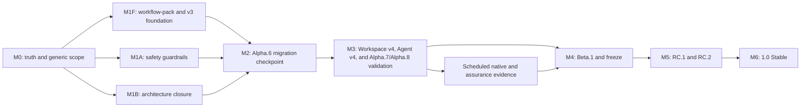

# CanISend generic framework 1.0 delivery roadmap

**Status:** Active — authoritative; Alpha.9 is published and Beta.1 readiness is pending

**Decision date:** 2026-07-25

**Rebased after repository audit:** 2026-08-02

**Rebased after Alpha.6 product validation:** 2026-08-05

**Reconciled after Alpha.7 publication:** 2026-08-10

**Reconciled after Alpha.8 publication:** 2026-08-11

**Reconciled after Alpha.9 host qualification:** 2026-08-16

**Planning authority:** This document is the sole top-level execution authority for the CanISend
1.0 line. The [plan registry](README.md) classifies every other roadmap and execution plan.

**Decision authority:** [ADR-RN-0014](../../architecture/rust-native/decisions/0014-start-the-unified-product-at-1.0-alpha.md)
starts the unified 1.0 line. [ADR-RN-0018](../../architecture/rust-native/decisions/0018-adopt-a-generic-evidence-application-framework.md)
defines the generic framework target and historical Alpha.6 boundary.
[ADR-RN-0020](../../architecture/rust-native/decisions/0020-adopt-a-neutral-multi-application-workspace-and-new-agent-surface.md)
defines the post-Alpha.6 Workspace v4, Agent v4, and no-legacy-compatibility direction. Accepted
ADRs remain authoritative for product and architecture decisions.

**Machine authority:** `Cargo.toml`, `release/*.json`, `docs/contracts/*.json`, Git tags, and
the exact public release artifacts determine version, qualification, support, and contract facts.
This roadmap sequences work; it does not authorize a tag, release, stage transition, or support
claim.

**Scope-rebase source snapshot:** `e524a6d2168c5b71525149e575861c79548aaf13`, reporting
`1.0.0-alpha.6`. This remains the historical rebase snapshot after the published Alpha.6 fixes.
Alpha.7 was published from `9986a6a63b596b7760b4721a7e97c36aedce6d51`. Alpha.8 was published
from `35e7c822ea2f469ab726a31b5d08e622f6810c55`. Alpha.9 was published from
`4876c5669b7ae48ca053b5e06e0005419d2051f6`; later `main` changes still require a new exact
candidate before they may be described as published bytes.

**Current public checkpoint:** [`v1.0.0-alpha.9`](https://github.com/jxpeng98/CanISend/releases/tag/v1.0.0-alpha.9)
at `4876c5669b7ae48ca053b5e06e0005419d2051f6`, published 2026-08-12. The tag, public artifacts,
and qualification records remain the machine authority for its exact source and evidence.

**Current machine stage:** Alpha / `pre-beta`; Beta pending, feature freeze planned, no RC
recorded, Stable not authorized.

**Feedback publication status:** Pending — separate from the plan classification above and
controlled by the body-free feedback snapshot and stage-transition tooling.

**Next intended checkpoint:** `v1.0.0-beta.1` may freeze the published Alpha.9 Workspace v4,
Application-level Pack binding, connected intake, App/CLI/MCP surface, and Agent v4/Skills
contract only after its post-release target-user and readiness gates pass. Beta is not yet
authorized.

## 1. How to use this roadmap

This file answers four questions:

1. What CanISend 1.0 promises and explicitly does not promise.
2. Which work is on the critical path and in what order it may be executed.
3. What evidence is required before a milestone can be marked complete.
4. Which machine-readable record authorizes a release-stage claim.

The words **must**, **must not**, **should**, and **may** are normative. A checked task means its
deliverable and verification evidence are committed or linked; intent, a local experiment, or an
uninspected workflow run is not completion evidence.

Roadmap changes follow these rules:

- update a task and its evidence in the same commit where practical;
- never rewrite historical release identifiers or evidence to make current state appear aligned;
- use a dated note under `docs/notes/rust-native/` for a material phase decision or completed
  qualification slice;
- keep only this file marked `Active — authoritative`;
- classify bounded unfinished work as `In progress — supporting` and link it back here;
- create a new ADR when product scope, trust, architecture, or platform support changes; and
- require explicit maintainer authorization for Beta, RC, and Stable transitions.

## 2. Product target

CanISend 1.0 is a local-first, evidence-constrained, recoverable, and auditable framework for
preparing evidence-bound applications and submissions. A user creates one domain-neutral
Workspace, then creates independent Applications that each bind an exact versioned workflow Pack.
Academic and generic Applications may coexist in that Workspace. The user starts from
user-controlled URL, text, text-based PDF, or local-file sources, explicitly associates sources
and confirmed Evidence with an Application, reviews Requirements and fit, plans pack-defined
Deliverables, collaborates with Codex or Claude through explicit consent and versioned contracts,
reviews and renders outputs, exports a package, and can back up, restore, repair, or audit the
Workspace.

The domain-neutral kernel owns data integrity, evidence traceability, approval, invalidation,
review, export, and recovery. Declarative workflow packs own domain vocabulary, metadata,
workflow stages, Requirement and Evidence taxonomies, Deliverable kinds, templates, prompts,
validators, localization, and readiness rules. Packs may strengthen but cannot weaken kernel
invariants.

CanISend prepares and exports. It never signs in to a portal, uploads, or submits on the user's
behalf.

### 2.1 Primary users and reference packs

The supported 1.0 user is a person preparing an evidence-bound application or submission on their
own computer. The 1.0 product includes two qualified built-in packs:

- `org.canisend.academic-job`, preserving the current academic-job journey as the reference pack;
  and
- `org.canisend.generic-application`, allowing a user to configure non-academic Requirements and
  Deliverables without academic-only required fields.

The generic pack must be validated across at least three non-academic scenario families selected
from professional jobs, grants/fellowships, admissions, tenders/proposals, and internal promotion
or review dossiers. Dedicated first-party packs for those domains are post-1.0 increments, not a
claim that the starter pack encodes every domain's policy.

### 2.2 Supported 1.0 surface

| Surface | 1.0 commitment | Evidence boundary |
|---|---|---|
| macOS Apple Silicon GUI | Publicly supported | Exact ZIP/DMG, launch, lifecycle, accessibility, and retention evidence |
| Five standalone CLI targets | Publicly supported | `release/targets.json`, signed/integrity-bound archives, install and uninstall evidence |
| Codex, Claude Code, and Claude Desktop | Supported external hosts; Code hosts use new v4 Skills and Desktop uses the same local MCP | Real-provider setup/new/resume/approval/failure-recovery dogfood |
| Two built-in workflow packs | Academic-job reference pack and generic starter pack, usable together in one Workspace | Same kernel, Application-level binding, adapter, end-to-end, and exact-pack-digest suites |
| URL, Markdown, text, JSON, CSV, and text-PDF intake | Supported within existing bounded policies | Malformed-input, destination-policy, size, consent, and no-mutation regressions |
| Evidence, Requirements, match, plan, Deliverables, review, render, export | Supported end-to-end | Pack-neutral typed operations plus dual-pack semantic adapter parity |
| Backup, restore, check, and projection repair | Supported | Fresh-path restore and failure-cleanup evidence |
| English and Simplified Chinese | Supported for the principal GUI journey | Keyboard, screen reader, scale, locale restart, and copy review |
| Windows/Linux GUI packages | Nonpublishing candidates | Scheduled qualification only; no 1.0 public support claim |

The five CLI targets remain:

- `aarch64-apple-darwin`;
- `x86_64-apple-darwin`;
- `x86_64-pc-windows-msvc`;
- `x86_64-unknown-linux-gnu`; and
- `x86_64-unknown-linux-musl`.

### 2.3 Explicit non-goals for 1.0

- automatic portal login, upload, or submission;
- cloud sync, hosted storage, telemetry, or collaborative editing;
- OCR for scanned PDFs;
- public Windows or Linux GUI support;
- Linux ARM packages;
- arbitrary external Typst packages or user fonts;
- ownership of Agent conversations, provider credentials, plugins, or search sessions; and
- arbitrary executable workflow-pack code;
- becoming a general-purpose AI client, workflow automation system, recruitment marketplace,
  applicant-tracking system, or generic plugin host; and
- claiming dedicated policy support for every domain that the generic starter pack can model;
- preserving Alpha.6 or earlier Skills, Agent v2/v3 requests, job-specific CLI aliases,
  host-resource layouts, or Workspace v2/v3 compatibility in Alpha.7 and later; and
- importing or upgrading legacy Workspaces into Workspace v4 on the 1.0 critical path.

### 2.4 Product and engineering invariants

- SQLite plus immutable content-addressed blobs remain authoritative; Markdown, Typst, PDF, and
  Agent/workflow packs are projections, verified resources, or exports.
- A factual application claim must trace to user-confirmed Evidence.
- An unsupported claim must be blocked before readiness or export.
- Source changes invalidate only dependent downstream state.
- A Workspace is domain-neutral and may contain Applications using different Packs concurrently.
- Every Application binds an exact workflow-pack ID, version, and digest; a Pack update never
  silently reinterprets existing data or changes another Application.
- Workspace-scoped sources, Profile fields, and Evidence become visible to an Application only
  through explicit association, consent, and revision binding.
- A workflow pack is declarative and cannot obtain database, filesystem, network, credential, or
  executable authority beyond kernel-registered bounded capabilities.
- Agents do not write `.canisend` directly and cannot bypass preview, approval, revision, or
  consent boundaries.
- Routine diagnostics, release evidence, update checks, and handoffs remain body-free.
- Workspace deletion, registry removal, CLI uninstall, and App uninstall do not delete an external
  workspace.
- Restore writes to a new path unless the documented recovery policy explicitly allows otherwise.
- CLI, GUI, MCP, and Agent v4 use the same application facade and kernel rules for shared
  operations; the App is not required for headless operation.
- Unsupported legacy Workspace, Agent, or host-resource versions fail closed before mutation;
  refusal does not imply a compatibility or migration commitment.
- A release is promoted from already qualified candidate bytes without rebuilding.

## 3. Current position

### 3.1 Delivered foundation

| Checkpoint | Durable result |
|---|---|
| Alpha.1 | Activated the unified 1.0 Rust-native line and published the first GUI/CLI prerelease |
| Alpha.2 | Added workspace recovery and workflow-control coverage |
| Alpha.3 | Completed the original 35-operation GUI workflow and qualified five-target artifacts |
| Alpha.4 | Replaced egui with Tauri + Svelte and published the first Tauri macOS packages |
| Alpha.5 | Published an exact prerelease with the connected-Agent and skills work available at its tag |
| Alpha.6 | Published the workflow-pack kernel, Workspace/Agent v3 boundary, academic reference Pack, and bounded generic Pack as the historical migration checkpoint |
| Alpha.7 | Published the clean Workspace v4/Agent v4 line, mixed-Pack Applications, connected intake, App/CLI bootstrap, guarded lifecycle, and retired public legacy surfaces from exact source `9986a6a` |
| Alpha.8 | Published the approved bootstrap usability fixes and repaired sequential-Alpha/Beta authority from exact source `35e7c822`; exact public and provider-host evidence is body-free and independently verified |
| Post-Alpha.8 source | Protected `main` commit `db966a34` closes the Store→IO production edge under M3-ARCH-001; it is not published Alpha.8 bytes, so exact Alpha.9 qualification is required |

The v4 application facade is shared by the desktop, CLI, and MCP surfaces, and exact Alpha.8 bytes
have been publicly reverified and exercised through Codex CLI, Claude Code, Claude Desktop, and a
bounded MCP host. M3-ARCH-001 changed later source bytes, so Alpha.9 qualification now precedes
affected invited-user evidence, blocker disposition, and Beta-entry readiness. It must not create
a parallel engine, a second approval system, or relabel later source as published Alpha.8.

### 3.2 Open gaps that govern the critical path

| Gap | Priority | Why it blocks progress |
|---|---|---|
| Invited target-user evidence is absent | P0 before Beta | Provider dogfood and zero public issues do not prove that users can complete the mixed-Pack workflow |
| Cumulative cohort metrics and Beta readiness remain pending in Issue #70 | P0 before Beta | Beta preparation must bind exact build, coverage, numerators, denominators, exclusions, and body-free evidence |

Repository-governance setup is now complete: nine Roadmap milestones and one Issue per P0/P1 ID
exist, while active rulesets protect `main` and immutable `v*` release tags. The current inventory,
ruleset IDs, bypass posture, probe evidence, and state-reconciliation boundary are recorded in the
[GitHub Roadmap governance synchronization note](../../notes/rust-native/2026-08-03-m0-github-roadmap-governance-sync.md).

## 4. Authority and conflict resolution

| Fact | Authority | Projection or consumer |
|---|---|---|
| Product and architecture decision | Accepted ADR | Roadmap, README, CONTRIBUTING |
| Workspace/source version | Root `Cargo.toml` plus exact internal dependency declarations | Tauri/npm metadata and release workflows |
| Release stage and qualification | `release/qualification-ledger.json` | Roadmap status, README, release notes |
| Beta readiness | `release/beta-readiness.json` | Alpha-to-Beta transition |
| Supported targets | `release/targets.json` and support policy | Installation and support documentation |
| Signing/trust tier | `release/signing-policy.json` | Release notes and installation warnings |
| Public operation coverage | Contract/parity registries | CLI, Tauri, MCP, guides |
| Workflow-pack identity and compatibility | `canisend.workflow-pack/v1` schemas plus embedded/external pack manifests and digests | Application records, UI labels, workflows, templates, and Agent context |
| Public artifact truth | Git tag, release manifest, checksums, attestations, and downloaded bytes | GitHub Release and package managers |
| Work ordering | This roadmap | GitHub milestones and child plans |
| Historical evidence | Archived records, tag-scoped source, and dated notes | Audit and regression context only |

When two sources disagree:

1. stop the affected stage or support claim;
2. determine which authority owns the fact;
3. correct projections rather than editing historical evidence;
4. add a regression check when the contradiction can be detected mechanically; and
5. record a dated note when the resolution changes an architectural or release assumption.

M0 must add a derived `xtask release status --json` view. It may aggregate existing authorities,
but it must not become another manually edited truth source.

## 5. Execution governance

### 5.1 Priorities

| Priority | Meaning | Scheduling rule |
|---|---|---|
| P0 | Data, privacy, evidence, release-truth, or stage-integrity blocker | Stop the affected milestone and resolve first |
| P1 | Required for Beta freeze, RC, supported usability, or maintainable architecture | Complete by the named exit gate |
| P2 | Valuable hardening or post-1.0 improvement | Must not displace a P0/P1 critical-path task |

### 5.2 Task states

- **Planned:** scoped here but prerequisites or owner evidence are incomplete.
- **Ready:** dependencies and acceptance tests are known.
- **In progress:** an implementation branch or bounded execution is active.
- **Blocked:** a named external dependency or repeated reproducible failure prevents progress.
- **Verified:** implementation and required evidence are committed or linked.
- **Deferred:** removed from the 1.0 path with a named later milestone.

Only `Verified` work may satisfy an exit gate. A successful local command, a green run that has
not been inspected, or an unchecked public artifact is not sufficient on its own.

### 5.3 Definition of ready

A task is Ready only when it has:

- one owner role, even when one maintainer fills every role;
- an explicit affected component and defensive invariant;
- a bounded implementation or evidence scope;
- acceptance tests or inspection steps;
- dependencies and rollback boundary; and
- no unresolved product decision hidden inside the implementation.

The milestone tables below are the planned backlog, not a substitute for work-item metadata.
Until M0-GOV creates a linked work item, a task remains Planned. Every GitHub Issue or equivalent
work item must carry:

| Field | Required content |
|---|---|
| Roadmap ID | Exact ID from this document |
| Owner role | Product, architecture, release, validation, or support owner |
| State | Planned, Ready, In progress, Blocked, Verified, or Deferred |
| Dependencies | Other roadmap IDs and external prerequisites |
| Issue | Stable Issue URL or number |
| Acceptance | Positive and negative verification |
| Evidence | Commit, test, run, artifact, or dated-note link |
| Rollback | Revert, migration, artifact, or stage-recovery boundary |

### 5.4 Definition of done

A task is Verified only when:

- the one primary test owner for each changed invariant passes, including the smallest negative
  regression for trust, consent, recovery, data-loss, or release-integrity behavior;
- formatting and static analysis pass for the changed language and package only;
- the smallest applicable source/native gate passes;
- documentation and machine contracts change in the same commit where required;
- negative and failure-path tests cover the protected invariant;
- evidence contains no credentials or private application bodies;
- the task's roadmap or Issue status is updated; and
- an exact release claim is backed by exact tag/run/artifact references.

### 5.5 Work-in-progress and change control

- Keep one critical-path milestone active at a time.
- At most two implementation workstreams may run beside it: one architecture/safety stream and
  one qualification/evidence stream.
- M1F framework-contract and migration gates must pass before Alpha.6.
- M1A safety and M1B architecture work may run beside M1F only when they do not create a second
  domain engine or conflict with the v3 contract boundary.
- Alpha.6 is a dual-Pack framework and migration checkpoint; it publishes the already implemented
  Generic Pack and canonical v3 surfaces, but it cannot authorize Beta or substitute for M3 user
  validation.
- M3 may replace pre-Beta v3 contracts because Alpha.7 is explicitly a breaking checkpoint.
- No M3 task may add a compatibility shim, silent legacy migration, or job-specific branch to
  avoid implementing the neutral v4 model.
- Alpha.7 candidate work starts only after clean-v4 App, CLI, MCP, Codex, Claude Code, and Claude
  Desktop flows pass.
- M3 multi-Application real-user evidence starts only from the published Alpha.8 replacement
  cohort checkpoint.
- Feature freeze activates only after Beta.1 is published, independently verified, and recorded as
  qualified.
- After freeze, allowed changes are documentation, release evidence, and confirmed release
  blockers. Any new feature is deferred to 1.1 or requires an explicit exception that resets the
  affected evidence.

### 5.6 Minimum-sufficient development flow

Ponytail principle: stop at the first verification layer that proves the changed behavior. Tests
are assigned by invariant, not copied into every crate, adapter, platform, and package.

| Work class | Required local evidence | CI/release owner | Explicitly skipped |
|---|---|---|---|
| D — prose/history | `git diff --check`; active release documents also run the relevant `xtask` check | Fast CI only when opened as a PR | Rust tests, Clippy, package builds |
| L — one leaf/package | One exact test or filter at the owning layer; changed-language format/static check | Fast CI workspace suite | Unaffected crates, native packages |
| V — vertical product slice | One kernel/facade invariant test plus one end-to-end adapter smoke; source gate once on final PR head | Fast CI | Repeating the same business assertion in every adapter |
| P — package/platform | Exact affected archive/App smoke | Native candidate or scheduled platform workflow | Five-target local matrix |
| R — release/trust boundary | Smallest positive and negative regression, then source gate | Build-once native, extended assurance, and public reverify | Any reduced qualification claim |

The implementation unit is one user-visible vertical slice, not one layer. A slice may update the
contract, facade, adapter, UI, documentation, and primary tests in one PR so the exact source head
runs Fast CI once. Before coding, reuse the existing facade, approval broker, semantic matrix,
resource generator, and package smoke. Do not add a helper, schema, workflow, fixture, or test when
an existing owner can express the requirement.

Development proceeds through four checkpoints:

1. **Trace:** identify the shared owner and all callers; make no speculative compatibility work.
2. **Edit:** run one smallest failing check, implement the smallest root-cause change, rerun it.
3. **Integrate:** update active contracts/docs before the first push; run Tier 2 once only when the
   change crosses packages, public contracts, CI, or release truth; open one PR for the slice.
4. **Qualify:** accept protected Fast CI as the complete source owner. Run native packages only
   when package/runtime bytes changed or the exact Alpha/Beta/RC/Stable candidate is frozen.

Feature-branch pushes do not run a second copy of Fast CI. The PR head and the eventual `main`
merge commit are the two integration identities. Failed checks are rerun only after a relevant
change; unchanged successful jobs are not recreated as local evidence.

### 5.7 Trellis execution control

This Roadmap remains the sole backlog and work-order authority. GitHub milestones and Issues are
its public projection; Trellis stores only the planning, context, and evidence checklist for work
that is Ready or In progress. Do not import the complete GitHub backlog into Trellis.

The `1-0-roadmap-trellis-control` programme parent owns cross-task integration. Each active
delivery child identifies its Roadmap ID, GitHub Issue and milestone, priority, owner role,
dependencies, authoritative files, expected evidence, and verification tier. Trellis `planning`
maps to Planned or Ready, `in_progress` maps to In progress, and a task is archived only after the
linked work is Verified or explicitly Deferred. A Trellis status never substitutes for protected
CI, exact artifacts, user evidence, or maintainer authorization.

Keep one critical-path child current, with at most one architecture/safety child and one
qualification/evidence child beside it. `M3-ARCH-001` is Verified and archived;
`M3-ALPHA9-001` is Verified against exact public Alpha.9 and its body-free host evidence.
`M3-EVID-005` / Issue #70 is the next critical-path evidence child and still requires real invited
users against that exact Alpha.9. Create
`M4-READY-001` / Issue #71 only after the M3 exit gate passes. When sources disagree, correct the
lower-authority projection before advancing the affected gate; Alpha.8 history remains immutable.

## 6. Critical path



| Milestone | Expected duration | Required predecessor | Exit artifact |
|---|---:|---|---|
| M0 — Truth and generic scope | 3–5 working days | Current audited source | Consistent authority, scope, plan registry, and drift gates |
| M1F — Framework contract and v3 foundation | 3–5 implementation weeks | M0 | Pack v1, neutral contracts, Workspace v3 migration, academic pack extraction |
| M1A — Safety guardrails | 4–6 working days, may run beside M1F | M0 | Approval, parity, MSRV, and source-gate protections |
| M1B — Architecture closure | 3–5 working days, may run beside M1F | M0 | Current ADR/graph plus store-render boundary decision |
| M2 — Alpha.6 migration checkpoint | 3–5 working days plus native runners | M1F, M1A, M1B | Published dual-Pack Alpha.6 with v2 migration, academic parity, and bounded Generic v3 qualification |
| M3 — Workspace v4, new Skills/Agent workflow, Alpha.7/Alpha.8, and validation | 5–8 implementation weeks plus 2–4 validation weeks | M2 | Public breaking Alpha.7 plus replacement Alpha.8, body-free validation evidence, closed blockers |
| M4 — Beta.1 and freeze | 2–3 working days plus native runners | M3 | Qualified Beta and committed freeze baseline |
| M5 — RC.1/RC.2 | 1–2 calendar weeks | M4 | Two distinct clean RC matrices and all Stable evidence classes |
| M6 — Stable | 2–3 working days | M5 | Publicly reverified `v1.0.0` and published support policy |

The expected solo-maintainer path is approximately 14–24 implementation weeks plus the 2–4 week
validation window if no major model, native, signing, or data-integrity blocker appears. This
is a planning range, not a release promise. Trusted Developer ID/notarized distribution adds
credential and qualification lead time. Public Windows/Linux GUI support is not part of that
estimate.

## 7. Workstreams

| Workstream | Scope | Principal evidence |
|---|---|---|
| W1 Product and governance | Scope, non-goals, prioritization, repository rules, Issue/Milestone hygiene | ADRs, protected-branch configuration, roadmap |
| W2 State and documentation | Derived current status, active/historical classification, user-facing truth | `release check`, link checks, generated status output |
| W3 Generic framework | Workspace v4, Application-level Pack binding, shared Evidence associations, connected intake | Schemas, immutable fixtures, multi-Application semantic suites |
| W4 Architecture and safety | Crate graph, app boundary, approval broker, semantic parity, failure atomicity | ADR, metadata graph, focused/contract tests |
| W5 Release integrity | Version transitions, native matrices, signing, SBOM, provenance, exact-byte promotion | Ledger, manifests, checksums, attestations, public reverify |
| W6 Agent and user validation | New Agent v4/Skills, both Packs in one Workspace, real providers, fresh-machine workflow, accessibility, recovery, comprehension | Consented body-free evidence note and issue dispositions |
| W7 Distribution and support | Installation, update, rollback, uninstall, package managers, support boundary | Native lifecycle records and published support policy |

## 8. M0 — Truth, scope, and planning reset

**Objective:** Make every active status and planning surface tell the same current truth before
more product changes are accepted.

**Entry:** Published Alpha.5 exists; changed post-Alpha.5 source remains unqualified.

| ID | Priority | Deliverable | Verification |
|---|---|---|---|
| M0-SCOPE-001 | P0 | Accept ADR-RN-0018 and approve the generic framework target, two built-in packs, compatibility boundary, and non-goals | Roadmap, README, repository instructions, and plan registry use the same target; current Alpha limitations remain explicit |
| M0-SCOPE-002 | P0 | Classify existing job/academic coupling as kernel, academic pack, optional adapter, compatibility surface, or removal | A generated inventory covers Rust, SQL, schemas, resources, UI, guides, tests, and projection paths without an unresolved ownership bucket |
| M0-LICENSE-001 | P0 | Adopt `GPL-3.0-only` for CanISend-authored source and future releases while preserving the license facts of historical tags | Root and package metadata, dependency policy, release-channel rendering, bundled notices, and the desktop legal notice agree; pre-Alpha.6 candidates remain reproducible as MIT |
| M0-PLAT-001 | P0 | Record Apple Silicon GUI + five CLI targets as the 1.0 public scope; Windows/Linux GUI remain nonpublishing | Support policy, target manifest, roadmap, guide, and release notes do not imply broader support |
| M0-STATE-001 | P0 | Implement `xtask release status --json` as a derived view over Cargo, ledgers, contracts, tags, and policy | Fixture tests reject source/public/stage/platform disagreement without adding a manual truth file |
| M0-STATE-002 | P0 | Extend `release check` to validate the active README status block, this roadmap header, root release guide, Issue template version, operation count, and signing wording | Seeded stale-current fixtures fail; historical version fixtures pass |
| M0-STATE-003 | P0 | Generalize feedback refresh and Stable transition code to use `feedback-snapshot.next_roadmap.path` instead of the historical post-0.7 path | Alpha, RC-reviewed, and Stable-published fixtures update whichever next-roadmap path the snapshot declares |
| M0-REL-001 | P0 | Extend dry-run-first `release prepare-stage` to support clean-worktree sequential Alpha iteration, beginning with Alpha.6 | One plan atomically covers Cargo, internal pins, locks, Tauri/npm, package contract, workflow default, and active docs |
| M0-REL-002 | P0 | Define sequential-Alpha readiness semantics: each Alpha invalidates the prior readiness/freeze candidate, while only a qualified dual-Pack Alpha iteration of 7 or greater may rebuild the Beta baseline | Alpha.4/5 and historical Alpha.6 cannot authorize Beta; refresh binds the exact eligible tag, source, run, URL, Workspace/Agent v4, Skills, Pack digests, provider record, and measured user evidence |
| M0-REL-003 | P0 | Require the current RC to be recorded before sequential RC iteration and automate or document the post-freeze transition-exception commit | RC.1 cannot be skipped before RC.2; stage-version changes pass the freeze audit without an unverifiable self-referential commit |
| M0-WF-001 | P0 | Align release, upgrade, and package-manager workflow defaults with the active 1.0 stage and validate them in `release check` | Workflow dispatch cannot silently suggest Alpha.5 or 0.7 Beta/RC pairs |
| M0-FEEDBACK-001 | P0 | Bind final feedback to the latest recorded RC, not merely any valid RC tag | Preparing RC.3 invalidates RC.2 feedback and notes review until refreshed |
| M0-DOC-001 | P0 | Reconcile README, CHANGELOG, RELEASE, qualification guidance, known limitations, desktop guide, and stale 35/37 statements | Links and source gate pass; Alpha.5 history is preserved |
| M0-PLAN-001 | P0 | Keep this file as the only active top-level roadmap; add the plan registry and normalize child-plan headers | A repository scan finds one `Active — authoritative` roadmap |
| M0-GOV-001 | P1 | Create GitHub milestones and Issue labels for M0, framework foundation, Alpha.6, Alpha.7, Beta, RC, and Stable | Every open critical-path task maps to one milestone and roadmap ID |
| M0-GOV-002 | P1 | Protect `main` and release tags: require fast CI, block force-push/delete, and do not require an unavailable second reviewer | A test branch cannot bypass required checks; solo maintenance remains possible |

### M0 repository evidence record

This table records available repository evidence without overriding §5.3. M0-GOV-001 has created
the linked work items; each task still requires task-specific evidence inspection before its Issue
may become Verified.

| Task | Repository evidence | Remaining state boundary |
|---|---|---|
| M0-SCOPE-001 | ADR-RN-0018, this roadmap, and the [generic framework transition plan](2026-08-02-generic-framework-transition-plan.md) | Verified in GitHub Issue #3 after active-surface and source-gate inspection |
| M0-SCOPE-002 | [Generic framework coupling audit](../../notes/rust-native/2026-08-02-generic-framework-coupling-audit.md), [checked inventory contract](../../contracts/domain-coupling-inventory-v1.json), and `xtask scope inventory/check` | Verified in GitHub Issue #4 after PR #95 merged as `c983414`; 188 files have generated ownership and eight required areas are source-gated |
| M0-LICENSE-001 | Commit `84263ba`; canonical GPLv3 text, package metadata, release-channel boundary tests, desktop notice, `cargo deny check licenses`, and source gate | Verified in GitHub Issue #5; historical Alpha.5 and earlier license facts remain unchanged |
| M0-PLAT-001 | Support policy, target manifest, active guides, release notes, and derived release status | Verified in GitHub Issue #6 with one public Apple Silicon GUI target, five CLI targets, and nonpublishing desktop candidates |
| M0-PLAN-001 | Commit `84263ba`; this authority, the plan registry, normalized child-plan headers, and documentation gate | Verified in GitHub Issue #16 after the one-active-authority source check |
| M0-STATE-001 | Commit `635d8d2`; [derived release-status implementation record](../../notes/rust-native/2026-08-02-m0-derived-release-status.md) and passing source gate | Verified in GitHub Issue #7; the view remains derived and explicitly non-authoritative |
| M0-REL-001 | [Sequential Alpha transition implementation record](../../notes/rust-native/2026-08-03-m0-sequential-alpha-transition.md), stage-transition policy/runbook, transactional writer, and 27-file Alpha.6 dry-run | Verified in GitHub Issue #10 for the planner only; applying Alpha.6, starting a candidate, tagging, and publishing remain M2 and require separate authorization |
| M0-STATE-002 / STATE-003 | [M0 release-truth closure](../../notes/rust-native/2026-08-03-m0-release-truth-closure.md), active-surface fixtures, and snapshot-declared feedback path | Verified in GitHub Issues #8 and #9 through PR #96, merge `32b5dc9`, Fast CI `30844498178`, and Dependency Policy `30844498189` |
| M0-REL-002 / REL-003 | [M0 release-truth closure](../../notes/rust-native/2026-08-03-m0-release-truth-closure.md), Alpha.7 authority and sequential-RC fixtures, and post-freeze runbook | Verified in GitHub Issues #11 and #12 through PR #96, merge `32b5dc9`, Fast CI `30844498178`, and Dependency Policy `30844498189` |
| M0-WF-001 / FEEDBACK-001 / DOC-001 | [M0 release-truth closure](../../notes/rust-native/2026-08-03-m0-release-truth-closure.md), dynamic workflow checks, latest-RC fixture, and reconciled active docs | Verified in GitHub Issues #13–#15 through PR #96, merge `32b5dc9`, Fast CI `30844498178`, and Dependency Policy `30844498189` |
| M0-GOV-001 | [GitHub governance audit](../../notes/rust-native/2026-08-03-m0-github-governance-audit.md) records the original absence; the [authorized synchronization](../../notes/rust-native/2026-08-03-m0-github-roadmap-governance-sync.md) records seven milestones, 22 Roadmap labels, and 92 uniquely mapped P0/P1 Issues | Verified in GitHub Issue #17; future edits must preserve one exact milestone, Roadmap ID, owner, priority, and state for every tracked Issue |
| M0-GOV-002 | The [authorized synchronization](../../notes/rust-native/2026-08-03-m0-github-roadmap-governance-sync.md) records active main/tag rulesets, no bypass actors, the solo-maintainer PR policy, and a rejected direct-push probe | Verified in GitHub Issue #18; retain the six unconditional Fast CI checks and immutable `v*` tag policy without adding an unavailable reviewer |

### M0 exit gate

- [x] Generic product and platform scope is approved and consistent across active surfaces.
- [x] Every current academic/job coupling has an explicit kernel, pack, adapter, compatibility, or
  removal owner.
- [x] The derived status command reports source version, public checkpoint, stage, support, and
  drift without owning those facts.
- [x] The source gate fails on a deliberately stale active document and ignores preserved history.
- [x] Feedback tooling follows the snapshot-declared current or post-1.0 roadmap path through
  Alpha, RC review, and Stable publication.
- [x] Sequential Alpha version planning is deterministic, dry-run-first, and clean-worktree
  guarded.
- [x] Alpha iteration invalidates stale readiness/freeze evidence and can rebind it only to the
  exact qualified dual-Pack Alpha iteration of 7 or greater.
- [x] Sequential RC iteration requires the current RC evidence to be committed first.
- [x] Post-freeze stage transitions have a deterministic, audited exception-recording path.
- [x] Active workflow defaults and final-RC feedback identity are source-gated.
- [x] This roadmap is the only active top-level plan.
- [x] GitHub milestones exist and protected refs cannot silently bypass required CI.

**M0 completed:** 2026-08-03. All sixteen M0 GitHub Issues (#3–#18) are closed with
`state:verified`; protected integration evidence is linked above.

**Rollback:** Revert only the M0 implementation/projection changes. Never edit tagged evidence,
archived 0.7 records, or published release metadata to make a check pass.

## 9. M1 — Generic framework foundation, architecture, and safety

M1 is split into the framework transition (M1F), existing safety gates (M1A), and architecture
closure (M1B). The [generic framework transition plan](2026-08-02-generic-framework-transition-plan.md)
owns GF0–GF6 implementation detail; this roadmap owns milestone state and release sequencing. All
three M1 streams must be resolved before the Alpha.6 candidate freeze.

### 9.1 M1F — Workflow-pack kernel and neutral v3 foundation

| ID | Priority | Deliverable | Verification |
|---|---|---|---|
| M1F-PACK-001 | P0 | Implement typed `canisend.workflow-pack/v1`, schema generation, bounded data-only resource validation, exact digest binding, and built-in/external registries | Valid packs round-trip; malformed, oversized, unsafe-path, digest-mismatch, executable, unknown-capability, and incompatible packs fail before mutation |
| M1F-DAG-001 | P0 | Replace the fixed public workflow enum with pack-qualified stable stage IDs and a validated acyclic graph | Duplicate/missing IDs, cycles, unreachable terminal stages, illegal modes/outputs, and oversized graphs fail; stale propagation and scoped rerun remain deterministic |
| M1F-DELIV-001 | P0 | Replace fixed v3 `DocumentKind` with pack-qualified `DeliverableKindId`, cardinality, ordering, validators, and registered render/template references | Two packs with disjoint Deliverable sets pass plan, draft, review, package, render, and export suites |
| M1F-MODEL-001 | P0 | Introduce neutral Opportunity, Application, Requirement, Plan, and Deliverable contracts in Agent v3 and Workspace v3 | Generated v3 schemas contain no academic-only required field; pack identity/version/digest is present on every Application and derived artifact boundary |
| M1F-MIG-001 | P0 | Implement dry-run-first, backup-backed, failure-atomic Workspace v2→v3 migration | Immutable v2 golden workspaces map every Job/stage/artifact/revision/dependency/review/package/render/audit record to the academic pack with identical referenced blobs |
| M1F-MIG-002 | P0 | Prove interruption, retry, corrupt-input, low-space, DB-busy, old-binary, downgrade, restore, and projection-conflict behavior | Every injected boundary leaves recoverable v2 or valid v3 authority; no mixed schema, silent projection overwrite, or content loss occurs |
| M1F-PROJ-001 | P0 | Add Pack-neutral `applications/APPLICATION_ID/` projections with bounded migrated `jobs/JOB_ID/` recognition | Edited, unmanaged, symlink, conflict, copy, replace, repair, and staged-restore paths preserve authority and ownership invariants |
| M1F-INVALID-001 | P0 | Add reviewed same-Pack version migration with exact binding and dependency-scoped invalidation | Label-only changes preserve current outputs; Requirement, workflow, template, renderer, validator, and Evidence changes stale only dependency-reached state; every failure is atomic |
| M1F-ACADEMIC-001 | P0 | Extract academic vocabulary, Evidence fields, ten stages, four Deliverables, templates, prompts, validators, and discovery references into `org.canisend.academic-job` | Current academic canonical fixtures pass through the pack kernel with no semantic drift or legacy business-engine branch |
| M1F-COMPAT-001 | P0 | Add bounded Agent v2, `job` CLI, and `jobs/JOB_ID` compatibility for migrated academic Applications | Current v2 fixtures pass for the academic pack, fail closed for other packs, identify the canonical v3 operation, and never guess a mapping |
| M1F-SURFACE-001 | P0 | Expose pack-driven vocabulary, stages, fields, and Deliverables through the app facade, CLI, MCP, and desktop | No shared surface hard-codes the academic four-document set; English/Chinese fallback and accessibility tests pass |

#### M1F repository evidence record

Available source evidence does not change milestone state until M0-GOV-001 creates and links the
work items and the committed evidence is independently inspected.

The [M1F workflow-pack framework verification record](../../notes/rust-native/2026-08-03-m1f-framework-verification.md)
maps all eleven acceptance contracts to current source and closes the former Academic Agent v3 and
cross-surface parity gap. Local formatting, Workspace tests, strict Clippy, schema/resource/
operation/semantic/scope/release checks, frontend checks, 72 UI tests, production build, and 14
critical browser tests pass. [PR #98](https://github.com/jxpeng98/CanISend/pull/98) merged as
[`48da419c1ff54e076e428a658eee8dc8836a8dbe`](https://github.com/jxpeng98/CanISend/commit/48da419c1ff54e076e428a658eee8dc8836a8dbe).
The exact merge commit passed [Fast CI
`30849789890`](https://github.com/jxpeng98/CanISend/actions/runs/30849789890) and
[dependency assurance
`30849787300`](https://github.com/jxpeng98/CanISend/actions/runs/30849787300). Issues #19–#29 are
closed with `state:verified`.

| Task | Contract/source record | Verification state |
|---|---|---|
| M1F-PACK-001 / #19 | [Workflow Pack v1](../../contracts/workflow-pack-v1.md) and [M1F record](../../notes/rust-native/2026-08-03-m1f-framework-verification.md) | Verified |
| M1F-DAG-001 / #20 | [Workflow Pack v1](../../contracts/workflow-pack-v1.md) and exact-Pack DAG tests | Verified |
| M1F-DELIV-001 / #21 | [Application flow v3](../../contracts/application-flow-v3.md) and two-Pack lifecycle tests | Verified |
| M1F-MODEL-001 / #22 | [Application flow v3](../../contracts/application-flow-v3.md) and generated v3 schemas | Verified |
| M1F-MIG-001 / #23 | [Workspace v2→v3](../../contracts/workspace-v2-to-v3-migration.md) and immutable migration fixtures | Verified |
| M1F-MIG-002 / #24 | [Failure qualification](../../notes/rust-native/2026-08-02-gf2-workspace-v3-failure-qualification.md) and [recovery matrix](../../recovery/interruption-matrix.md) | Verified; exact release-binary repetition is M2-LIFE-001 |
| M1F-PROJ-001 / #25 | [Application projections v3](../../contracts/application-projections-v3.md) and recovery fixtures | Verified |
| M1F-INVALID-001 / #26 | [Pack migration v3](../../contracts/application-pack-migration-v3.md) and scoped-invalidation fixtures | Verified |
| M1F-ACADEMIC-001 / #27 | [Academic Pack v1](../../contracts/academic-job-workflow-pack-v1.md) and neutral Academic v3 lifecycle fixtures | Verified |
| M1F-COMPAT-001 / #28 | [Academic v2 compatibility](../../contracts/academic-v2-compatibility-v1.md) and fail-closed mapping fixtures | Verified |
| M1F-SURFACE-001 / #29 | [Pack presentation v1](../../contracts/workflow-pack-presentation-v1.md), [Agent v3/MCP](../../contracts/agent-v3-mcp.md), and cross-surface semantic fixtures | Verified |

#### M1F exit gate

- [x] Pack v1 schema, validators, digests, registries, and data-only trust boundary pass.
- [x] Neutral v3 schemas contain no academic-only core noun or fixed Deliverable set.
- [x] Workspace v2 golden fixtures migrate to v3 with failure-atomic backup/recovery evidence.
- [x] The academic pack reproduces current supported behavior through the single neutral kernel.
- [x] Agent v2, `job` CLI, and legacy projections are bounded compatibility surfaces, not a second
  engine.
- [x] Pack changes invalidate only affected downstream state and cannot weaken kernel invariants.
- [x] CLI, MCP, Agent v3, and desktop semantic fixtures agree for the academic pack.

**M1 completed:** 2026-08-03. GitHub milestone M1 is closed with 26/26 Issues verified. M1F,
M1A, and M1B are complete; Alpha.6 candidate/release evidence begins in M2 and does not retroactively
change M1 source verification.

### 9.2 M1A — Required before Alpha.6

The current evidence status and ordered closure path are recorded in the
[post-GF4 first usable Alpha gap audit](../../notes/rust-native/2026-08-03-first-usable-alpha-gap-audit.md).
GF4 completion does not waive any M1A gate.

| ID | Priority | Deliverable | Verification |
|---|---|---|---|
| M1-ADR-001 | P0 | Accept an ADR describing the current nine product crates, MCP adapter, Tauri/Svelte surface, unified host, and intentional platform boundaries; mark egui ADR-RN-0013 superseded by ADR-RN-0015 | ADR records actual and target graphs plus the temporary Store→IO exception/expiry; no contradictory Accepted presentation ADR remains |
| M1-GRAPH-001 | P0 | Add an allowed workspace-dependency graph check covering normal, dev, build, target-specific, optional, and feature-enabled edges | A new or reclassified unapproved crate edge fails the source gate |
| M1-OP-001 | P0 | Introduce typed leaf-level `OperationId` and validated `OperationStatus` registries; explicitly classify composite, wildcard alias, CLI, GUI, MCP, and adapter-only operations | Adding an operation/status without registry coverage fails compilation or contract tests |
| M1-OP-002 | P0 | Derive or verify surface mappings from Clap leaves, Tauri handlers, and the MCP router | A missing, duplicate, falsely shared, or adapter-only mapping fails the source gate |
| M1-OP-003 | P0 | Add semantic parity fixtures over canonical pack-neutral application outcomes, not transport envelopes | Every shared mutating leaf and preview/commit pair covers success, stale/replay, wrong pack/context, and no-mutation; every revision-bound leaf covers stale; every read family has a fixture; uncovered leaves are machine-listed |
| M1-APPR-001 | P0 | Replace duplicated pending-mutation stores with a shared approval/preview broker | MCP and desktop use the same expiry, binding, retry, capacity, and replay policy |
| M1-TEST-001 | P0 | Add broker unit tests, MCP Application/task preview→commit tests, and migration tests for every desktop preview-store family | Success, stale, replay, wrong kind/pack/context, validation, DB-busy/transient IO, permanent IO, capacity race, disposition, and no-mutation paths pass before Alpha.6 |
| M1-MSRV-001 | P0 | Align the declared MSRV with continuously tested reality; default decision is pinned Rust 1.97 unless Rust 1.92 receives required locked CI | Cargo, toolchain, README, CI, and status checks agree |
| M1-CI-001 | P1 | Add lightweight Ubuntu/Windows core-store-IO-CLI-MCP PR jobs and a Chromium keyboard/accessibility/key-visual job | A platform or UI regression fails before the release workflow |
| M1-CI-002 | P0 | Make the release source gate reuse or rerun required Svelte formatting, TypeScript, unit, production-build, and critical browser checks | A manual release dispatch cannot bypass UI source qualification |
| M1-DEP-001 | P1 | Run advisory/license checks on dependency changes and add owner, reachability, review date, expiry, removal condition, and upstream issue to every exception | Expired or unexplained exceptions fail policy checks |

Current source evidence for M1-OP-001/002/003 is the
[operation registry v1 contract](../../contracts/operation-registry-v1.md) and
[GF5 operation-registry implementation record](../../notes/rust-native/2026-08-03-gf5-operation-registry.md),
plus the [semantic parity v1 contract](../../contracts/semantic-parity-v1.md) and
[GF5 semantic-parity implementation record](../../notes/rust-native/2026-08-03-gf5-semantic-parity.md).
The registry derives or extracts 86 Clap, 111 Tauri, and 22 MCP leaves and rejects missing,
duplicate, falsely shared, Pack-incompatible, status-unregistered, and unclassified adapter
states. The semantic gate binds 8 shared operations, 6 two-Pack surface cases, 7 revision-bound
operations, 5 preview/commit families, and 5 read families to exact source fixtures. It qualifies
71 bindings and machine-lists 148 typed, non-shared bindings as explicitly uncovered; an
unqualified shared or unclassified leaf fails the source gate. Native qualification and the other
M1A requirements remain open.

Current source evidence for GF5-DOC-001 is the
[dual-Pack user documentation implementation record](../../notes/rust-native/2026-08-03-gf5-user-documentation.md).
Ten required guides now expose explicit Generic v3 and Academic v2 paths, Pack-preserving
v2→v3 migration before mutation, current source versus public Alpha.5 truth, privacy, backup,
rollback, and limitations. The source gate checks stable journey markers and the documented smoke
runs both Packs through separate disposable Workspaces. Native artifact qualification and linked,
independently inspected evidence remain open.

Current source evidence for M1-MSRV-001/M1-CI-002 is the
[toolchain and frontend source-gate implementation record](../../notes/rust-native/2026-08-03-m1-msrv-frontend-source-gates.md).
Cargo and the README now declare Rust 1.97; the exact toolchain, Clippy, 16 stable workflow uses,
cache namespaces, and the release ownership ledger pin 1.97.0. The candidate-only Ubuntu source
job now reruns locked formatting, Svelte/TypeScript checking, 72 UI unit tests, the production
build, and 14 Chrome accessibility/browser checks. `release check` rejects drift in all of those
bindings.
Exact remote CI evidence is recorded by Fast CI run
[`30802993463`](https://github.com/jxpeng98/CanISend/actions/runs/30802993463) at commit
`e9c4b955721571ea90473c951c1459ffdaaec4d0`. The P1 lightweight Linux/Windows and Chrome expansion
is implemented in source as recorded by the
[M1-CI-001 implementation note](../../notes/rust-native/2026-08-03-m1-fast-cross-platform-ci.md).
It adds a bounded two-runner core/Store/IO/CLI/MCP matrix and a 14-check Chrome
keyboard/accessibility/key-visual job. The replacement run passed all six required jobs, including
the Windows resource-digest regression and the macOS academic compatibility smoke; Draft PR #95
remains the protected integration boundary for the two follow-up CI fixes.

Current source evidence for M1-DEP-001 is the
[dependency-assurance implementation record](../../notes/rust-native/2026-08-03-m1-dependency-assurance.md),
the [runbook](../../release/dependency-assurance.md), and the lock-bound exception authority.
Dependency changes now run the pinned advisory/license/ban/source scan and a policy validator. All
23 current exceptions have owner, exact reachability, review/expiry, removal, and upstream tracking;
the two `quick-xml` vulnerability exceptions additionally fail if bibliography/CSL/XML becomes
reachable. Dependency-assurance run
[`30802993936`](https://github.com/jxpeng98/CanISend/actions/runs/30802993936) passed
`policy-and-deny` on the same exact PR head.

Current source evidence for M1-ADR-001/M1-GRAPH-001 is
[ADR-RN-0019](../../architecture/rust-native/decisions/0019-current-product-graph.md), the
[workspace dependency policy](../../architecture/rust-native/workspace-dependency-policy-v1.json),
and its [implementation record](../../notes/rust-native/2026-08-03-m1-architecture-dependency-graph.md).
The release source gate now derives locked Cargo metadata and checks nine product crates, `xtask`,
26 exact actual edges, the 25-edge target, every Cargo edge classification, ADR supersession, and
the review/expiry-bound Store→IO exception. M1-ARCH-001/002 still owns removal or renewed explicit
acceptance of that exception before its 2026-08-17 expiry.

The approval broker must prove all of the following:

- TTL uses an injectable monotonic clock; wall time is used only for a client-visible
  `expires_at`; the initial immutable lifetime is 10 minutes;
- token material comes from the operating system CSPRNG; collision never replaces an existing
  payload;
- tokens are bound to operation kind, complete Workspace/Application/pack context, and source
  revision;
- preview responses expose `expires_at` or the remaining TTL;
- expiry, wrong kind, wrong context, stale revision, and replay cause no mutation;
- exactly one concurrent commit may succeed;
- an approval-specific `ApprovalDisposition::{Consume, RestoreSameApproval}` decides recovery;
  generic `ApplicationFailure.retryable` does not;
- Consume is the default for stale, validation, wrong-kind, wrong-context, and permanent IO
  failures; only explicitly classified transient failures restore the same approval without
  extending expiry;
- expired entries are swept before capacity decisions; a full store rejects a new preview rather
  than evicting a still-valid approval;
- periodic or deterministic sweep releases expired private payloads even when no later `take`
  occurs;
- total retained entries never exceed the configured bound; and
- process restart invalidates every in-memory token.

Current source evidence for M1-APPR-001/M1-TEST-001 is the
[shared approval broker implementation record](../../notes/rust-native/2026-08-03-m1-shared-approval-broker.md).
MCP Application/job/task and every former desktop preview-store family now use the same app-owned
broker with exact Workspace/Pack/operation/source binding, monotonic expiry, CSPRNG single-use
tokens, bounded waiting plus in-flight capacity, explicit disposition, and idle sweeping. Broker,
MCP stdio, desktop migration, Svelte bridge, stale/no-mutation, failure-classification, replay,
wrong-kind/Pack/context, and concurrency tests pass; `xtask approvals check` prevents duplicate
stores, predictable adapter tokens, or missing expiry contracts from returning. Exact Fast CI and
dependency-assurance evidence below complete the remaining M1A source requirements.

### M1A exit gate

- [x] Current architecture and dependency graph agree.
- [x] All public operations and statuses have typed leaf-level ownership and verified adapter
  mappings.
- [x] Semantic parity meets the minimum per-leaf coverage matrix and reports no unclassified leaf.
- [x] Approval/preview unit, MCP job/task, desktop migration, expiry, collision, clock rollback,
  idle sweep, cross-workspace, single-commit, and capacity tests pass.
- [x] MSRV claims are proven by CI.
- [x] Fast PR gates cover macOS plus lightweight Linux, Windows, and browser accessibility paths.
- [x] Release source qualification includes the required UI source gates.
- [x] Advisory/license checks pass and every exception is current, reachable-scope reviewed, and
  time-bounded.
- [x] `cargo run -p xtask --locked -- release check` and fast CI pass.

### 9.3 M1B — Required before the Alpha.6 candidate freeze

| ID | Priority | Deliverable | Verification |
|---|---|---|---|
| M1-ARCH-001 | P1 | Resolve the undocumented `canisend-store -> canisend-io` dependency through a neutral render/projection port, or accept a narrowly documented temporary exception after a time-boxed review | The selected path, expiry/removal condition, graph, and ADR agree; no implicit exception remains |
| M1-ARCH-002 | P1 | Implement the selected path: decoupling uses app-owned prepare → render/project → revision-bound commit and fake ports; an exception uses named compensating render/projection failure tests | DB heads, artifact rows, and audit events remain unchanged on failure/stale; any new unreferenced CAS blob is auditable and safely recoverable |
| M1-ARCH-003 | P1 | Complete facade hygiene and remove unused adapter-to-store dependencies | Production adapters use `canisend-app` for shared business operations except ADR-approved parsing/host boundaries |
| M1-ARCH-004 | P1 | Cover renderer and projector failure boundaries, CAS cleanup, symlink/path conflicts, partial writes, `RepairRequired`, and repair convergence | Cleanup never deletes a pre-existing or shared digest; projection recovery converges without changing authoritative content |

If the Store→IO refactor produces a higher data-integrity risk than the existing edge, stop the
refactor, record the bounded exception and removal condition in the ADR, and retain failure
atomicity tests. Do not preserve an untruthful architecture diagram merely to avoid the decision.

M1-ARCH-003 source evidence is the
[facade-hygiene implementation record](../../notes/rust-native/2026-08-03-m1-cli-facade-hygiene.md).
The CLI no longer depends on Store, IO, or Resources; generic candidate input/output, Agent skill
states, and performance setup cross the application facade. The machine graph now has 26 actual
edges and one reviewed delta from its 25-edge target.

M1-ARCH-001/002/004 source evidence is the
[Store/render exception review](../../notes/rust-native/2026-08-03-m1-store-render-exception.md).
The 2026-08-03 review explicitly accepts the single Store→IO edge for Alpha.6 rather than forcing a
four-path transaction/recovery refactor. `RenderExecutor` provides a replaceable boundary for
compensating tests: direct renderer failure leaves CAS and authority unchanged; a stage change after
compile rolls back every artifact/head/reference/audit write and leaves only digest-valid,
`workspace check`-visible CAS; projection generator/path failures record `repair-required` and
converge without changing authoritative artifacts. The edge still expires on 2026-08-17 and remains
absent from the target graph.

### M1B exit gate

- [x] Store/render ownership is either decoupled and tested or explicitly accepted with an expiry
  and compensating tests.
- [x] Renderer/projector failure and concurrent revision change produce zero partial authoritative
  DB/audit writes; CAS leftovers are absent or explicitly classified as recoverable unreferenced
  blobs.
- [x] Adapter dependencies match the accepted graph.
- [x] M1A remains green after the architecture change.

## 10. M2 — Publish and qualify the Alpha.6 migration checkpoint

**Objective:** Turn the workflow-pack kernel, neutral v3 contracts, v2→v3 migration, extracted
academic reference pack, and already implemented Generic Pack into an honest exact checkpoint.

**Entry:** M0, M1F, M1A, and M1B are Verified. Alpha.6 is not a Beta candidate and cannot refresh
the Beta freeze baseline. The Generic Pack landed before the M1 exit gate and is already embedded
in the product resource catalog, adapters, desktop, and documentation; Alpha.6 therefore qualifies
those bytes as a bounded starter Pack instead of pretending they are absent. M3 still owns broad
real-user evidence, non-academic scenario coverage, feedback-driven hardening, and the Beta
baseline.

| ID | Priority | Deliverable | Verification |
|---|---|---|---|
| M2-SCOPE-001 | P0 | Freeze Alpha.6 to Pack v1, Agent/Workspace v3, both embedded Packs, v2 migration, bounded academic compatibility, post-Alpha.5 fixes, and required documentation | No feature or unrelated change enters after candidate freeze; the Generic Pack is shipped only with its documented bounded capability set |
| M2-NATIVE-001 | P0 | Inspect desktop-platform qualification run `30742363439` for source `cb2db0f` to completion, or record an explicit superseding run before this task becomes Ready; triage failures by shared invariant versus unsupported-platform-only defect | Shared failures block; Windows/Linux GUI-only failures remain explicit nonpublishing issues |
| M2-VERSION-001 | P0 | Dry-run and apply the atomic sequential Alpha change to `1.0.0-alpha.6` | Every controlled source, package, lock, contract, and workflow value agrees |
| M2-CONTRACT-001 | P0 | Create the Alpha.6 package contract from the Alpha.6 source and bind Pack v1, Agent/Workspace v3, both built-in Pack digests, migrations, compatibility registry, and resources | Checkout of the Alpha.5 tag still verifies its historical v2 package truth; Alpha.6 cannot be mistaken for Beta baseline |
| M2-LICENSE-001 | P0 | Verify Alpha.6 as the first publicly conveyed `GPL-3.0-only` release | Exact bundles contain GPLv3 and third-party notices; Scoop/WinGet metadata and the matching source tag declare `GPL-3.0-only`; Alpha.5 and older candidate reproduction remains unchanged |
| M2-SOURCE-001 | P0 | Run formatting, focused tests, Clippy, Svelte type/unit/build, Playwright critical paths, Pack validation, v2 migration/fault injection, dual-Pack semantic parity, and release source gate | Every required source job is green on the candidate commit |
| M2-CANDIDATE-001 | P0 | Build the future Alpha.6 tag once through the exact native matrix | Five CLI archives and macOS ZIP/DMG bind one commit, manifest, checksums, SBOM, signing evidence, and provenance |
| M2-LIFE-001 | P0 | Qualify fresh install, both Pack initializations, v2 workspace migration, pre-migration backup/restore, old-binary refusal, rollback, uninstall, workspace retention, PDF preview/export, accessibility, and v2/v3 Agent/CLI/MCP modes | Body-free records bind the exact candidate archives and both Pack digests |
| M2-AGENT-001 | P0 | Run maintainer Codex and Claude smokes for both Packs on the exact Alpha.6 candidate before promotion | Each host proves Generic v3 new/resume, preview/approval, one committed mutation, rejection/recovery, bounded Academic v2/v3 compatibility, and no direct workspace write |
| M2-PROMOTE-001 | P0 | Inspect candidate evidence, create the annotated tag, and promote the cached candidate without product recompilation | Published digests equal qualified candidate digests |
| M2-PUBLIC-001 | P0 | Download every public asset and independently reverify checksums, manifest, attestations, update response, and limitations | Public reverify record names the exact release and run |

The [Alpha.6 scope freeze](../../notes/rust-native/2026-08-03-m2-alpha6-scope-freeze.md)
records the included dual-Pack release surface, explicit exclusions, post-freeze change classes,
and the qualification consequence of shipping the already embedded Generic Pack. The exact
protected-main merge commit and merge-commit CI run are recorded on Issue #45.

The [Alpha.6 package-contract record](../../notes/rust-native/2026-08-03-m2-alpha6-package-contract.md)
records the v2-to-v3 authority boundary and the exact protocol, dual-Pack, resource-manifest,
operation-registry, compatibility-alias, and migration-tree bindings. The source verifier
recomputes each binding and rejects drift; this evidence does not replace the exact candidate or
public-asset gates.

M2-NATIVE-001 inspection evidence is recorded in the
[desktop-platform run review](../../notes/rust-native/2026-08-03-m2-desktop-platform-run-review.md).
Run `30742363439` completed successfully for source `cb2db0f772ff1931c84427becd4674c59acf9028`:
Windows and Linux one-host build/package/smoke jobs passed, native PDF preview passed under WKWebView,
WebView2, and WebKitGTK, and the matrix selected no PDF.js fallback. This resolves the named-run
inspection prerequisite only. Because the run predates the Alpha.6 candidate commit, it cannot
replace M2-CANDIDATE-001 or authorize publication.

Historical prepublication local source evidence is recorded in the
[Alpha.6 local preflight](../../notes/rust-native/2026-08-03-alpha6-local-preflight.md). The complete
workspace, frontend, browser-accessibility, debug-host, dual-Pack quick-start, Host Agent, Clippy,
and release-source paths pass after correcting the Host Agent smoke to select the explicit academic
v2 compatibility authority. Its statement that HEAD was Alpha.5 is a point-in-time fact; it is not
the current post-publication status and does not qualify Alpha.7 bytes.

The [Apple Silicon package preflight](../../notes/rust-native/2026-08-03-alpha-package-preflight.md)
also proves that the `release-alpha` CLI and unified desktop host build, package, and pass the exact
local archive/ZIP/DMG smoke paths, including notices, binary identity, ad-hoc signatures, GUI launch,
dual-Pack quick-start, bounded Agent v2 compatibility, isolated install/uninstall, and Workspace
retention. The resulting Alpha.5-named files are deliberately nonpublishing diagnostics from a
post-Alpha.5 source commit; all hashes must be discarded and regenerated after the authorized
Alpha.6 transition.

### M2 exit gate

- [x] `v1.0.0-alpha.6` points to one reviewed clean commit.
- [x] All public artifacts are the exact qualified bytes.
- [x] The five CLI targets and Apple Silicon GUI satisfy their claimed lifecycle.
- [x] Pack v1, Agent v3, Workspace v3, both built-in Pack digests, and v2 compatibility are
  machine-bound to the package contract.
- [x] Immutable v2 fixtures and fresh v2 workspaces migrate, back up, restore, and fail atomically
  on every supported CLI target.
- [x] Structural and semantic parity pass through both workflow Packs and the neutral kernel.
- [x] Backup/restore and PDF preview/export use the expected exact artifact bytes.
- [ ] Exact-candidate real Codex and Claude dogfood is not proven by retained body-free evidence;
  ADR-RN-0020 dispositions this historical gap to M3 Agent v4 validation rather than recreating
  obsolete Skills.
- [x] Public documentation describes Alpha.6 as a dual-Pack migration checkpoint, explains the
  bounded Generic starter capability, v2/v3 and community-signing limitations, and does not claim
  Alpha.7 user validation or Beta readiness.
- [x] Alpha.5 tag-scoped facts remain unchanged.

The [Alpha.6 public truth reconciliation](../../notes/rust-native/2026-08-08-m3-alpha6-public-truth-reconciliation.md)
binds the exact candidate and promotion/public-verification runs, package-contract digests, public
release, M2 Milestone state, intentionally pending Beta records, and the unretained provider
evidence disposition. No unchecked M2 item is silently counted as verified.

## 11. M3 — Workspace v4, new Agent workflow, Alpha.7/Alpha.8, and user validation

**Objective:** Replace the Alpha-era mode and compatibility model with one neutral Workspace that
contains independently Pack-bound Applications. Prove that the App can initialize the complete
v4 environment, that the same authority remains usable headlessly through CLI and MCP, and that
new first-party Skills guide Codex and Claude Code through evidence-bound work without depending
on earlier Skills or Agent protocols, while Claude Desktop consumes the same guarded local MCP as
a separate desktop client.

**Entry:** Public Alpha.6 exists and establishes the historical v3 checkpoint. M3 design may begin,
but M3-TRUTH-001 must reconcile every M2 gate as evidenced or explicitly dispositioned before
Workspace v4 implementation. Tests use clean disposable v4 Workspaces and synthetic or explicitly
consented materials. The change is allowed to break Alpha.6 development contracts before Beta.
Alpha.6 tag-scoped facts remain immutable.

**GitHub execution ledger:** [Alpha.7 Milestone #4](https://github.com/jxpeng98/CanISend/milestone/4)
contains the original v4 tasks; [Alpha.8 Milestone #8](https://github.com/jxpeng98/CanISend/milestone/8)
contains the replacement checkpoint and cohort entry. Architecture and model work is tracked by
[#109](https://github.com/jxpeng98/CanISend/issues/109),
[#110](https://github.com/jxpeng98/CanISend/issues/110),
[#112](https://github.com/jxpeng98/CanISend/issues/112),
[#114](https://github.com/jxpeng98/CanISend/issues/114), and
[#60](https://github.com/jxpeng98/CanISend/issues/60); surface work by #56–#59 and
[#115](https://github.com/jxpeng98/CanISend/issues/115); desktop and initialization by
[#116](https://github.com/jxpeng98/CanISend/issues/116)–[#119](https://github.com/jxpeng98/CanISend/issues/119);
new Agent resources by [#120](https://github.com/jxpeng98/CanISend/issues/120)–[#122](https://github.com/jxpeng98/CanISend/issues/122)
and #62–#65; release truth and qualification by
[#113](https://github.com/jxpeng98/CanISend/issues/113), #61, and #66–#70. Issue state and evidence
must change with the corresponding Roadmap task; Milestone membership alone is not completion.

### 11.1 Binding decisions and non-goals

- Workspace v4 is a neutral container, not an academic or generic mode.
- Pack ID, version, and digest belong to each Application.
- One Workspace may contain academic and generic Applications concurrently.
- Shared Profile, Source, and Evidence records require explicit Application associations and
  consent; there is no implicit cross-Application sharing.
- The App, CLI, MCP, and Agent v4 call the same Rust application facade and authority.
- App setup is the easiest path, but closing or never installing the App cannot disable CLI, MCP,
  Codex, Claude Code, or Claude Desktop workflows.
- Old Skills, host-resource layouts, Agent v2/v3 requests, job-specific aliases, and Workspace
  v2/v3 migration are not Alpha.7 deliverables.
- Unsupported versions must be detected before mutation and refused clearly. Refusal is the only
  required legacy behavior; import and compatibility adapters are deferred outside the 1.0 path.
- A single Application cannot merge multiple Packs, and CanISend still does not log in, upload, or
  submit on the user's behalf.

### 11.2 Slice A — Workspace v4 and Application ownership

| ID | Priority | Dependencies | Deliverable | Verification |
|---|---|---|---|---|
| M3-TRUTH-001 | P0 | Public Alpha.6 records | Reconcile the public Alpha.6 tag, source, release URL/run, public verification, M2 Issue/evidence state, Beta-readiness projection, and roadmap checkpoint without rewriting tag-scoped facts | `release check`, derived status, GitHub Release, package contract, Beta readiness, and M2 evidence agree; missing evidence remains an explicit blocker rather than being inferred |
| M3-WORKSPACE-001 | P0 | ADR-RN-0020 | Define `canisend.workspace/v4` as a neutral container with stable Workspace identity and an Application collection | A clean Workspace can contain at least one academic and one generic Application; deleting or changing either cannot change the other's Pack identity or state |
| M3-MODEL-001 | P0 | M3-WORKSPACE-001 | Move exact Pack ID, version, digest, stage graph, and pack-defined metadata ownership to each Application | Schema, SQLite constraints, Rust types, projections, and receipts reject absent, mismatched, or silently substituted Pack bindings |
| M3-ASSOC-001 | P0 | M3-WORKSPACE-001 | Add explicit typed links from Workspace-scoped Profile, Source, and Evidence records to Applications | Cross-Application lookup, consent denial, stale revision, unlink, delete, and targeted invalidation tests prove no implicit data exposure or unrelated invalidation |
| M3-STORE-001 | P0 | M3-MODEL-001, M3-ASSOC-001 | Implement clean-v4 create, open, check, backup, restore-to-new-path, projection repair, and concurrent App/CLI access | Fault-injection tests leave valid v4 authority, no partial Pack binding, no lost Blob or audit record, and deterministic busy/stale errors |
| M3-LEGACY-001 | P0 | M3-WORKSPACE-001 | Detect unsupported Workspace v2/v3 and Agent v2/v3 inputs before mutation | Stable unsupported-version responses identify clean-v4 initialization; fixture digests and filesystem snapshots prove zero mutation and no hidden migration path |

**Slice A exit:** the kernel and Store can complete a mixed-Pack, multi-Application fixture without
desktop, CLI, MCP, or host-specific branches. No UI work begins against an unresolved ownership
model.

Implementation note (2026-08-08): schema 20 introduces native Workspace v4 Application,
dependency, projection, Pack-migration, and association tables. Clean v4 creation no longer writes
the retired v3 storage bridge, and pre-native v4 storage is rejected before database open. The
bounded contract and rollback boundary are documented in
[Workspace v4 storage](../../contracts/workspace-v4-storage.md). PR #135 and Fast CI run
`31266895635` verify the native authority, exact Pack binding, mixed-Pack change isolation, and
legacy-surface refusal. The follow-up removal boundary models deletion as an immutable archived
revision so history and shared Workspace data are retained while either Pack can be removed from
active work without changing the other Application. The recovery follow-up makes the native v4
schema gate mandatory for shared App/CLI discovery and restore, binds verified backups to Workspace
format and native schema, and exercises mixed-Pack projection repair, restore-to-new-path, fault
rollback, Blob/audit retention, and same-revision concurrency. GitHub evidence and task state remain
authoritative until each follow-up PR and remote matrix are recorded.

Legacy-boundary follow-up (2026-08-09): the public operation registry now contains zero
compatibility aliases. The six transitional read-only Agent/Job/Task/Workflow Tauri handlers and
the v2-to-v3 Workspace migration preview/commit handlers are removed from the registered desktop
surface; their frontend entry points return a stable local unsupported-legacy error before invoke.
The CLI command tree and MCP router remain clean-v4-only. Historical facade code is retained solely
for internal regression fixtures and is not an advertised App, CLI, MCP, or host-resource surface.
PR #152 merged as `887514c62714027263ffa601d164c7eab95035ea`; protected Fast CI run
`31294360073`, policy run `31294360066`, and isolated package-integrity/signature checks passed.
M3-LEGACY-001 is Verified and its canonical Issue #60 is closed.

CLI basic-data follow-up (2026-08-09): the shared facade now provides strict Workspace v4
`profile-source.import` and body-free `profile-source.list`. The standalone CLI imports reviewed
public or explicitly consented private-local Markdown/text/JSON sources and lists their metadata;
MCP exposes the same list receipt without bodies. The packaged Agent v4 MCP smoke exercises this
path so native qualification covers it with the App absent. M3-CLI-001 remains in progress only
for final surface reconciliation and five-target release qualification.

Association-read follow-up (2026-08-09): the exact operation-v4 projections
`profile association list` / `evidence association list` and
`canisend_profile_association_list` / `canisend_evidence_association_list` now expose body-free,
Application-scoped candidate and link inventories through the standalone CLI and MCP server. They
require an exact Application ID and do not imply consent or create a link. At that checkpoint,
guarded association preview/commit remained unavailable until the Agent v4 single-use
approval-token boundary below was implemented end to end.

Association-approval follow-up (2026-08-09): Profile Source and Evidence association previews now
enter the shared 10-minute, 16-entry approval Broker and issue a CSPRNG single-use token bound to
the exact Workspace, Pack, Application, Application revision, preview digest, and private-read
requirement. Desktop and MCP commits require explicit approval and consent, consume denial,
wrong-context, replay, and permanent failures, and restore only explicitly transient failures. MCP
now exposes both guarded preview/commit pairs; the independent-process CLI deliberately retains
list-only association access until a durable cross-process approval authority is designed.

Application-resource read follow-up (2026-08-09): the shared facade now exposes exact
`requirement.list/show`, `plan.show`, and body-free `deliverable.list/show` receipts bound to one
Application ID, Pack binding, Application revision, and snapshot digest. The same five operation
IDs are callable through the standalone CLI, MCP, Tauri, and TypeScript bridge for either built-in
Pack. Cross-Application IDs fail closed; Deliverable reads return metadata/content references but
never the private body.

Application-mutation follow-up (2026-08-09): `requirement.confirm`, `plan.propose`,
`plan.confirm`, `deliverable.draft`, and `deliverable.revise` now use exact preview/commit pairs
through the shared Application facade, Tauri, TypeScript bridge, and MCP. Every token is CSPRNG,
single-use, bounded to ten minutes and 16 live entries, and bound to the exact Workspace, Pack,
Application revision, snapshot digest, operation and proposed bytes. `deliverable.audit` requires
explicit private-read consent. The real JSON-RPC fixture completes the full sequence and proves
stale context, denial, cross-Application use, missing consent, and replay leave authority
unchanged. The compiled inventory is now 31 CLI, 129 Tauri, and 36 MCP leaves, with 38 shared
operations and 101 qualified bindings in the two-Pack semantic matrix. Exact Source-bound
Requirement extraction now appends reviewed, deduplicated proposals through its own guarded
preview/commit pair. Standalone one-shot CLI mutation approval is deferred beyond 1.0: duplicating
the process-bound Broker would add a second authority without improving the intended Skills/MCP
workflow. The CLI does not falsely advertise those in-memory approval-token pairs.

Packaged lifecycle follow-up (2026-08-09): the native Agent v4 smoke now keeps one real MCP stdio
server alive while generic and academic Applications in the same Workspace complete Source-bound
Requirement extraction/confirmation, Plan proposal/confirmation, Deliverable drafting, denied and
consented audit, replay, stale, wrong-Application, and invalid cross-Pack-kind cases. The current
`release-alpha` standalone CLI, unified desktop host in CLI/MCP mode, and ad-hoc-signed staged App
host passed the local body-free preflight documented in
[Agent v4 dual-Pack lifecycle preflight](../../notes/rust-native/2026-08-09-m3-agent-v4-dual-pack-lifecycle-preflight.md).
The exact local CLI archive and macOS App ZIP then passed the clean-v4 documented quick start,
Agent v4 host resource lifecycle and legacy refusal, full MCP lifecycle, integrity checks, and
packaged GUI launch. Active package smoke no longer invokes the retired `agent capabilities` or
v2 host-Agent fixture. Protected Linux/Windows/macOS CI and the later five-target clean-tag
release qualification remain required; these local bytes do not authorize Alpha.7.

### 11.3 Slice B — Packs, connected intake, and canonical surfaces

| ID | Priority | Dependencies | Deliverable | Verification |
|---|---|---|---|---|
| M3-PACK-001 | P0 | M3-MODEL-001 | Rebind `org.canisend.academic-job` and `org.canisend.generic-application` to Application-level Pack context | Both Packs compile from the same registry and operate in one Workspace; neither manifest introduces a Workspace mode or academic-only kernel field |
| M3-PACK-002 | P0 | M3-PACK-001 | Qualify professional-job, grant/fellowship, admission, tender/proposal, and internal-dossier generic examples | Every example validates offline and at least three materially different families complete source-to-export with custom metadata and Deliverable kinds |
| M3-INTAKE-001 | P0 | M3-ASSOC-001, M3-PACK-001 | Create one URL, pasted-text, text-PDF, and local-file intake flow that produces Sources and proposes explicit Application links | Generic and academic fixtures preserve spans, digests, provenance, consent, duplicates, parsing limits, and no-mutation failures; generic work no longer depends on disconnected manual requirement entry |
| M3-SURFACE-001 | P0 | M3-MODEL-001, M3-INTAKE-001 | Define neutral v4 `workspace`, `application`, `source`, `evidence`, `requirement`, `plan`, `deliverable`, `review`, and `export` operations | CLI help, MCP schemas, Tauri commands, Agent schemas, and docs contain the same operation IDs and no new job-specific alias |
| M3-PARITY-001 | P0 | M3-SURFACE-001 | Run both Packs through one leaf-level v4 semantic adapter matrix | Success, stale, replay, wrong Workspace/Application/Pack, invalid kind/stage, consent denial, and no-mutation outcomes agree across App, CLI, MCP, and desktop |

**Slice B exit:** a headless fixture imports a source, creates both Application types, associates
Evidence, advances their independent stages, drafts different Deliverables, and exports both
without a Pack-specific engine.

### 11.4 Slice C — Desktop initialization and mixed-Application UX

| ID | Priority | Dependencies | Deliverable | Verification |
|---|---|---|---|---|
| M3-DESKTOP-001 | P0 | None | Grant only the required Tauri `core:window:allow-start-dragging` capability and retain the declarative drag region | Packaged App drag works without the ACL error; capability allowlist and unrelated window commands remain denied |
| M3-BOOTSTRAP-001 | P0 | M3-STORE-001, M3-SURFACE-001 | Implement App-led v4 initialization: choose an external path, create the neutral Workspace, record only its display alias, validate both built-in Packs, and optionally install selected v4 Skills plus project-local MCP configuration | A clean supported Mac completes setup without terminal use; the result contains no Profile, private body, Application, or Workspace mode, while cancel and failure leave no partial Workspace, host file, or registry entry |
| M3-DESKTOP-002 | P0 | M3-BOOTSTRAP-001, M3-PACK-001 | Replace academic/generic Workspace modes with one Application collection, Pack-aware create action, filters, and independent Application context | The user creates, opens, and alternates between academic and generic Applications in the same Workspace without clearing the other Pack's state or switching Workspace |
| M3-DESKTOP-003 | P0 | M3-INTAKE-001, M3-DESKTOP-002 | Connect desktop generic intake, source association, Requirement confirmation, Evidence selection, and Deliverable setup | Keyboard, locale restart, empty/error/stale states, and reopen tests cover both Packs; no required generic step is a disconnected text field |

**Slice C exit:** a new user can initialize once in the App, create one academic and one generic
Application, complete the basic data boundary, close the App, and reopen the same Workspace with
both Applications intact.

Implementation note (2026-08-09): the App bootstrap command now treats the selected new or empty
directory, optional Codex/Claude integrations, and Workspace registry update as one rollback
boundary. It creates only a neutral v4 authority and display alias, uses the exact running desktop
executable in newly created project-local MCP files, installs integrity-managed v4 Skills, never
merges or overwrites an existing host file, and reports explicit zero-Profile, zero-private-body,
zero-Application, and zero-mode facts. Focused backend tests cover both-host success, duplicate-host
preflight, new-directory rollback, and restoration of a pre-existing empty directory. Packaged-Mac
interaction and remote matrix evidence remain required before the GitHub task becomes Verified.

Association follow-up (2026-08-09): the Application workspace now lists body-free Workspace
Profile Source and confirmed Evidence metadata, previews an exact per-Application selection diff,
requires explicit private-read consent, and commits or unlinks revision-bound associations through
the shared Rust facade. Stale and replayed previews fail without implicit sharing; unlink does not
reread a private body. Only explicit current Evidence associations feed Deliverables or complete the
Evidence stage—confirmed Requirements are no longer treated as Evidence. Local verification covers
the full Rust workspace, 77 frontend tests, 17 visual/accessibility journeys, production frontend
build, and an isolated `release-alpha` macOS package reopened with both built-in Packs in one
Workspace. Remote protected-branch evidence is still required before the associated GitHub tasks
become Verified. The follow-up global context bar now projects the active v4 Application title,
lifecycle, Pack, current stage, and progress; switching the Pack replaces that context without
reading the retired Job projection. Full connected Requirement/Deliverable qualification and
remote protected-branch evidence still remain before the Slice C exit is claimed.

Connected lifecycle follow-up (2026-08-09): the mixed-Pack desktop view now requires a reviewed
single-use v4 preview/commit for Requirement decisions, Plan proposal/confirmation, and
Deliverable drafts, and uses consent-gated `deliverable.audit` for private review. The retired
direct `application.plan` and `application.compose` Tauri writes are no longer registered, so the
visible workflow and callable desktop authority share the same approval boundary. PR #159 merged
as `d5eea826`; push Fast CI `31307148618`, PR Fast CI `31307175525`, and dependency assurance
`31307175524` passed. Exact packaged interaction for both Packs, reopen, denial, stale recovery,
and the remaining Profile/Evidence association boundary remain before M3-DESKTOP-003 becomes
Verified.

Packaged desktop follow-up (2026-08-09): an exact local `release-alpha` App completed clean UI
bootstrap with Codex and Claude resources, Pack-neutral empty states, pasted-text connected intake
for both Packs, explicit Profile Source associations, Requirement/Plan/Deliverable approval,
consent-gated review, three validated PDF exports, App reopen, integrity check, verified backup,
restore-to-new-path, and restored mixed-Pack reopen. The interaction found and fixed stale Pack
category state plus an omitted-Deliverable execution-mode mismatch at the shared preview boundary.
The body-free evidence and exact local identities are retained in the [packaged desktop dual-Pack
journey](../../notes/rust-native/2026-08-09-m3-packaged-desktop-dual-pack-journey.md). Protected CI
and clean-tag native qualification remain the authority for closing the GitHub task.

### 11.5 Slice D — New Skills, Agent v4, CLI, and MCP workflow

| ID | Priority | Dependencies | Deliverable | Verification |
|---|---|---|---|---|
| M3-AGENT-DESIGN-001 | P0 | M3-SURFACE-001 | Define `canisend.agent/v4` and a canonical task-resource model for orientation, Profile/Evidence, intake, Application creation, Requirements, fit/plan, drafting, review, export, and recovery | Versioned schemas and examples bind Workspace, Application, Pack, revision, consent, preview, approval, commit, and receipt; no task depends on an old Skill or alias |
| M3-CLI-001 | P0 | M3-SURFACE-001, M3-AGENT-DESIGN-001 | Make clean-v4 initialization, host setup/status, basic data import/read, Application context/read, MCP stdio, and recovery available through the standalone CLI; approval-token mutations remain in one persistent MCP/App process | Five-target tests run with the App absent; the CLI launches the canonical MCP workflow and never writes authority outside the application facade |
| M3-AGENT-RESOURCES-001 | P0 | M3-AGENT-DESIGN-001, M3-CLI-001 | Generate new Codex and Claude Code Skills plus MCP guidance from one canonical resource source | Install, status, upgrade-within-v4, uninstall, drift detection, and isolated-host tests pass; generated resources declare Agent v4 and no legacy compatibility claim |
| M3-AGENT-001 | P0 | M3-AGENT-RESOURCES-001 | Complete new and resumed Codex sessions for both Packs in one Workspace on exact Alpha.7 bytes | Discovery, CLI initialization/recovery, MCP-first work, approval, cancel, commit, reopen, and stale recovery are recorded |
| M3-AGENT-002 | P0 | M3-AGENT-RESOURCES-001 | Complete the equivalent Claude Code scenarios and the bounded Claude Desktop MCP companion flow | New/resumed Claude Code uses the v4 Skills; Desktop uses the same guarded local MCP; both remain body-free with no host-specific business rule or direct `.canisend` write |
| M3-AGENT-003 | P0 | M3-AGENT-001, M3-AGENT-002 | Exercise another conforming MCP client plus missing runtime/authentication, malformed output, invented IDs, wrong context, stale revision, denied consent, and host restart | No case bypasses validation, mutates the wrong Application, leaks another Application's data, or requires the App to be running |
| M3-AGENT-004 | P0 | M3-AGENT-RESOURCES-001, M3-LEGACY-001 | Enforce v4 host-resource integrity and explicit unsupported-legacy refusal | Tampered, stale, wrong-version, Alpha.6 Skill, and Agent v2/v3 fixtures fail before mutation with stable clean-install guidance; no compatibility negotiation exists |

**Slice D exit:** initialization in either the App or CLI produces the same v4 Workspace and host
resources. Codex, Claude Code, and Claude Desktop can continue work after the App closes, and
changes are visible when the App reopens. Desktop configuration remains a separate user-reviewed
merge because CanISend does not overwrite a user-global host file.

Real-host follow-up (2026-08-09): the exact local draft candidate completed new/resumed Codex,
Claude Code, and Claude Desktop flows with the CanISend App closed. Both Packs remained accessible;
cancelled previews did not mutate; MCP restarts rejected prior tokens; explicit fresh approvals
committed once; and Claude Code recovered from a real stale Plan preview. The body-free identities,
fail-closed host findings, and outcomes are retained in the
[Agent v4 real-host dogfood](../../notes/rust-native/2026-08-09-m3-agent-v4-real-host-dogfood.md).
The same record now closes the exact-candidate failure matrix with a separate JSON-RPC client plus
missing runtime/authentication, malformed output, invented ID, wrong context, stale revision,
denied consent, and host-restart evidence; every case failed before unauthorized mutation or data
crossing.

Canonical review/export convergence (2026-08-09): the shared facade and existing single-use
approval Broker now own `review.inspect`, `review.disposition.preview/commit`, `export.list/show`,
and `export.prepare.preview/commit`. CLI exposes the three read operations; Tauri and MCP expose
all seven. Review requires private-read consent, export requires separate private-export consent,
and local manifests reverify path, size, digest, Application, Pack, and no-submission boundaries.
The packaged dual-Pack smoke now continues through review disposition and verified PDF export.

### 11.6 Slice E — Alpha.7–Alpha.9 qualification and user cohorts

| ID | Priority | Dependencies | Deliverable | Verification |
|---|---|---|---|---|
| M3-ALPHA7-001 | P0 | All M3 P0 implementation tasks | Prepare, build once, qualify, promote, download, and publicly reverify `v1.0.0-alpha.7` | Exact artifacts bind Workspace v4, Agent v4, Skills manifest/resources, Pack v1, both Pack digests, operation schemas, SBOM, provenance, and signing evidence |
| M3-ALPHA8-001 | P0 | M3-ALPHA7-001 and approved post-publication cohort blocker | Merge the bounded bootstrap fixes, repair sequential-Alpha/Beta release authority, and qualify exact `v1.0.0-alpha.8` as the replacement cohort checkpoint | Protected source and exact public artifacts bind the fixes, Workspace/Agent v4 contracts, both Packs, provider/host dogfood, SBOM, provenance, and signing evidence |
| [M3-ARCH-001](https://github.com/jxpeng98/CanISend/issues/182) | P1 | M3-ALPHA8-001 | Remove the expiring production `canisend-store -> canisend-io` edge by moving the existing render seam to Core and composing its IO implementation in App | Locked Cargo metadata matches the reviewed target graph with no temporary Store/IO exception; render, projection, export, restore, stale, failure-atomicity, Blob-ledger, and repair-convergence tests pass |
| [M3-ALPHA9-001](https://github.com/jxpeng98/CanISend/issues/183) | P0 | M3-ARCH-001 and any other accepted changed-byte P0/P1 blocker | Qualify the next sequential Alpha from the exact protected source before affected cohort evidence resumes | Build-once candidate, public artifacts, provider/host evidence, both Packs, and affected render/recovery scenarios bind one exact source without rewriting Alpha.8 |

Alpha.8 qualification evidence: [public release](https://github.com/jxpeng98/CanISend/releases/tag/v1.0.0-alpha.8),
[promotion and public verification run](https://github.com/jxpeng98/CanISend/actions/runs/31441308337),
`release/provider-dogfood.json`, and the
[body-free exact public host note](../../notes/rust-native/2026-08-11-alpha8-exact-public-host-dogfood.md).

Alpha.9 qualification evidence: [public release](https://github.com/jxpeng98/CanISend/releases/tag/v1.0.0-alpha.9),
[candidate run](https://github.com/jxpeng98/CanISend/actions/runs/31609344160),
[promotion and public verification run](https://github.com/jxpeng98/CanISend/actions/runs/31618836210),
[protected host-evidence PR](https://github.com/jxpeng98/CanISend/pull/190),
`release/provider-dogfood.json`, and the
[body-free exact public host note](../../notes/rust-native/2026-08-16-alpha9-exact-public-host-dogfood.md).

| Cohort | Minimum | Purpose |
|---|---:|---|
| Latest qualified Alpha invited cohort | 5–8 users and at least 10 complete flows across both Packs | Find initialization, mixed-Application, intake, Skills, consent, recovery, and export blockers |
| Beta-entry cumulative cohort | 8–12 users and at least 20 complete flows | Establish repeatability across two Packs in shared Workspaces, three non-academic families, languages, inputs, hosts, and recovery |

The cumulative evidence must cover:

- clean App initialization and clean CLI-only initialization;
- academic and generic Applications coexisting in the same Workspace;
- at least three non-academic scenario families and two academic disciplines or job types;
- English and Simplified Chinese;
- URL, pasted text, local file, and text-based PDF intake with explicit associations;
- at least two Deliverable sets, including one containing neither a CV nor academic statement;
- new Agent v4 Skills in Codex and Claude Code, Claude Desktop using the same local MCP, plus one
  schema-conforming MCP client;
- App-closed headless operation followed by App reopen and receipt reconciliation;
- backup and restore to a new path for a mixed-Application Workspace;
- an intentional Evidence gap, cross-Application access denial, and unsupported-claim rejection;
- clean refusal of an unsupported legacy Workspace and old Skill fixture without mutation;
- keyboard-only navigation, VoiceOver, and 200% text scale; and
- user understanding that Ready or Exported does not mean Submitted.

### 11.7 Evidence and privacy

| ID | Priority | Deliverable | Verification |
|---|---|---|---|
| M3-EVID-001 | P0 | Create a dated, body-free validation note referencing consent, exact build, v4 schema/resource digests, Pack digests, scenarios, aggregate outcome, blockers, and fixes | No CV, letter, proposal, application body, transcript, credential, or provider token is committed |
| M3-EVID-002 | P0 | Link every failure to a public or private maintainer issue using only the minimum safe metadata | P0/P1 dispositions are independently reviewable without private bodies |
| M3-EVID-003 | P1 | Re-run affected scenarios after fixes on the exact replacement build and resource digests | Closed blockers contain regression evidence rather than prose-only resolution |
| M3-EVID-004 | P0 | Add a machine-validated provider-dogfood record bound to source/artifact, host, Agent v4, Skills digest, Pack identity, consent, scenario IDs, and outcomes | Beta preparation rejects missing, stale, failed, mismatched-context, or private-body-bearing records |
| M3-EVID-005 | P0 | Extend Beta readiness with cohort size, mixed-Application/scenario coverage, completed-flow count, exact build, metric numerators/denominators, exclusions, and evidence-note digest | Beta preparation rejects missing, stale, inconsistent, single-Pack-only, or unbound user evidence |

### M3 exit gate

- [x] Exact public Alpha.7 binds Workspace v4, Agent v4, new Skills, both built-in Packs, and all
  canonical operation/resource digests.
- [x] Exact public Alpha.8 binds the approved bootstrap fixes and repaired sequential-Alpha/Beta
  authority before invited cohort entry.
- [x] Exact public Alpha.9 binds the architecture checkpoint, both Packs, affected render/recovery
  coverage, and body-free Codex CLI, Claude Code, and Claude Desktop host evidence.
- [ ] A clean App setup initializes Workspace, minimum basic data, Packs, MCP, and new host Skills
  without terminal use; the same result can be initialized headlessly by CLI.
- [ ] One Workspace contains academic and generic Applications concurrently, and neither workflow
  clears, relabels, leaks, or invalidates the other.
- [ ] URL, text, text-PDF, and local-file intake feed explicit Source, Requirement, Evidence, and
  Application associations for both Packs.
- [ ] App, CLI, MCP, Codex, Claude Code, and Claude Desktop pass one v4 semantic suite; App-closed
  operation and reopen reconciliation pass.
- [ ] Old Skills, Agent v2/v3, job aliases, and Workspace v2/v3 are absent from the supported v4
  Alpha matrix and fail closed before mutation when detected.
- [ ] At least 80% of cumulative users complete the supported end-to-end flow without the
  maintainer operating CanISend for them.
- [ ] Both Packs and at least three non-academic scenario families are represented in completed
  flows.
- [ ] Every audited factual claim is traceable to confirmed Evidence and unsupported claims equal
  zero.
- [ ] Mixed-Application backup/restore succeeds in every measured recovery scenario.
- [ ] No unresolved P0/P1 data-loss, privacy, evidence, Pack, rendering, recovery, host-setup, or
  supported-install blocker remains.
- [ ] No blocking keyboard, VoiceOver, or 200%-scale issue remains.
- [ ] Every tested user understands the no-submission boundary.

## 12. M4 — Beta.1 and feature freeze

**Objective:** Establish a qualified Beta baseline and freeze the public 1.0 contracts.

**Entry:** M2 and M3 are Verified. Public Alpha.9 has no unresolved P0/P1 blocker and is the latest
qualified Alpha.

| ID | Priority | Deliverable | Verification |
|---|---|---|---|
| M4-READY-001 | P0 | Refresh Beta readiness against Alpha.9 and reviewed mixed-Application Agent/user evidence | Snapshot is no older than 24 hours, binds Workspace v4, Agent v4, Skills and both Pack digests, is body-free, and zero issues is not the only blocker evidence |
| M4-FREEZE-001 | P0 | Run `release freeze-candidate` for Agent v4, Workspace v4, Skills manifest/resources, Pack v1, both built-in Packs, schemas, operation registry, exit codes, and bundle layout | Baseline digests match the qualified Alpha.9 surface; no Alpha.6, v2, or v3-only baseline can pass |
| M4-STAGE-001 | P0 | Preview `release prepare-stage v1.0.0-beta.1`, review all controlled digests, then apply `--write` from a clean worktree | Transition is Alpha→Beta.1 only and source/ledger/release notes agree |
| M4-CANDIDATE-001 | P0 | Build, inspect, tag, promote, download, and publicly reverify the exact Beta.1 candidate | Beta assets satisfy the native signed/integrity matrix and no rebuild occurs during promotion |
| M4-LEDGER-001 | P0 | Preview and write `record-beta-qualification` from independently downloaded assets | Ledger records exact Beta tag, source, run, and manifest |
| M4-CHANNEL-001 | P1 | Generate and commit Beta package-channel candidates from independently verified public Beta assets | Candidate digests match public Beta; no external package index is modified |
| M4-FREEZE-002 | P0 | Activate feature freeze against the qualified Beta source commit | Ledger contains a non-null baseline and only approved change classes |

### M4 exit gate

- [ ] The ledger contains a qualified Beta tag/source/run.
- [ ] Feature-freeze baseline equals the qualified Beta source.
- [ ] Agent v4, Workspace v4, Skills, Pack v1, both built-in Packs, schema, operation, approval,
  bundle, and exit-code contracts are digest-bound.
- [ ] Beta packages and public docs match.
- [ ] New feature requests are assigned to 1.1 unless a documented release exception resets the
  affected evidence.

## 13. M5 — RC.1, RC.2, and complete Stable evidence

**Objective:** Prove the frozen product across clean tags, upgrades, documentation, package
channels, accessibility, and final release communication.

**Entry:** Qualified Beta.1 and active feature freeze.

| ID | Priority | Deliverable | Verification |
|---|---|---|---|
| M5-RC1-001 | P0 | Preview/apply the Beta→RC.1 transition and build one exact clean RC.1 matrix | Tag, source commit, run ID, and manifest are unique |
| M5-RC1-002 | P0 | Publicly verify RC.1 and record it with `record-rc-qualification` | Ledger contains the inspected RC.1 matrix |
| M5-UPGRADE-001 | P0 | Run clean-v4 Alpha.8→Beta.1→RC.1 five-target product/resource upgrade, Pack-update, rollback, and restore-to-new-path qualification | `record-upgrade-qualification` accepts the exact v4 evidence chain, both Pack identities, and Skills/resource digests; no legacy Workspace migration is claimed |
| M5-DOC-001 | P0 | Run five-target App and CLI initialization, mixed-Application quick starts, new host Skills, MCP, Pack validation, install, uninstall, and Workspace-retention qualification | `record-documentation-qualification` binds all records to the RC matrix and current v4/Pack/resource digests |
| M5-PKG-001 | P0 | Qualify Homebrew arm64/Intel, Scoop, and WinGet Sandbox install/upgrade/uninstall | `record-package-qualification` accepts four records from the same run |
| M5-A11Y-001 | P0 | Complete exact-package keyboard, VoiceOver, scale, locale, and reduced-motion review | No blocking supported-platform accessibility defect remains |
| M5-RC2-001 | P0 | Prepare and qualify RC.2 from a different clean tag, source commit, and run | Ledger contains at least two distinct successful RC matrices |
| M5-NOTES-001 | P0 | Review final RC issues, assets, limitations, package channels, release notes, and rollback guide | `record-release-notes-qualification` binds the latest RC and named reviewer |
| M5-FEEDBACK-001 | P1 | Create a bounded post-1.0 roadmap in Draft, point the feedback snapshot to it, then refresh body-free final-RC feedback and mark that next roadmap Reviewed | Snapshot, measured next-roadmap block, latest recorded RC, and release stage agree |

If a blocker changes bytes after RC.2, prepare the next sequential RC. Re-run every affected
evidence class and the final release-notes review; an earlier review cannot authorize changed
bytes.

Every RC or Stable stage transition after feature freeze uses the audited two-commit protocol
until tooling can make it safer: first commit the deterministic stage transition, then record that
exact commit and changed paths as a `release-evidence` freeze exception in a second commit. Run
the source gate and bind the candidate tag to the second commit. Never prepare RC.N+1 before RC.N
is recorded in the ledger.

### M5 exit gate

- [ ] At least two distinct clean-tag RC matrices are recorded.
- [ ] Beta→RC upgrade and restore evidence passes on all five targets.
- [ ] Five-target documentation/uninstall evidence passes.
- [ ] Homebrew Cask, Scoop, and WinGet lifecycle evidence passes.
- [ ] Exact-package accessibility passes for every claimed surface.
- [ ] The latest RC release notes and rollback guide receive explicit maintainer review.
- [ ] No change outside the frozen classes is present.
- [ ] Every Stable prerequisite field in the qualification ledger is complete.

## 14. M6 — Publish CanISend 1.0 Stable

**Objective:** Publish `v1.0.0` from one exact, qualified Stable candidate and establish the
supported patch line.

**Entry:** M5 is Verified and the ledger proves every Stable prerequisite.

| ID | Priority | Deliverable | Verification |
|---|---|---|---|
| M6-STAGE-001 | P0 | Preview the RC→Stable transition and inspect the complete controlled-file plan | Dry run sets qualified status, Stable authorization, notes heading, support publication, current-roadmap completion, and next-roadmap publication |
| M6-STAGE-002 | P0 | Apply the Stable transition from a clean worktree and run the full source gate | Workspace reports `1.0.0`; ledger and support policy are canonical |
| M6-CANDIDATE-001 | P0 | Build and qualify the exact `v1.0.0` candidate once | All public targets, signing/integrity, lifecycle, SBOM, provenance, and artifact checks bind one commit |
| M6-PROMOTE-001 | P0 | Create the reviewed annotated tag and promote the exact candidate without recompilation | Published bytes equal candidate bytes |
| M6-PUBLIC-001 | P0 | Download and independently verify every public Stable asset and update-channel response | Public verification record contains tag, run, manifest digest, and attestation result |
| M6-PUBLIC-002 | P1 | Commit or permanently retain a body-free Stable publication record | Tag, source, candidate/promotion/public run IDs, manifest digest, and attestation review remain auditable after artifact expiry |
| M6-DOC-001 | P0 | Publish exact README, CHANGELOG, App/CLI initialization, mixed-Application quick starts, Pack authoring/validation, new Skills/Agent v4/MCP, backup, privacy, breaking-change limitations, rollback, and support guidance | Clean-machine instructions match the public packages and current Workspace/Agent/Skills/Pack digests and make no legacy-compatibility claim |
| M6-OPS-001 | P1 | Establish the 1.0.x patch, vulnerability, recovery, and support triage process | A dry-run patch scenario identifies owner, severity, rollback, and response path |

### M6 exit gate

- [ ] `v1.0.0` is public and all artifacts match the qualified candidate.
- [ ] Stable authorization and published support policy are committed.
- [ ] Installation, update, rollback, uninstall, Agent, privacy, and limitation guidance matches
  the released bytes.
- [ ] The update response and GitHub-release package-channel assets reference the verified Stable
  release; external package-index submission remains separately authorized.
- [ ] The 1.0.x support and emergency patch process is documented and dry-run reviewed.
- [ ] This roadmap is Completed and the snapshot-declared post-1.0 roadmap is Published by the
  stage tool.

## 15. Verification tiers and required commands

Use the smallest tier that proves the change, then rely on native/scheduled gates for the scope
they own. A higher tier is not a reward for caution: run it only when the change crosses into the
authority that tier owns.

### Tier 1 — Focused edit gate

```console
# Always
git diff --check

# Rust source only
cargo fmt --all -- --check
cargo test -p AFFECTED_CRATE --locked TEST_FILTER
cargo clippy -p AFFECTED_CRATE --all-targets --locked -- -D warnings
```

Select one exact owning test first. Omit `TEST_FILTER` only when the affected package is the
smallest useful owner. For desktop changes, run the affected pnpm unit/type/accessibility command;
run the production build only when bundling, routes, generated bindings, assets, or package input
changed. Prose-only changes run no Rust or frontend tests.

### Tier 2 — Source gate

```console
cargo run -p xtask --locked -- release check
```

The required Fast CI jobs must pass on the exact source commit. The release source gate must reuse
or repeat the required Svelte/TypeScript/unit checks so an unprotected dispatch cannot bypass the
UI source boundary. Run this tier once on the final local PR head for shared contracts, schemas,
resources, CI, release metadata, or multi-crate behavior. Do not rerun it after a prose-only edit
that cannot affect an active checked document.

### Tier 3 — Native candidate gate

Use the release and native-qualification workflows against the exact future tag and source commit.
Verify packaged launch, CLI/GUI/MCP modes, signing/integrity, install/update/rollback/uninstall,
workspace retention, PDF, accessibility, archive contents, sizes, and downloaded-byte equality.
Ordinary product PRs do not run a local five-target matrix. A package-script or native-runtime PR
smokes only its affected package before protected CI; the exact candidate owns the full matrix.

### Tier 4 — Extended assurance

Scheduled fuzzing, dependency advisory/license checks, platform package candidates, signing
operations, provenance, package-manager lifecycle, clean-tag RC matrices, and public reverify own
their extended scope. Do not move broad fuzzing or full Windows/Linux GUI packaging into the fast
edit loop unless reproducing a focused defect.

### Evidence rules

- Record exact commit, tag, run URL/ID, target, toolchain, manifest digest, and artifact digest.
- Independently inspect external run IDs and attestations; an invented number in JSON is not
  evidence.
- Keep release evidence body-free and credential-free.
- Preserve failed evidence when it explains a blocker, but never present it as qualification.
- Mark local or nonpublishing candidates explicitly.
- A release gate consumes committed evidence, not an uncommitted local directory.

### Release operator sequence

Every `xtask` command that accepts `--write` is previewed first, its complete digest plan is
reviewed, and the write is run only from a clean worktree. Commit each bounded ledger or transition
write before running the next recorder.

After M0 adds sequential Alpha support, prepare Alpha.6 and dispatch its future-tag candidate:

```console
cargo run -p xtask --locked -- release prepare-stage v1.0.0-alpha.6
cargo run -p xtask --locked -- release prepare-stage v1.0.0-alpha.6 --write
cargo run -p xtask --locked -- release check

gh workflow run release.yml --repo jxpeng98/CanISend --ref main \
  -f tag=v1.0.0-alpha.6 \
  -f cache_epoch=alpha6-v1 \
  -f promote_existing_tag=false
```

Inspect and download the successful candidate before creating the annotated tag. Pushing that tag
must locate the same unexpired tag/commit candidate and promote it without recompilation.

Alpha.7 used the same future-tag flow for the breaking v4 checkpoint. The approved bootstrap
replacement repeated it for `v1.0.0-alpha.8`; Alpha.8 is now the exact public candidate whose
provider and invited-user evidence may authorize Beta.

Before Beta.1, against exact qualified Alpha.8:

```console
./scripts/refresh_beta_readiness.sh jxpeng98/CanISend BODY_FREE_USER_EVIDENCE_JSON
./scripts/refresh_beta_readiness.sh jxpeng98/CanISend BODY_FREE_USER_EVIDENCE_JSON --write
./scripts/audit_community_signing_configuration.sh
./scripts/check_signing_readiness.sh beta
cargo run -p xtask --locked -- release freeze-candidate
cargo run -p xtask --locked -- release check
cargo run -p xtask --locked -- release prepare-stage v1.0.0-beta.1
cargo run -p xtask --locked -- release prepare-stage v1.0.0-beta.1 --write
```

After public Beta assets are independently downloaded:

```console
cargo run -p xtask --locked -- release record-beta-qualification \
  v1.0.0-beta.1 CANDIDATE_RUN_ID DOWNLOADED_BETA_ASSETS

cargo run -p xtask --locked -- release verify \
  v1.0.0-beta.1 DOWNLOADED_BETA_ASSETS
cargo run -p xtask --locked -- release channels \
  v1.0.0-beta.1 DOWNLOADED_BETA_ASSETS packaging/candidates/v1.0.0-beta.1

cargo run -p xtask --locked -- release activate-feature-freeze FULL_HEAD_COMMIT
```

Repeat the recorder and freeze commands with `--write` only after inspecting their plans. Commit
the Beta qualification, channel candidates, and necessary documentation before choosing the
feature-freeze baseline.

For RC.1:

```console
cargo run -p xtask --locked -- release prepare-stage v1.0.0-rc.1
cargo run -p xtask --locked -- release prepare-stage v1.0.0-rc.1 --write

cargo run -p xtask --locked -- release record-rc-qualification \
  v1.0.0-rc.1 CANDIDATE_RUN_ID DOWNLOADED_RC1_ASSETS
```

After RC.1 is public and recorded, the three evidence streams may execute in parallel, but their
ledger writes remain separately reviewed and committed:

```console
gh workflow run upgrade-qualification.yml --repo jxpeng98/CanISend --ref main \
  -f from_tag=v1.0.0-beta.1 \
  -f to_tag=v1.0.0-rc.1

cargo run -p xtask --locked -- release record-upgrade-qualification \
  v1.0.0-beta.1 v1.0.0-rc.1 DOWNLOADED_UPGRADE_EVIDENCE

cargo run -p xtask --locked -- release record-documentation-qualification \
  v1.0.0-rc.1 DOWNLOADED_RC1_ASSETS DOWNLOADED_DOCUMENTATION_EVIDENCE

gh workflow run package-manager-qualification.yml --repo jxpeng98/CanISend --ref main \
  -f from_tag=v1.0.0-beta.1 \
  -f to_tag=v1.0.0-rc.1

cargo run -p xtask --locked -- release verify-package-evidence \
  v1.0.0-beta.1 v1.0.0-rc.1 DOWNLOADED_PACKAGE_EVIDENCE
cargo run -p xtask --locked -- release record-package-qualification \
  v1.0.0-beta.1 v1.0.0-rc.1 DOWNLOADED_PACKAGE_EVIDENCE
```

The package evidence is not complete until the WinGet lifecycle record is returned from a fresh
Windows Sandbox with the same run identity. These commands generate or record GitHub-release
channel assets only; they do not authorize modification of external package indexes.

RC.2 can begin only after RC.1 is recorded:

```console
cargo run -p xtask --locked -- release prepare-stage v1.0.0-rc.2
cargo run -p xtask --locked -- release prepare-stage v1.0.0-rc.2 --write

cargo run -p xtask --locked -- release record-rc-qualification \
  v1.0.0-rc.2 CANDIDATE_RUN_ID DOWNLOADED_RC2_ASSETS

cargo run -p xtask --locked -- release record-release-notes-qualification \
  v1.0.0-rc.2 DOWNLOADED_RC2_ASSETS REVIEWER

./scripts/refresh_release_feedback.sh jxpeng98/CanISend v1.0.0-rc.2
./scripts/refresh_release_feedback.sh jxpeng98/CanISend v1.0.0-rc.2 --write
```

If RC.3 is needed, repeat the sequential transition and final-RC reviews against RC.3. The source
gate must reject stale RC.2 notes or feedback.

Finally:

```console
cargo run -p xtask --locked -- release prepare-stage v1.0.0
cargo run -p xtask --locked -- release prepare-stage v1.0.0 --write
cargo run -p xtask --locked -- release check
```

After each post-freeze RC or Stable stage-transition commit, add the exact transition commit and
paths to the freeze-exception record in a second reviewed commit before dispatching the candidate.
Stable then follows the same future-tag, build-once, annotated-tag promotion, public download, and
attestation-verification flow.

### Release recovery boundary

Use `finalize-verified-release.yml` only when the annotated-tag release run failed after candidate
promotion and every draft native smoke succeeded, and only the final publication step failed while
the verified draft and its attestations remain intact. That workflow may publish the already
verified draft bytes; it must not rebuild them. For any earlier, different, or ambiguous failure,
rerun the safe promotion path or create a new candidate. Never replace a failed public candidate
with locally rebuilt artifacts.

## 16. Release gates at a glance

| Gate | Must be true |
|---|---|
| Start Alpha.6 candidate | M0 + M1F + M1A + M1B complete; migration-checkpoint scope frozen; source and docs agree |
| Publish Alpha.6 | Pack v1/v3/migration, both Pack digests, dual-Pack parity, and exact source/native/lifecycle/accessibility/integrity gates pass; public bytes reverified |
| Start Alpha.7 candidate | Alpha.6 publication truth is reconciled; every M2 gate and M3 P0 implementation task is Verified; clean-v4 scope is frozen |
| Publish Alpha.7 | Workspace v4, Agent v4, new Skills, mixed-Application App/CLI/MCP flows, both Packs, exact native/lifecycle/accessibility/integrity, and public-byte gates pass |
| Publish Alpha.8 replacement | Approved bootstrap fixes and release-authority repair pass protected source, exact native, public-byte, and provider-host gates |
| Publish Alpha.9 architecture checkpoint | Store-to-IO decoupling, both Packs, render/recovery coverage, exact candidate/public bytes, and provider-host evidence agree |
| Start Beta transition | M2 + M3 complete against Alpha.9; readiness refreshed within 24 hours; no P0/P1 blockers |
| Activate freeze | Beta.1 published, reverified, and recorded as qualified |
| Start RC.1 | Qualified Beta and active freeze |
| Prepare RC.2 | RC.1 recorded; source/tag/run distinct; only frozen change classes |
| Prepare Stable | Two clean RCs plus upgrade, docs/uninstall, package-manager, accessibility, feedback, and final-notes evidence |
| Publish Stable | Exact Stable candidate verified; explicit transition/authorization; public bytes reverified |

## 17. Global release blockers

No Alpha, Beta, RC, or Stable release may be published while an applicable condition is true:

- source, internal dependencies, Tauri/npm, package contract, manifest, or ledger versions
  disagree;
- the source is described as a previously published Alpha after product bytes changed;
- historical evidence fails its committed digest or was rewritten;
- an unregistered operation or unapproved crate edge reaches a public adapter;
- a workflow pack is malformed, incompatible, digest-mismatched, silently substituted, or can
  request unregistered executable/network/filesystem/database authority;
- an Application or derived artifact is not bound to its exact pack ID, version, and digest;
- Workspace v4 can mix Workspace-level and Application-level ownership, lose an exact Pack
  binding, expose unassociated data, or partially commit authoritative data, Blobs, audit history,
  or managed projections;
- an unsupported legacy Workspace, Agent request, alias, or Skill can be interpreted or mutated
  instead of failing closed;
- the academic and generic packs use different kernel business paths for a shared invariant;
- preview/approval expiry, binding, replay, or single-commit guarantees can be bypassed;
- malformed URL, HTML, PDF, JSON, CSV, text, archive, or path fixtures bypass their bounded policy;
- an Agent can mutate authoritative state without the required preview/approval/revision checks;
- an unsupported claim reaches package readiness or export;
- backup/restore, registry removal, CLI/App uninstall, or rollback can delete or overwrite an
  external workspace;
- a renderer or projection failure leaves a partial authoritative commit;
- private bodies enter routine diagnostics, handoffs, release evidence, update checks, or registry
  state;
- the exact package fails its claimed launch, workflow, reopen, accessibility, or retention path;
- signing/trust limitations or platform support are misleading;
- required public assets differ from qualified candidate bytes; or
- release notes omit a known blocker, limitation, recovery action, or no-submission boundary.

Windows/Linux GUI-only failures do not block a release that does not claim those surfaces, unless
the failure exposes a shared data, protocol, renderer, packaging, or integrity defect.

## 18. Product and validation scorecard

| Measure | Beta-entry target | RC/Stable target |
|---|---:|---:|
| Built-in workflow-pack coverage | Academic + generic, exact digests | Both frozen packs, exact digests |
| Non-academic scenario families | At least 3 | At least 3 represented in frozen evidence |
| Structural operation parity | Complete v4 registry with no legacy alias | Frozen complete registry with no unclassified leaf |
| Semantic shared-operation fixtures | Per-leaf matrix passes for both Packs in one Workspace | Frozen mixed-Application matrix passes with no unclassified leaf |
| Workspace v4 mixed-Application isolation | 100% of association, consent, invalidation, backup, and recovery fixtures | 100%, including retained clean-v4 recovery fixtures |
| Unsupported legacy no-mutation | 100% of v2/v3 Workspace, Agent, alias, and old-Skill fixtures | 100% stable refusal; no compatibility claim |
| Real-provider host coverage | New Agent v4 Skills in Codex and Claude Code plus Claude Desktop local MCP for both Packs | No regression on final candidate |
| Cumulative target users | 8–12 | At least 8–12 represented in the frozen evidence |
| Completed supported end-to-end flows | At least 20 | At least 20 represented in the frozen evidence |
| Unassisted supported-flow completion | At least 80% | At least 80%, no unresolved blocker pattern |
| Audited factual-claim traceability | 100% | 100% |
| Unsupported audited claims | 0 | 0 |
| Measured backup/restore success | 100% | 100% |
| Unresolved P0/P1 data/privacy/evidence/pack/migration/render/recovery issues | 0 | 0 |
| Blocking keyboard/VoiceOver/200%-scale issues | 0 | 0 |
| Public artifact digest mismatch | 0 | 0 |
| Users who understand Exported is not Submitted | 100% | 100% |

These thresholds are release evidence, not telemetry. Collect only consented aggregate results and
minimum safe issue metadata. The unassisted-completion denominator includes every consented,
supported-platform attempt that starts installation or an existing supported installation. Exclude
only participant withdrawal or a documented external-host outage; installation, product, data,
navigation, rendering, and recovery failures remain in the denominator.

## 19. First execution queue

Execute these in order unless a P0 defect interrupts the queue. Completed implementation history
stays in the M3 evidence notes; it is not repeated as future work.

1. **Completed 2026-08-09:** merge and inspect the protected CI result for the packaged Agent v4
   host/MCP lifecycle slice.
2. **Completed 2026-08-09:** run one M3 convergence audit against the current operation registry
   and Issues. Close evidenced
   implementation tasks; create no replacement work unless an Alpha.7 exit assertion actually
   lacks an owner or runnable check.
3. **Completed 2026-08-09:** cut active development truth from Workspace/Agent v2/v3 to v4 in one
   vertical PR: version output, support policy, release notes, package contract, docs, and their
   existing source checks. Alpha.6 tag-scoped history remains unchanged.
4. **Completed 2026-08-09:** one exact local packaged desktop journey covered bootstrap, both
   Packs, connected intake, explicit associations, Requirement/Plan/Deliverable approval, reopen,
   recovery, and export. Only its two observed failures were fixed, with body-free evidence in the
   [packaged desktop dual-Pack journey](../../notes/rust-native/2026-08-09-m3-packaged-desktop-dual-pack-journey.md).
5. **Completed 2026-08-09:** froze the Alpha.7 draft candidate and ran Codex, Claude Code, and
   Claude Desktop dogfood against it, using CLI for initialization/recovery and persistent MCP for
   guarded work. The retained note is body-free and does not qualify public Alpha.7 bytes.
6. **Completed 2026-08-10:** built once, qualified the five CLI targets and supported macOS App
   packages, promoted the same bytes, downloaded them, and publicly reverified
   `v1.0.0-alpha.7`; Issue #61 records `M3-ALPHA7-001` as Verified.
7. **Completed 2026-08-11:** merged the bounded bootstrap fixes, repaired sequential-Alpha/Beta
   release authority, qualified exact `v1.0.0-alpha.8`, promoted without recompilation, publicly
   reverified every asset, and recorded body-free exact-host evidence for `M3-ALPHA8-001`.
8. **Completed 2026-08-12:** merged the Store→IO production-edge removal as protected `main`
   commit `db966a34`; Fast CI and dependency assurance passed and Issue #182 is Verified.
9. **Completed 2026-08-17:** exact public Alpha.9, protected source
   `4876c5669b7ae48ca053b5e06e0005419d2051f6`, candidate/promotion evidence, both Packs,
   render/recovery coverage, and body-free host dogfood agree; PR #190 merged the provider record.
10. **Next:** run the invited cohort and body-free evidence on exact public Alpha.9. Only P0/P1
   observed blockers may change the candidate line; defer feature requests.
11. Refresh Beta readiness from that qualified Alpha, publish Beta.1, and activate feature freeze.
12. Qualify two distinct RCs, complete every Stable evidence class, and publish Stable only after
   explicit authorization.

## 20. Child-plan registry

The [plan registry](README.md) is the navigational index. The following classification controls
how earlier documents may be used:

### Supporting workstreams

- [Cross-platform desktop size optimization](../../performance/cross-platform-desktop-size-optimization-plan.md):
  native candidate measurements support M3 but do not expand 1.0 support.
- [Post-template size optimization](../../performance/post-template-upgrade-size-optimization-plan.md):
  bounded profile/native qualification may support M3; later experiments are P2.
- [Typst preview execution](../../architecture/typst-template-preview-execution-plan.md): source
  behavior is implemented; native evidence belongs to M3.

### Implemented or completed delivery references

- [Stage 4A–4B](2026-07-26-stage-4a-4b-execution-plan.md)
- [Stage 4C–4F](2026-07-26-stage-4c-4f-execution-plan.md)
- [Release-pipeline optimization](2026-07-26-release-pipeline-optimization-roadmap.md)
- [Tauri + Svelte migration](2026-07-27-tauri-svelte-ui-migration-roadmap.md): source/cutover
  implemented; native qualification inherited by M2.
- [Stage 4I–4M content integration](2026-07-30-stage-4i-content-integration-plan.md): source
  implemented; release qualification inherited by this roadmap.
- [shadcn-svelte system migration](2026-07-31-shadcn-svelte-system-migration-plan.md)
- [Generic framework transition](2026-08-02-generic-framework-transition-plan.md): implemented
  the historical Alpha.6 Pack v1, v2→v3, and dual-Pack checkpoint; ADR-RN-0020 supersedes its
  post-Alpha.6 compatibility direction.
- [Stage 4G connected Agent workspace](2026-07-30-stage-4g-connected-agent-workspace-plan.md):
  implemented the historical Agent v2/v3 host surface; Agent v4 work is owned directly by M3.
- [Stage 4H Agent efficiency](2026-07-30-stage-4h-agent-efficiency-plan.md): implemented Alpha-era
  Agent optimizations; its Skills structure is not a v4 compatibility requirement.

### Historical references

- [Rust-native greenfield rebuild](2026-07-17-rust-native-greenfield-roadmap.md)
- [Post-0.7 feedback roadmap](2026-07-18-post-0.7-roadmap.md)
- [Native desktop GUI design](2026-07-19-native-desktop-gui-roadmap.md)
- [macOS-first GUI execution](2026-07-24-macos-gui-execution-plan.md)
- [Unified-host earlier measurements](../../performance/unified-host-further-size-reduction-plan.md)
- [Python-era Agent-native design](../specs/2026-07-10-agent-native-workflow-roadmap.md)
- [Python-era CLI-first plan](../specs/2026-07-11-cli-first-workflow-optimization-roadmap.md)

Historical plans preserve the decisions and version identities that existed when they were
executed. They do not define current status.

## 21. Roadmap definition of done

- [x] The 1.0 release line exists and Alpha.1 through Alpha.6 were published.
- [x] The intended ordinary workflow has structural CLI/GUI coverage.
- [ ] Alpha.6 publication projections and every M2 evidence gate are reconciled without rewriting
  historical facts.
- [x] Exact public Alpha.7 qualifies Workspace v4, Application-level Pack binding, new Agent v4
  Skills, connected intake, and both Packs in one Workspace through the same kernel and adapters.
- [x] Exact public Alpha.8 qualifies the approved bootstrap fixes and fresh Codex CLI, Claude Code,
  Claude Desktop, and bounded MCP-host evidence without changing the clean v4 boundary.
- [ ] State, architecture, MSRV, approval, and semantic-parity gates prevent known drift classes.
- [ ] Mixed-Application v4 data, consent, Pack identity, Blobs, audit, backup, and projections
  preserve isolation and recovery; unsupported legacy inputs never mutate authority.
- [ ] Real Codex, Claude Code, Claude Desktop, MCP-client, and mixed-Application user evidence meets
  M3 thresholds.
- [ ] Beta.1 is qualified and establishes the exact feature-freeze baseline.
- [ ] At least two distinct clean RC matrices and every Stable evidence class pass.
- [ ] `v1.0.0` is explicitly authorized and promoted from exact qualified candidate bytes.
- [ ] App/CLI initialization, Pack selection/validation, new Skills/Agent/MCP integration, update,
  rollback, uninstall, privacy, breaking-change limitations, and support guidance match the public
  release.
- [ ] A documented 1.0.x maintenance and emergency recovery process is ready.

## 22. Deferred post-1.0 paths

The following require separate demand evidence, ADRs, support policy, and roadmaps:

- Developer ID/notarized macOS distribution and publicly trusted Windows signing;
- public Windows and Linux desktop support;
- OCR and scanned-PDF intake;
- Linux ARM;
- cloud sync, collaboration, or hosted services;
- dedicated first-party professional-job, grant/fellowship, admissions, tender/proposal, and
  promotion-dossier packs beyond the generic starter pack;
- arbitrary executable plugins, pack scripts, or unregistered runtime capabilities; and
- any optional one-way legacy Workspace import or external conversion utility;
- global coverage thresholds, broad mutation testing, expanded fuzz targets, and large file
  decomposition not tied to a current release invariant.

Community signing remains the accepted 1.0 trust tier unless a later ADR explicitly funds and
adopts a trusted-distribution path. If community signing is retained, release communication must
call the result a community build and explain Gatekeeper/SmartScreen friction.

## 23. Release feedback publication marker

This block is intentionally empty while the active Alpha feedback snapshot points to this roadmap.
M0 generalizes the tooling to the snapshot-declared path. M5 must create the post-1.0 roadmap and
move the final-RC feedback marker there before Stable.

<!-- release-feedback-measured:start -->
Pending final-RC body-free feedback measurement.
<!-- release-feedback-measured:end -->
