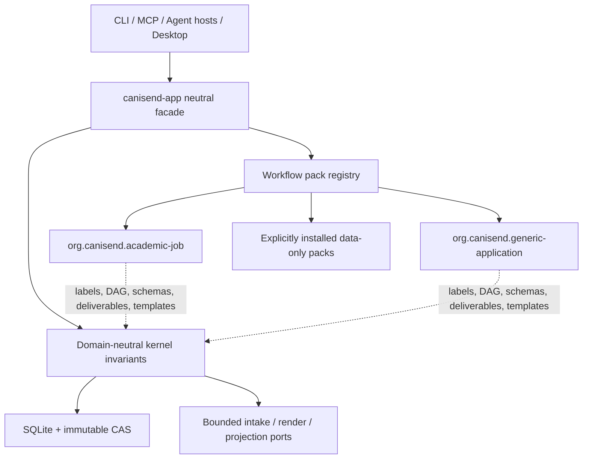

# Generic framework transition plan

**Status:** In progress — supporting

**Parent authority:** [CanISend 1.0 delivery roadmap](2026-07-25-1.0-release-roadmap.md), M0, M1,
M2, and M3

**Decision:** [ADR-RN-0018](../../architecture/rust-native/decisions/0018-adopt-a-generic-evidence-application-framework.md)

**Created:** 2026-08-02

**Exit:** Workspace v2 academic data migrates safely to Workspace v3; the academic and generic
workflow packs complete the same kernel-owned end-to-end suite through CLI, MCP, Agent hosts, and
desktop; Alpha.7 is publicly qualified and ready to become the Beta contract baseline.

This is a bounded implementation plan, not a release or stage authority. If it conflicts with the
parent roadmap, the parent controls scheduling and this plan must be corrected.

## 1. Outcome

CanISend becomes a domain-neutral framework for evidence-bound applications rather than a core
academic-job model with renamed labels.

The completed 1.0 architecture has:

- one kernel for consent, evidence, revision, invalidation, workflow, review, export, recovery,
  and audit invariants;
- a validated `canisend.workflow-pack/v1` contract;
- an `org.canisend.academic-job` pack preserving the existing academic journey;
- an `org.canisend.generic-application` pack supporting user-defined requirements and
  deliverables without academic-only fields;
- neutral Workspace v3 and Agent v3 contracts;
- bounded compatibility for Workspace v2, Agent v2, `job` CLI commands, and existing managed
  projections; and
- the same semantic and failure-path tests for every pack and adapter.

## 2. Audit baseline and coupling map

The 2026-08-02 source audit found that generic behavior must cross contracts, persistence, and all
adapters. A source scan reported:

| Coupling | Files in active product/contracts/resources scope | Migration implication |
|---|---:|---|
| `job_id`, `JobId`, or `jobs/JOB_ID` | 82 | Public IDs, storage queries, tasks, projections, and adapters need a versioned boundary |
| Fixed research/teaching statement kinds | 48 | Deliverable kinds must become pack-owned stable IDs |
| Fixed `WorkflowStage` enum | 11 | Workflow execution must consume a validated pack DAG |
| Academic/faculty/jobs.ac.uk vocabulary | 18 | Domain content moves to the academic pack or an optional adapter |

The highest concentrations are embedded resources, `canisend-store`, `canisend-app`, desktop
commands, store migrations, contracts, and CLI tests. This is why a vocabulary-only UI change is
out of scope: it would preserve the wrong public ontology.

### 2.1 Current-to-target model

| Current concept | Canonical v3 concept | Compatibility rule |
|---|---|---|
| `Job` | `Opportunity` metadata plus an `Application` aggregate | A migrated v2 Job creates one Opportunity and one Application |
| `job_id` | `application_id`; `opportunity_id` where target identity is required | v2 adapters map only for the academic pack |
| `Criterion` | `Requirement` | Academic pack retains “criterion” as a localized label |
| `ApplicationPlan` | `Plan` | Decision vocabulary is pack-provided; kernel owns state and revisions |
| `DocumentKind` enum | `DeliverableKindId` | The four enum values map to academic pack IDs |
| `Document` | `Deliverable` | “Document” may remain a media subtype, not the aggregate noun |
| fixed `WorkflowStage` enum | `StageId` plus pack DAG | Existing ten stages become academic pack stage IDs |
| `jobs/JOB_ID/` | `applications/APPLICATION_ID/` | Existing projections remain recognized and read-only until explicit reconcile/copy |
| academic profile fields | pack Evidence schema | Shared identity/contact fields stay kernel-neutral only when used by both packs |
| jobs.ac.uk/Greenhouse/Lever discovery | optional Opportunity-source adapters | Packs reference registered adapters; they do not execute network code |

### 2.2 Concepts that remain kernel-owned

The following are not extension points: safe IDs and paths, content hashes, UTC timestamps,
revision references, immutable blobs, audit events, consent receipts, task leases, approval
tokens, Application lifecycle, dependency invalidation, backup/restore, projection ownership,
bounded parsing, renderer isolation, no-submission semantics, and release-integrity evidence.

## 3. Target architecture

The kernel loads a validated, immutable pack snapshot before it evaluates an Application. The
snapshot supplies domain policy; the kernel supplies enforcement. Pack resources never receive a
database handle, filesystem authority, network authority, provider credential, or executable
hook.

## 4. Pack v1 contract

### 4.1 Required manifest sections

| Section | Required content | Validation |
|---|---|---|
| identity | ID, version, publisher, schema, digest | Stable ID grammar, SemVer, digest match |
| compatibility | kernel, Workspace, Agent ranges | Unsupported ranges fail closed before mutation |
| vocabulary | localized singular/plural labels and descriptions | Required fallback locale and bounded strings |
| application | Opportunity/Application metadata fields | Typed field kinds, safe defaults, no executable expressions |
| workflow | stable stages, dependencies, outputs, execution modes | Unique IDs, acyclic graph, reachable terminal state |
| requirements | categories, priorities, confirmation rules | Stable IDs and kernel-approved field constraints |
| evidence | categories, fields, source/confirmation policy | Cannot disable provenance or user confirmation |
| deliverables | kinds, cardinality, order, templates, renderers | Registered renderer/template references and safe paths |
| validation | kernel validator IDs and pack parameters | Unknown validator rejected; pack may only strengthen gates |
| resources | prompts, templates, examples, translations | Per-resource digest, type and size bounds |
| migration | compatible predecessor and declarative mappings | No code; previewed, deterministic, failure-atomic |

### 4.2 Pack lifecycle

1. Discover built-in or explicitly selected external pack.
2. Parse within size/depth/count limits.
3. Validate schema, IDs, graph, compatibility, capability references, safe paths, and digests.
4. Store an immutable pack snapshot or reference its verified built-in digest.
5. Create an Application bound to that exact snapshot.
6. On update, show a semantic diff and migration preview.
7. Back up, approve, migrate atomically, audit, and revalidate downstream state.
8. Keep the prior snapshot available for audit and rollback/export interpretation.

## 5. Compatibility and migration design

### 5.1 Workspace v2 to v3

The migration must be append-only or otherwise failure-atomic and must:

- refuse to run when integrity checks fail;
- produce a body-free dry-run report containing counts, versions, pack identity, required space,
  projection conflicts, and rollback boundary;
- create or require a verified pre-migration backup;
- map every v2 Job to one Opportunity and one Application under the academic pack;
- map all current stages, artifacts, documents, revisions, dependencies, review findings, package
  records, renders, tasks, approvals, audit events, and discovery promotion links;
- bind derived artifacts to the academic pack digest without changing their content hashes;
- commit the schema/data change in one transaction where SQLite authority is involved;
- leave existing external projections untouched;
- run full integrity, referenced-blob, dependency, and semantic checks before success; and
- fail closed for an old binary opening Workspace v3 with a stable downgrade/restore message.

No fixture may be “migrated” by regenerating expected output from new code. Golden v2 fixtures
remain immutable inputs and their expected v3 semantic inventory is reviewed separately.

### 5.2 Agent and CLI compatibility

- Agent v3 is the canonical neutral protocol and uses `application_id`, `requirement`,
  `deliverable`, pack-qualified stage IDs, and pack identity.
- Agent v2 is a compatibility adapter for academic-pack Applications only. It cannot create or
  mutate a generic-pack Application.
- `job` CLI commands become documented aliases for academic-pack operations. New documentation
  and examples use `application` and `opportunity` commands.
- Every compatibility response identifies its deprecated surface and canonical v3 operation in a
  machine-readable field; ordinary JSON data remains deterministic.
- Unsupported pack/surface combinations fail without mutation and with a stable remediation.

### 5.3 Projection compatibility

The projection manager recognizes both path generations. It must never infer that an unmanaged
`jobs/` or `applications/` directory belongs to CanISend. A migration may register the old path as
a legacy managed projection, but moving, replacing, or copying it requires the existing explicit
reconcile choices and preserves user edits.

## 6. Work packages

Each item becomes a linked work item before implementation. State and evidence remain governed by
the parent roadmap.

### GF0 — Scope and contract decision

| ID | Priority | Deliverable | Verification |
|---|---|---|---|
| GF0-ADR-001 | P0 | Accept ADR-RN-0018 and update active product wording | ADR, roadmap, README, repository instructions, and plan registry agree |
| GF0-AUDIT-001 | P0 | Generate a checked coupling inventory by crate/surface/schema/resource | Inventory covers Rust, SQL, JSON Schema, resources, UI, guides, tests, and projections |
| GF0-NAME-001 | P0 | Freeze v3 neutral nouns and ID grammar | Naming review finds no academic-only noun in new kernel contracts |
| GF0-BOUNDARY-001 | P0 | Classify every current field/operation as kernel, academic pack, optional adapter, compatibility, or removal | No implementation task hides an unresolved ownership decision |

### GF1 — Pack contract and registry

| ID | Priority | Deliverable | Verification |
|---|---|---|---|
| GF1-SCHEMA-001 | P0 | Add typed `canisend.workflow-pack/v1` manifest and generated schema | Round-trip, unknown-field, limit, invalid-ID, digest, and compatibility tests pass |
| GF1-DAG-001 | P0 | Add validated dynamic stage graph and pack-qualified `StageId` | Duplicate, missing dependency, cycle, unreachable terminal, invalid mode/output, and oversized graph fixtures fail |
| GF1-DELIV-001 | P0 | Replace fixed core `DocumentKind` with pack-qualified `DeliverableKindId` in v3 | Two packs with disjoint kinds complete plan/draft/review/package/render tests |
| GF1-REG-001 | P0 | Add built-in/external pack registry and immutable snapshot binding | Pack substitution, digest mismatch, incompatible range, and silent-upgrade tests fail closed |
| GF1-TRUST-001 | P0 | Enforce data-only pack resources and registered capability references | Executable/resource escape, unsafe path, unknown adapter/renderer, and oversized resource fixtures fail |
| GF1-I18N-001 | P1 | Resolve pack vocabulary through the existing English/Chinese localization layer | Missing fallback, placeholder mismatch, bidi/Unicode edge, and locale restart tests pass |

Repository evidence currently available:

| Task | Evidence | Remaining state boundary |
|---|---|---|
| GF1-SCHEMA-001 | [Workflow-pack v1 contract](../../contracts/workflow-pack-v1.md) and [implementation record](../../notes/rust-native/2026-08-02-gf1-workflow-pack-contract.md) | Create/link its work item and inspect the committed focused/source-gate evidence before marking Verified |
| GF1-REG-001 | [Verified registry implementation record](../../notes/rust-native/2026-08-02-gf1-workflow-pack-registry.md) and the shared [workflow-pack v1 contract](../../contracts/workflow-pack-v1.md) | Add explicit bounded loading and persistent Workspace snapshot binding; create/link its work item and inspect committed evidence before marking Verified |
| GF1-DAG-001 | [Pack stage-graph implementation record](../../notes/rust-native/2026-08-02-gf1-workflow-pack-stage-graph.md) and the shared [workflow-pack v1 contract](../../contracts/workflow-pack-v1.md) | Bind the graph to Workspace v3 execution/invalidation; create/link its work item and inspect committed evidence before marking Verified |
| GF1-DELIV-001 | [Pack Deliverable catalog implementation record](../../notes/rust-native/2026-08-02-gf1-workflow-pack-deliverable-catalog.md) and the shared [workflow-pack v1 contract](../../contracts/workflow-pack-v1.md) | Bind catalog Kinds to neutral v3 planning/drafting/review/render persistence and academic compatibility; create/link its work item and inspect committed evidence before marking Verified |
| GF1-TRUST-001 | [Pack byte trust-boundary implementation record](../../notes/rust-native/2026-08-02-gf1-workflow-pack-trust.md) and the shared [workflow-pack v1 contract](../../contracts/workflow-pack-v1.md) | Add symlink-safe explicit installation and renderer virtual-filesystem isolation; create/link its work item and inspect committed evidence before marking Verified |
| GF1-I18N-001 | [Pack localization implementation record](../../notes/rust-native/2026-08-02-gf1-workflow-pack-localization.md) and the shared [workflow-pack v1 contract](../../contracts/workflow-pack-v1.md) | Bind verified Pack vocabulary/labels into Workspace v3 read models and the desktop presentation layer; create/link its work item and inspect committed evidence before marking Verified |

### GF2 — Neutral kernel and Workspace v3

| ID | Priority | Deliverable | Verification |
|---|---|---|---|
| GF2-MODEL-001 | P0 | Introduce neutral Opportunity, Application, Requirement, Plan, Deliverable, and pack-binding contracts | Generated v3 schemas contain no academic-only required field |
| GF2-STORE-001 | P0 | Add Workspace v3 persistence and repositories behind neutral app services | Transaction, revision, stale propagation, concurrent completion, and audit tests pass |
| GF2-MIG-001 | P0 | Implement dry-run-first, backup-backed Workspace v2→v3 migration | Golden v2 fixtures migrate with identical semantic inventory and referenced blobs |
| GF2-MIG-002 | P0 | Add failure injection and old-binary/downgrade behavior | Interruption at every write boundary leaves v2 recoverable or v3 valid, never mixed authority |
| GF2-PROJ-001 | P0 | Add `applications/APPLICATION_ID/` projections and legacy recognition | Edited/unmanaged/symlink/conflict/copy/replace/repair paths preserve current safety invariants |
| GF2-INVALID-001 | P0 | Bind dependencies and stale state to pack ID/version/digest | Pack migration invalidates only affected downstream outputs |

Repository evidence currently available:

| Task | Evidence | Remaining state boundary |
|---|---|---|
| GF2-MODEL-001 | [Application-model v3 contract](../../contracts/application-model-v3.md) and [implementation record](../../notes/rust-native/2026-08-02-gf2-application-model.md) | Repository and v2 migration binding are implemented; add Pack invalidation and canonical Agent v3 operations, then create/link its work item and inspect committed evidence before marking Verified |
| GF2-STORE-001 | [Workspace v3 storage contract](../../contracts/workspace-v3-storage.md) and [implementation record](../../notes/rust-native/2026-08-02-gf2-workspace-v3-store.md) | Authority activation is restricted to GF2-MIG-001 and projections are implemented; add Pack-migration invalidation and canonical Agent v3 operations, then create/link its work item and inspect committed evidence before marking Verified |
| GF2-MIG-001 | [Workspace migration contract](../../contracts/workspace-v2-to-v3-migration.md), [migration implementation record](../../notes/rust-native/2026-08-02-gf2-workspace-v3-migration.md), and [academic Pack contract](../../contracts/academic-job-workflow-pack-v1.md) | Built-in Pack consumption and source failure qualification are complete; create/link its work item and inspect committed evidence before marking Verified |
| GF2-MIG-002 | [Workspace migration contract](../../contracts/workspace-v2-to-v3-migration.md), [failure qualification record](../../notes/rust-native/2026-08-02-gf2-workspace-v3-failure-qualification.md), and [recovery matrix](../../recovery/interruption-matrix.md) | Source implementation and focused fault matrix are complete; run exact old/new release-binary lifecycle qualification, create/link its work item, and inspect committed evidence before marking Verified |
| GF2-PROJ-001 | [Application projection v3 contract](../../contracts/application-projections-v3.md), [implementation record](../../notes/rust-native/2026-08-02-gf2-application-projections.md), and [recovery matrix](../../recovery/interruption-matrix.md) | Store implementation and focused recovery matrix are complete; expose Pack-driven operations through shared surfaces, create/link its work item, and inspect committed source/native evidence before marking Verified |
| GF2-INVALID-001 | [Application Pack migration v3 contract](../../contracts/application-pack-migration-v3.md), [implementation record](../../notes/rust-native/2026-08-02-gf2-pack-invalidation.md), and [recovery matrix](../../recovery/interruption-matrix.md) | Store implementation and focused dependency/atomicity matrix are complete; add installed-Pack registry integration and shared surfaces, create/link its work item, and inspect committed source/native evidence before marking Verified |

### GF3 — Extract the academic reference pack

| ID | Priority | Deliverable | Verification |
|---|---|---|---|
| GF3-PACK-001 | P0 | Move academic vocabulary, ten stages, profile categories, four deliverables, templates, prompts, and validators into `org.canisend.academic-job` | Current canonical academic fixtures pass through the pack kernel without semantic drift |
| GF3-ADAPTER-001 | P1 | Register jobs.ac.uk and job-board adapters as optional academic/professional Opportunity sources | Destination policy, limits, provenance, refresh, and promotion regressions pass |
| GF3-COMPAT-001 | P0 | Implement bounded Agent v2 and `job` CLI compatibility | All current v2 golden fixtures pass for the academic pack and fail closed for generic packs |
| GF3-UI-001 | P0 | Render academic labels and forms from pack metadata | Principal desktop journey remains English/Chinese accessible and no core UI branch hard-codes the four kinds |

Repository evidence currently available:

| Task | Evidence | Remaining state boundary |
|---|---|---|
| GF3-PACK-001 | [Academic reference Pack contract](../../contracts/academic-job-workflow-pack-v1.md), [implementation record](../../notes/rust-native/2026-08-02-gf3-academic-reference-pack.md), and [workflow-pack v1 contract](../../contracts/workflow-pack-v1.md) | Declarative bundle, canonical parity, and built-in migration consumption are implemented; complete GF3-ADAPTER/COMPAT/UI, create/link its work item, and inspect committed source evidence before marking Verified |

### GF4 — Build the generic starter pack

| ID | Priority | Deliverable | Verification |
|---|---|---|---|
| GF4-PACK-001 | P0 | Add `org.canisend.generic-application` with configurable metadata, requirements, evidence, and deliverable kinds | Pack contains no academic-only required field or label |
| GF4-FLOW-001 | P0 | Complete intake→requirements→evidence→match→plan→deliverables→review→package→render/export | A local fixture completes with at least two custom deliverable kinds |
| GF4-UI-001 | P0 | Add pack selection and generic configuration to CLI and desktop | Keyboard/screen-reader flows create, resume, migrate, and export a generic Application |
| GF4-AGENT-001 | P0 | Expose generic context and operations through Agent v3/MCP | Codex and Claude can run new/resume/approval/recovery without academic assumptions |
| GF4-EXAMPLE-001 | P1 | Ship synthetic examples for a grant, admission, tender/proposal, and professional job | Examples validate offline and contain no real personal/application body |

### GF5 — Surface parity and documentation

| ID | Priority | Deliverable | Verification |
|---|---|---|---|
| GF5-OP-001 | P0 | Register canonical v3 leaves and explicit v2 compatibility mappings | Missing, duplicate, falsely shared, or pack-incompatible operations fail source gate |
| GF5-PARITY-001 | P0 | Run semantic outcomes through CLI, MCP, and desktop for both packs | Success, stale, replay, wrong pack/context, no-mutation, and recovery matrices agree |
| GF5-DOC-001 | P0 | Rewrite quick start, Agent, desktop, privacy, backup, upgrade, and limitations guides | A new user can choose either pack and sees the v2→v3 boundary before mutation |
| GF5-SDK-001 | P1 | Publish a workflow-pack authoring guide, schema, validator command, and safe examples | A data-only external sample pack validates and completes the offline fixture suite |

### GF6 — Dual-pack qualification

| ID | Priority | Deliverable | Verification |
|---|---|---|---|
| GF6-ALPHA6-001 | P0 | Publish Alpha.6 as the framework-kernel and migration checkpoint | Exact artifacts prove v2 migration, academic parity, pack validation, backup, and rollback |
| GF6-ALPHA7-001 | P0 | Publish Alpha.7 with the generic pack and canonical v3 surfaces | Exact artifacts prove both packs through every supported adapter |
| GF6-DOGFOOD-001 | P0 | Run real Codex and Claude new/resume/approval/recovery for both packs | Body-free records bind host, pack, source, exact artifact, and outcome |
| GF6-USER-001 | P0 | Validate academic and non-academic flows with target users | Parent M3 thresholds pass and at least three non-academic scenario families are represented |
| GF6-FREEZE-001 | P0 | Freeze v3, pack v1, both built-in pack digests, operations, schemas, migrations, and bundle layout | Beta baseline is derived from the qualified Alpha.7, not Alpha.5/6 history |

## 7. Test matrix

Every row is required for the academic and generic built-in packs unless explicitly marked
compatibility-only.

| Layer | Positive fixture | Negative/failure fixture |
|---|---|---|
| pack parser | valid embedded and external data-only pack | malformed JSON, unknown field, depth/count/size limit, unsafe path |
| graph | valid linear and branched DAG | cycle, duplicate/missing ID, unreachable terminal, illegal output |
| pack binding | create/reopen with exact digest | substitution, missing pack, incompatible version, silent update |
| migration | v2 academic Workspace to v3 | low disk, DB busy, interruption, corrupt blob, invalid v2, retry |
| workflow | complete and scoped rerun | wrong stage, stale input, cross-pack ID, invalid transition |
| evidence | confirmed claim with exact source span | invented ID, excluded/unconfirmed evidence, changed source |
| deliverables | different kind sets and cardinalities | unknown kind, missing required kind, duplicate singleton |
| adapters | same semantic outcome on CLI/MCP/desktop | preview expiry/replay, wrong context, transient/permanent failure |
| projections | create, inspect, reconcile, copy, repair | user edit, unmanaged path, symlink, partial write, digest mismatch |
| recovery | backup/restore and post-migration restore | incomplete archive, missing blob, destination conflict |
| compatibility | Agent v2 and `job` CLI on academic pack | v2 request against generic pack, old binary against v3 |
| privacy | explicit private read/export | no consent, body-bearing diagnostic/evidence record |

## 8. Sequencing and release boundary

```mermaid
flowchart LR
    GF0["GF0: decision and inventory"] --> GF1["GF1: pack contract"]
    GF1 --> GF2["GF2: neutral kernel + v3 migration"]
    GF2 --> GF3["GF3: academic pack extraction"]
    GF3 --> A6["Alpha.6: migration checkpoint"]
    A6 --> GF4["GF4: generic starter pack"]
    GF4 --> GF5["GF5: v3 adapter parity and docs"]
    GF5 --> A7["Alpha.7: dual-pack checkpoint"]
    A7 --> GF6["GF6: Agent and user validation"]
    GF6 --> BETA["Beta.1 contract freeze"]
```

GF1 and the existing approval/architecture safety work may be implemented in parallel only when
they do not edit the same public contract. GF2 must land before GF3 so the academic pack proves the
new kernel instead of becoming a second hard-coded path. GF4 must not add a special-case generic
engine. Beta preparation cannot begin from Alpha.6.

## 9. Stop and rollback rules

- Stop if a proposed pack field can weaken a kernel invariant; move the rule into the kernel or
  reject the extension point.
- Stop if migration cannot bind every current artifact and audit record deterministically; add an
  explicit compatibility record rather than guessing.
- Stop if academic fixtures pass only through a legacy business path; the reference pack must use
  the same kernel as the generic pack.
- Stop if a third-party pack requires executable code for 1.0; defer the capability to a separate
  post-1.0 ADR.
- Roll back an unshipped code slice by reverting it. Never rewrite tagged v2 schemas, migrations,
  Alpha evidence, or user projections.
- If a shipped migration has a defect, disable automatic migration, preserve the verified backup,
  publish recovery guidance, and issue a patch from exact qualified bytes.

## 10. Completion evidence

This plan is complete only when:

- the parent roadmap marks GF0–GF6 deliverables Verified through linked work items;
- generated schemas and embedded pack digests are committed and source-gated;
- immutable Workspace v2 golden fixtures migrate and verify on every supported CLI target;
- both built-in packs pass the same kernel, adapter, consent, recovery, and release suites;
- existing academic data and projections are preserved without silent reinterpretation;
- real-provider and target-user evidence meets the parent scorecard;
- Alpha.7 public bytes are independently reverified; and
- Beta freeze binds Agent v3, Workspace v3, workflow-pack v1, both built-in packs, operations,
  resources, migrations, and package layout.
