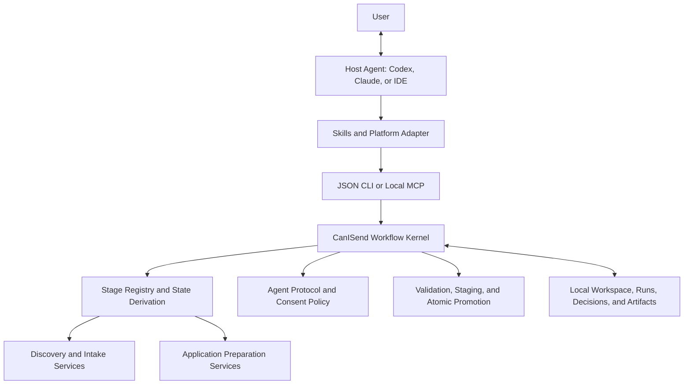
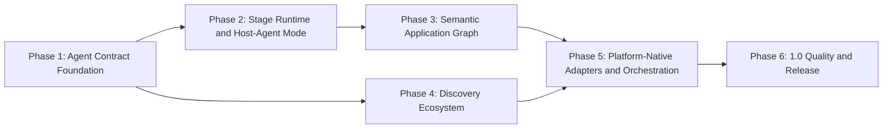

# Agent-Native Application Workflow Roadmap

**Status:** Active — Phase 1 implementation and local exit review complete; remote candidate CI pending

**Date:** 2026-07-10

**Current product version:** 0.2.0 (`Development Status :: 3 - Alpha`)

**Roadmap horizon:** 0.3 alpha to 1.0

## Executive Decision

CanISend will evolve from a local-first application-preparation CLI into an agent-native workflow runtime.

The product remains local-first and file-backed, but the primary user experience is expected to happen inside a host
agent such as Codex, Claude, or an IDE agent. CanISend owns deterministic operations, durable state, contracts,
validation, privacy boundaries, provenance, and recovery. The host agent owns natural-language interaction, semantic
reasoning, and writing.

The recommended architecture is contract-first and hybrid:

1. keep the Python service layer and CLI as the portable source of truth;
2. add a versioned machine-readable agent protocol;
3. implement a resumable stage runtime and a first-class host-agent execution mode;
4. expose the same service layer through skills, CLI adapters, and later a thin local MCP server;
5. keep provider/API-backed execution optional rather than making it the primary integration model.

This roadmap retains the discovery and quality work in
`2026-07-09-discovery-and-workflow-v2-design.md`, but changes the delivery order. Agent contract and workflow-state work
move ahead of additional source adapters because every later feature depends on reliable cross-platform state and
machine-readable outcomes.

## Current Baseline

The current repository already provides a substantial application-preparation core:

- private workspace creation, updating, diagnostics, and packaged resource distribution;
- jobs.ac.uk compatibility plus generic RSS 1.0, RSS 2.0, and Atom ingestion;
- bounded one-URL HTML/PDF import and local `.pdf`, `.md`, and `.txt` advert import;
- Typst-first profile evidence extraction with item-level citations;
- deterministic and opt-in provider-backed parsing and drafting;
- fit reports, cover-letter drafts, CV-tailoring notes, criteria checklists, package output, and Typst sources;
- APP-Q1 through APP-Q4 package checks and machine-readable gate reports;
- Typst regeneration protection for user-edited sources;
- Codex, Claude, and general agent skills plus a local multi-CLI orchestrator;
- 295 passing tests at the time this roadmap was written.

The main maturity gap is not missing document generation. It is the absence of a stable agent runtime contract:

- most CLI output is human-readable text;
- the pipeline is monolithic and cannot resume or selectively rerun;
- user decisions are stored in regenerable prose rather than durable structured state;
- host agents must infer phase, privacy requirements, and next action from files;
- agent outputs are not staged, validated, and atomically promoted through a common protocol;
- orchestrator write scopes and declared outputs are not yet technical enforcement boundaries.

## Product Definition

### Primary Experience

A user should be able to say the following in any supported host platform:

> Help me prepare this application. Here is the job link or PDF.

The host agent should then be able to:

1. inspect the local CanISend workspace without exposing private content;
2. import the supplied source and receive a structured result;
3. ask only for genuinely missing user decisions;
4. obtain the next workflow TaskSpec;
5. use the host model to produce a candidate result without a nested model call;
6. ask CanISend to validate and promote that result;
7. resume the same job from another platform using only the workspace state;
8. stop at a reviewed package that the user submits manually.

### Core Product Boundary

CanISend prepares and verifies application materials. It does not:

- create accounts;
- fill application portals;
- upload documents;
- submit applications;
- answer sensitive declarations;
- bypass access controls;
- crawl arbitrary search-result pages;
- fabricate applicant evidence or employer requirements.

## Architecture Principles

1. **Host-agent first:** Codex or Claude should normally provide the model already present in the user session.
2. **CLI and files remain portable:** no supported platform is allowed to become the only source of truth.
3. **Contracts before adapters:** MCP, provider commands, and job-board adapters wrap stable service contracts.
4. **Candidates before promotion:** agent-generated content never writes directly to authoritative artifacts.
5. **State outside chat:** workflow progress, decisions, hashes, and approvals live in the workspace.
6. **Evidence before prose:** structured criterion matches and claim receipts precede application-facing drafting.
7. **Explicit privacy:** every artifact and task has a derived privacy tier and clear consent requirements.
8. **Untrusted sources remain data:** adverts, PDFs, feeds, emails, and webpages cannot issue agent instructions.
9. **Selective recomputation:** changed inputs invalidate only their stage and dependent stages.
10. **Manual submission:** `ready_for_manual_submission` is the final possible state inside CanISend.

## Target Architecture



The CLI, MCP server, and platform-specific adapters must call the same Python service layer. Business rules must not be
reimplemented in MCP handlers, skill prose, or provider adapters.

## Execution Modes

| Mode | Reasoning executor | Intended use | Provider exposure |
|---|---|---|---|
| `deterministic` | CanISend code | Local extraction, validation, baseline generation | None |
| `host-agent` | Current Codex/Claude/IDE agent | Primary interactive semantic and writing workflow | Current host platform |
| `command-provider` | Configured local agent CLI | Headless or batch execution | Selected CLI/provider |
| `api-provider` | Configured model endpoint | Optional automation and integrations | Selected API provider |

All four modes eventually consume the same TaskSpec and return the same TaskResult contract. `host-agent` is the
preferred interactive mode because it avoids nested model calls and preserves the platform conversation.

## Canonical Application Workflow

| Stage | Main inputs | Authoritative outputs | Exit gate |
|---|---|---|---|
| Discovery | Query, feed, API, connector, or imported lead batch | Versioned leads and provenance | Source and identity recorded |
| Intake | Selected lead, URL, PDF, Markdown, or text | `job.yaml`, `job_advert.md` | Full advert or accepted limitation recorded |
| Evidence | Profile sources | `profile/generated/*.evidence.md` | Evidence exists and is current |
| Parse | Complete advert | `parsed_job.json` | Required fields, source spans, and unknowns validated |
| Confirm | Parsed advert and user input | Confirmed metadata and criteria decisions | Required corrections resolved |
| Match | Criteria and profile evidence | `criterion_matches.json` | Every essential criterion classified |
| Decide | Match report, deadline, risk, and effort | Apply/hold/skip decision | User decision recorded |
| Brief | User preferences and match strategy | `application_brief.yaml` | Language, motivation, emphasis, and exclusions confirmed |
| Draft | Matches, brief, evidence, required-document list | Document candidates | Citations resolve and gaps remain explicit |
| Review | Draft candidates and claims | `review_findings.json`, claim receipts | Blockers resolved or explicitly accepted |
| Package | Reviewed materials | Markdown and Typst package | Editable sources and manifest consistent |
| Verify | Current package and run provenance | APP-Q gate report | No unresolved readiness blockers |
| Render | Verified Typst sources | Optional PDFs | Render matches current source hashes |
| Submit | User-controlled portal work | Outside CanISend | Always manual |

Evidence refresh and advert parsing may run independently after intake. Document-specific drafts may run in parallel
after Match and Brief, but cross-document review and package promotion remain serialized.

## Target Workspace Contracts

The physical layout will be finalized by an architecture decision in Phase 2. The logical contract requires the
following durable artifacts:

```text
jobs/<job-id>/
  job.yaml
  job_advert.md
  parsed_job.json
  criterion_matches.json
  application_brief.yaml
  claims.json
  review_findings.json
  workflow/
    state.json
    runs/<run-id>/
      manifest.json
      tasks/<task-id>/
      candidates/
      validation/
  typst/
```

`job.yaml` keeps human-readable metadata and a small additive workflow summary. Detailed attempts, hashes, platform
metadata, and candidates belong under `workflow/runs/` so routine status inspection does not rewrite the main metadata
file.

### Artifact Ownership

| Ownership | Examples | Rewrite policy |
|---|---|---|
| User-owned | Profile sources, `application_brief.yaml`, explicit approvals | Never regenerated silently |
| Source-owned | Imported raw-source snapshot and source provenance | Immutable or versioned |
| User/source shared | Reviewable `job_advert.md` | Explicit edit or versioned re-import; never silent replacement |
| Core-owned | Workflow state, run manifests, hashes, gate reports | Written only by validated services |
| Agent candidate | Parsed corrections, match review, draft revisions | Staged until validated and accepted |
| Generated editable | Typst and application-facing drafts | Protected baseline and candidate merge |

## Protocol Layers

### Command Response Envelope

Every agent-facing operation will return a versioned envelope in JSON mode:

```json
{
  "protocol": "canisend.agent/v1",
  "schema_version": "1.0.0",
  "request_id": "req_...",
  "operation": "job.intake",
  "ok": true,
  "job": {},
  "artifacts": [],
  "missing_fields": [],
  "required_consents": [],
  "warnings": [],
  "blockers": [],
  "next_actions": []
}
```

JSON output contains safe metadata, relative paths, privacy tiers, and hashes by default. It does not include full CV,
advert, reference, or application-package text.

Producer models reject undeclared fields so implementation mistakes cannot leak arbitrary data. Experimental scalar
metadata uses a namespaced `extensions` mapping. A new core field requires a response-schema revision; breaking
semantic changes require a new major protocol value and capability negotiation.

### Host-Agent Task Contract

CanISend prepares a TaskSpec that declares:

- operation and stage;
- immutable input references and hashes;
- allowed reads and writes;
- derived privacy tier and required consent;
- output schema and required citations;
- validation gates and acceptance criteria.

The host agent returns a TaskResult or writes a candidate into a task staging directory. CanISend then validates input
freshness, output schema, evidence citations, and write scope before atomic promotion.

### Run Manifest

Every mutating stage run eventually records:

- protocol and package versions;
- stage, run, task, and attempt IDs;
- executor mode, platform, adapter version, and model when known;
- prompt, template, input, output, and candidate hashes;
- consent scope and private artifact classes used;
- warnings, blockers, timings, and final disposition;
- no secrets and no unnecessary private text.

## Roadmap Dependency Graph



Phase 4 model and transport work may proceed in parallel with Phase 3 after Phase 1 freezes the shared response and
artifact conventions. Platform-native promotion and 1.0 release remain blocked on the stage runtime.

## Phase 1: Agent Contract Foundation

**Candidate milestone:** 0.3.0a1

**Phase status:** Implemented and locally accepted on 2026-07-10. Release promotion remains gated on a pushed
candidate and successful remote CI.

**Objective:** Make the existing workflow safely inspectable and callable by an agent without parsing human-oriented
terminal output.

Deliverables:

- freeze the current compatibility/discovery/quality slice as the reviewed starting point for a new version;
- introduce `canisend.agent/v1` response models and JSON schemas;
- provide machine-readable capabilities and context inspection;
- derive conservative workflow phase, readiness, missing inputs, consents, blockers, and next actions;
- add structured output to the initial agent-facing command set while preserving text defaults;
- define stable error codes and stdout/stderr behavior;
- unify skill distribution so every routed focused skill exists in initialized workspaces;
- make host-agent privacy and untrusted-source rules explicit;
- ensure dry-run operations do not contact a provider;
- add a Python 3.11, 3.12, and 3.13 CI test matrix and stable-release source guard;
- add minimum resolved-address protection to explicit agent-driven URL intake while the shared transport is pending;
- add offline contract and packaged-resource tests.

Exit criteria:

- Codex and Claude can inspect the same workspace and receive the same safe JSON context;
- no operation declared supported by the Phase 1 agent surface needs to parse a human-readable table or success
  sentence;
- JSON failure output has a stable error code and non-zero process status;
- JSON context never contains full Tier 2 private text;
- existing text-mode CLI tests and workflows remain compatible;
- focused skills referenced by the main workspace skill are actually installed;
- the full offline suite, wheel resource check, and packaged smoke test pass.

Phase 1 supports local-shell hosts: Codex CLI/App sessions with workspace command access, Claude Code, and IDE agents
that can invoke the CLI. Claude Desktop/App environments without a local command bridge are not Phase 1 targets; they
join through the experimental local MCP bridge in Phase 2.

The detailed implementation plan is
`docs/superpowers/plans/2026-07-10-agent-runtime-contract-foundation.md`.

## Phase 2: Stage Runtime And Host-Agent Mode

**Candidate milestone:** 0.4.0a1

**Objective:** Replace monolithic execution with resumable, selectively rerunnable stages and validated host-agent
candidates.

Deliverables:

- stage registry, preconditions, exit gates, and dependency graph;
- TaskSpec and TaskResult schemas;
- candidate staging, validation, diff generation, and atomic promotion;
- persistent state and immutable run manifests;
- stale-input detection, resume, retry, and selective rerun;
- first-class `host-agent` executor;
- experimental local stdio MCP exposing only inspect, context, stage-prepare, result-apply, and verification services;
- compatibility wrapper that preserves `canisend run`;
- persistent `application_brief.yaml` and approval records;
- initial host-agent vertical slice for Parse and Cover Letter preparation.

Exit criteria:

- a process can stop after any completed stage and resume without repeating valid work;
- switching host platforms requires no chat-history transfer;
- a failed stage cannot corrupt authoritative artifacts;
- changed inputs invalidate only the affected stage and its descendants;
- host-agent mode performs no second model invocation;
- all promotions are schema-, hash-, citation-, and scope-validated.
- a Claude Desktop/App client with local MCP support can run the same vertical slice without separate business logic.

## Phase 3: Semantic Application Graph

**Candidate milestone:** 0.5.0a1

**Objective:** Make criteria, evidence, claims, user decisions, and documents a shared structured graph rather than
independent Markdown generations.

Deliverables:

- versioned Pydantic models for Job, Criterion, Evidence, CriterionMatch, Claim, Artifact, and ReviewFinding;
- source spans, confidence, unknown state, and confirmation state in parsed jobs;
- durable `criterion_matches.json` with stable criterion IDs;
- claim-level evidence ledger and stronger support validation;
- deterministic, semantic, and agent-reviewed matcher strategies behind one interface;
- required-document-driven task planning;
- research, teaching, supporting, diversity, publication-list, email, and interview artifacts where required;
- cross-document consistency review and correction patches.

Exit criteria:

- every essential criterion is classified and reviewable;
- every strong application claim has a resolvable evidence receipt;
- required documents drive the plan rather than a fixed four-document bundle;
- one correction to a criterion or evidence item propagates through declared downstream dependencies;
- unsupported claims and missing required documents are executable blockers.

## Phase 4: Discovery Ecosystem

**Candidate milestone:** 0.6.0a1

**Objective:** Expand sources without introducing brittle crawling or locking source-specific details into the core
lead model.

Deliverables:

- shared bounded transport with DNS-aware public-address enforcement;
- Lead v2 with stable ID, canonical URL, source record ID, timestamps, provenance, and match reasons;
- deterministic merge, deduplication, and explainable ranking;
- atomic batch writes, conditional requests, retry/backoff, throttling, and partial-failure reports;
- local CSV, JSON, and exported email-alert ingestion;
- normalized import of host-agent search/connector results;
- documented read-only Greenhouse and Lever adapters;
- adapter conformance suite and fixture corpus;
- `--lead-id` selection while retaining legacy index compatibility.

Exit criteria:

- multiple sources refresh without duplicating stable leads;
- one failed source does not discard successful batches;
- every lead and ranking reason is explainable and traceable;
- a user-provided URL or PDF remains a peer intake path;
- no adapter performs account, application POST, upload, or private API emulation.

## Phase 5: Platform-Native Adapters And Orchestration

**Candidate milestone:** 0.7.0b1

**Objective:** Make CanISend feel native in supported platforms while keeping the protocol and service layer portable.

Deliverables:

- production packaging, onboarding, and compatibility hardening for the Phase 2 local MCP server;
- Codex, Claude, and generic CLI adapter conformance;
- capability negotiation and structured final-output extraction;
- canonical skill source and generated platform distributions;
- isolated worker staging with filesystem-diff enforcement;
- validation of every declared orchestrator output;
- automatic privacy-tier derivation from input references;
- retry, resume, cancel, and per-attempt orchestration artifacts;
- explicit handling or rejection of unsupported native subagent counts.

Exit criteria:

- CLI, MCP, Codex, and Claude expose equivalent state and next actions;
- workers cannot promote undeclared writes;
- exit code zero is insufficient without valid declared outputs;
- a Tier 2 artifact cannot be mislabeled Tier 1 to bypass consent;
- adapter versions and model metadata are recorded without secrets;
- no platform adapter duplicates workflow business rules.

## Phase 6: 1.0 Quality And Release

**Candidate milestone:** 1.0 release candidate and stable

**Objective:** Prove the workflow is safe, portable, recoverable, and useful on representative application fixtures.

Deliverables:

- anonymized or synthetic real-world advert and application fixture corpus;
- contract, migration, security, failure-injection, and cross-platform conformance tests;
- linting, formatting, typing, coverage threshold, dependency audit, and security checks;
- performance budgets for status inspection, import, validation, and selective rerun;
- workspace schema migrations and rollback documentation;
- complete installation, upgrade, privacy, recovery, and troubleshooting documentation;
- release telemetry limited to explicit opt-in, non-private diagnostics if telemetry is added at all.

Exit criteria:

- the same workspace resumes correctly across supported platforms;
- all versioned contracts have migration and compatibility tests;
- no known path exposes private content without its declared consent boundary;
- unsupported claims, stale inputs, unresolved candidates, and missing required documents block readiness;
- a failed or interrupted run can be diagnosed and safely retried;
- release packaging and clean-environment smoke tests pass on supported Python versions.

## Cross-Cutting Quality Strategy

### Privacy And Security

- Derive privacy tier from artifact type and path; do not trust task authors to self-classify it.
- Treat all imported source content as untrusted data and delimit it from agent instructions.
- Keep full Tier 2 text out of normal status, capability, and list responses.
- Pass allowlisted environment variables to workers and redact command/provider diagnostics.
- Strengthen URL transport against private DNS resolution and redirect rebinding.
- Bound PDF pages, bytes, extracted text, and optional OCR work.

### Compatibility And Migration

- Text remains the default CLI format through the alpha roadmap.
- JSON is additive through `--format json` until a future major version decides otherwise.
- Existing `job.yaml status`, lead list fields, job slugs, commands, and file names remain readable.
- New fields are optional for older workspaces and derived when absent.
- `canisend update-workspace` remains non-destructive unless overwrite is explicit.
- `update-workspace` refreshes packaged resources; a separate migration service owns user data and artifact schemas.
- Every persistent schema receives an old-workspace fixture, upgrade test, and rollback behavior in the phase that
  introduces it rather than deferring migrations until 1.0.

### Observability

- Record IDs, hashes, versions, state transitions, timings, warnings, blockers, and consent scopes.
- Do not record secrets, full private prompts, or unnecessary raw provider output in normal manifests.
- Separate stable machine JSON on stdout from diagnostics on stderr.
- Make `packaged`, `review_required`, and `ready_for_manual_submission` distinct states.

### Evaluation

The evaluation corpus should measure:

- advert extraction success and loss rate;
- metadata and essential-criterion recall;
- criterion-to-evidence classification quality;
- unsupported-claim rate, which must be zero at readiness;
- required-document recall;
- stale-state and selective-rerun correctness;
- cross-platform contract equivalence;
- recovery after interruption and provider failure.

## Required Architecture Decisions

The following ADRs should be accepted before or during the named phase:

1. **ADR-001, Phase 1:** Python service layer and file workspace remain the source of truth.
2. **ADR-002, Phase 1:** protocol version, envelope, operation names, and capability negotiation.
3. **ADR-003, Phase 1:** `ok`, gate outcome, workflow readiness, and process-exit semantics.
4. **ADR-004, Phase 1:** JSON stdout, diagnostic stderr, and Typer usage-error boundary.
5. **ADR-005, Phase 1:** relative paths, external artifacts, symlinks, privacy tier, trust, and consent scope.
6. **ADR-006, Phase 1:** text compatibility, schema evolution, migration ownership, and supported platform matrix.
7. **ADR-007, Phase 2:** physical workflow-state and immutable run-manifest layout.
8. **ADR-008, Phase 2:** TaskSpec/TaskResult and candidate-promotion semantics.
9. **ADR-009, Phase 2:** host-agent is the primary interactive model executor.
10. **ADR-010, Phase 3:** canonical criterion, match, claim, and review models.
11. **ADR-011, Phase 4:** source-adapter and Lead v2 identity/provenance contract.
12. **ADR-012, Phase 5:** MCP remains a transport adapter and cannot own business logic.

## Principal Risks

| Risk | Consequence | Mitigation |
|---|---|---|
| Adding sources before stable lead and workflow contracts | Duplicate data and hard-to-migrate adapters | Freeze contracts first |
| Treating MCP as the core | Platform coupling and duplicated logic | Wrap the Python service layer only |
| Nested model calls in host-agent sessions | Cost, privacy confusion, and inconsistent context | Prefer `host-agent` mode |
| Agent output writes directly to workspace | Corruption and undeclared changes | Candidate staging and atomic promotion |
| Prompt injection in adverts or PDFs | Source text influences tool behavior | Untrusted-data boundaries and task policy |
| Markdown used as machine state | Ambiguous recovery and lost decisions | Versioned JSON/YAML state and views |
| Overusing multiple agents | Higher cost and conflicting edits | Stage contracts first; parallelize only independent tasks |
| Coarse `packaged` status | False readiness claims | Separate generation, review, and manual-submission readiness |

## Definition Of 1.0

CanISend is ready for 1.0 when a user can begin with a URL or PDF in one supported agent platform, complete any subset
of application stages, close that platform, resume in another supported platform, and obtain the same durable state,
blockers, consents, and next actions. All promoted strong claims must remain evidence-backed, failures must be
recoverable, private data must remain within declared boundaries, and submission must remain a manual user action.
