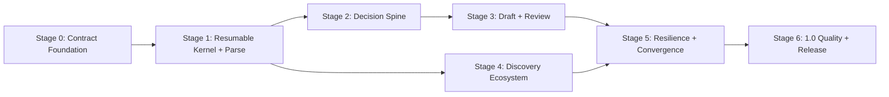

# CLI-First Workflow Optimization Execution Roadmap

**Status:** Active — Stages 1 and 2 plus Stage 3 Tasks 0–12 are locally accepted; the `0.3.0.dev2` TestPyPI
development checkpoint is accepted and Stage 3 aggregate Review completion is in progress

**Date:** 2026-07-11

**Constraints:** Keep Python, the local file workspace, the existing CLI, and current shell-capable agent hosts. Do not
make a GUI, MCP transport, hosted service, or language migration a prerequisite for improving the application
workflow.

**Roadmap horizon:** current 0.2.0 baseline to 1.0

## Executive Decision

CanISend will optimize the workflow kernel before expanding presentation surfaces or adding many source adapters.
The next delivery path is CLI-first and contract-first:

1. make one stage resumable and safe end to end;
2. structure user decisions, criteria, evidence, and claims;
3. move application drafting behind the same candidate-validation boundary;
4. expand discovery only after lead identity and provenance are stable;
5. converge the legacy pipeline on the stage runtime;
6. prove recovery, privacy, compatibility, and usefulness before 1.0.

The existing `canisend.agent/v1` envelope remains the stable host inspection boundary. New persistent workflow,
task, result, and artifact schemas evolve independently. The current `canisend run` command remains available while
its internals are incrementally moved behind the new services.

## Baseline

Stage 0, the Agent Contract Foundation, is locally accepted:

- strict `canisend.agent/v1` responses and packaged JSON Schema;
- machine-readable capabilities, workspace context, intake, job listing, diagnostics, and package checks;
- conservative phase, readiness, consent, blocker, and next-action derivation;
- privacy-safe relative or opaque artifact references;
- self-contained workspace skill installation;
- provider-free preview behavior and untrusted-source boundaries;
- Python 3.11, 3.12, and 3.13 local suites, distribution checks, and clean-wheel smoke tests.

The only open Stage 0 release gate is remote CI on a pushed candidate. It does not block isolated Stage 1 development,
but it remains required before publishing the corresponding prerelease.

## Delivery Stages

| Stage | Priority | Objective | Main deliverables | Exit decision |
|---|---:|---|---|---|
| 0. Contract Foundation | P0, locally complete | Give agents a safe, stable inspection contract | Agent envelope, context, capabilities, privacy and error semantics | Remote candidate CI passes before release |
| 1. Resumable Kernel + Parse | P0, locally complete | Prove a resumable, validated stage with one authoritative output | Registry, state, immutable runs, fingerprints, TaskSpec/TaskResult, candidate promotion, Parse CLI | Fresh sessions resume; stale/invalid candidates cannot change `parsed_job.json` |
| 2. Decision Spine | P0 | Make requirements, evidence matching, and user decisions durable | Criterion, EvidenceRef, CriterionMatch, confirmations, apply/hold/skip decision, `application_brief.yaml` | Every essential criterion and required decision is structured and reviewable |
| 3. Evidence-Backed Draft + Review | P0/P1 | Generate only evidence-supported, reviewable application material | Claim, ReviewFinding, document-scoped Cover Letter and Research Statement slices, consistency review | Strong claims resolve to evidence; unsupported claims block readiness |
| 4. Discovery Ecosystem | P1 | Expand sources on stable identity and provenance | Lead v2, merge/dedupe/ranking, CSV/JSON/email import, read-only adapters, agent-result import | Multi-source refresh is traceable, partial-failure safe, and duplicate resistant |
| 5. Resilience + Legacy Convergence | P1 | Move the remaining monolith behind the stage runtime | All stages, `run` compatibility wrapper, locking, migrations, failure injection | Any stage can resume and only true descendants become stale |
| 6. 1.0 Quality + Release | P2 | Demonstrate safe, portable, recoverable usefulness | Fixture corpus, budgets, security audit, dependency checks, recovery and privacy docs | Supported versions pass clean installs and all readiness invariants hold |

## Dependency Graph



Discovery contract work may proceed after Stage 1 while Stages 2 and 3 continue, but new adapters must not invent
their own workflow state, task execution, or promotion semantics.

## Stage 1: Resumable Kernel + Parse

**Candidate milestone:** 0.4.0a1

**Stage status:** Implemented and locally accepted on 2026-07-11. Publishing remains gated on a pushed candidate and
successful remote CI.

### Objective

Prove the complete safety and recovery loop for one single-file authoritative output:

```text
job.yaml + job_advert.md
  -> prepare Parse TaskSpec
  -> deterministic or current-host candidate
  -> TaskResult
  -> identity, freshness, scope, hash, and schema validation
  -> atomic promotion
  -> parsed_job.json + reconstructable state + immutable run evidence
```

### Deliverables

- accepted workflow-state/run and candidate-promotion ADRs;
- a validated acyclic registry for the complete logical stage graph;
- strict versioned models for workflow state, artifact fingerprints, TaskSpec, TaskResult, validation, and run
  manifests;
- `jobs/<job-id>/workflow/state.json` as a rebuildable current view;
- immutable task specifications and finalized run manifests under `workflow/runs/<run-id>/`;
- canonical Parse input projection and fingerprinting that ignores downstream metadata and profile changes;
- optimistic freshness checks and downstream invalidation;
- candidate staging separated from `parsed_job.json`;
- atomic single-file promotion with output-drift protection;
- `stage status`, `stage prepare`, `stage apply`, and deterministic `stage run` CLI operations;
- reuse of the existing Parse service and validator rather than duplicate business logic;
- compatibility tests proving the existing `run`, dry-run, text output, Typst protection, and git behavior remain
  unchanged.

### Stage Graph

The registry declares the complete logical graph. Parse became executable in Stage 1; the first Stage 2 slice adds
Confirm while later stages remain unsupported:

```text
intake -> parse -> confirm ------+
   |                   \         |
   +-----> evidence ----> match --+-> decide -> brief
                                  \                 \
                                   +----------------> draft -> review -> package -> verify -> render
```

Parse depends only on Intake. Evidence may proceed independently after Intake. Match requires current Confirm and
Evidence outputs. Unimplemented stages must be reported as unsupported; their presence in the registry is not a
capability claim.

### Parse Fingerprint

The Parse fingerprint includes:

- `job_advert.md` content hash;
- a canonical projection of title, institution, department, location, deadline, and source URL;
- parser mode and parser/schema version;
- prompt hash only for a mode that actually consumes a prompt.

It excludes status, updated timestamps, notes, writing preferences, profile evidence, run files, and downstream
artifacts. Consequently, changing the advert or relevant job metadata invalidates Parse and descendants; changing a
CV or package status does not invalidate Parse.

### Exit Criteria

- a fresh process can inspect and continue an existing prepared task without chat history;
- an unchanged deterministic Parse rerun is a no-op and preserves the authoritative file hash and modification time;
- an advert or relevant metadata change makes Parse stale;
- a profile evidence or downstream status change does not make Parse stale;
- an old TaskResult, wrong task identity, wrong candidate hash, invalid schema, unsafe path, or symlink escape is
  rejected without changing `parsed_job.json`;
- a successful Parse promotion uses one atomic replacement and records a finalized immutable run manifest;
- output drift is reported for review and is not silently overwritten;
- current-host preparation does not construct or invoke an additional model provider;
- the existing full pipeline and text CLI remain compatible;
- focused, full, distribution, and clean-wheel checks pass on the supported Python range.

### Explicit Non-Goals

- MCP, GUI, web service, or a new platform adapter;
- Rust or another language migration;
- Cover Letter or other application-facing draft stages;
- final Criterion, Claim, or ReviewFinding models;
- new discovery adapters;
- direct agent writes to authoritative outputs;
- multi-file transactional promotion;
- replacing the existing orchestrator;
- automatic portal work, uploads, or submission.

## Stage 2: Decision Spine

**Stage status:** Locally accepted on `feat/decision-spine-foundation`. ADR-009 and ADR-010 freeze semantic identity and
user-owned input boundaries. ADR-011 freezes the Evidence read and privacy boundary. The stable Criteria/Confirm,
Evidence/Match, user-owned corrections/Decision, Brief/document-plan, and guarded structured-view slices are locally
accepted with guarded candidate submission, explicit consent, cooperative compare-and-swap, recovery, compatibility,
and distribution smoke coverage. ADR-012 freezes the Brief/document-plan ownership, privacy, precondition,
source-receipt, and blocker boundary. This status does not claim a remote CI result, published package, Draft
readiness, or submission readiness.

### Deliverables

- stable Criterion and EvidenceRef identifiers;
- a run-scoped, immutable, job-local Evidence input snapshot that preserves TaskSpec v1 job-relative reads;
- a private `evidence_catalog.json` data artifact and locator-only `criterion_matches.json` projection;
- source spans, confidence, unknown, and confirmed states for parsed requirements;
- durable CriterionMatch classifications with explicit evidence gaps;
- confirmed corrections separate from regenerable prose;
- apply, hold, or skip decision with user ownership;
- `application_brief.yaml` for language, motivation, emphasis, exclusions, and document-specific choices;
- required-document planning from the advert rather than a fixed bundle.

### Accepted Evidence/Match Slice

The second Stage 2 slice is:

```text
workspace profile/generated evidence
  -> core-owned run input snapshot under the selected job
  -> evidence_catalog.json
  -> criteria.json + evidence_catalog.json
  -> criterion_matches.json
```

TaskSpec v1 remains job-relative. Evidence preparation materializes a validated, immutable snapshot under
`workflow/runs/<run-id>/inputs/`; Match then reads only current job-local Criteria and Evidence catalogs. A
workspace-level TaskSpec read scope, parent traversal, undeclared direct profile reads, and platform-specific APIs are
outside this slice.

The snapshot, Evidence candidate, and promoted Evidence catalog form a private data plane and may contain normalized
evidence bodies. Workflow state, task and run receipts, error messages, command responses, AgentResponse extensions,
and `criterion_matches.json` form the control plane and must contain only safe paths, hashes, IDs, classifications,
reason codes, and counts. They never copy evidence bodies. Match references use opaque catalog-item locators rather
than private profile paths, headings, item labels, or evidence kinds.

The private data plane deliberately duplicates normalized profile text and remains until the user removes the run or
job directory. Resumable Evidence rejects workspace-external profile roots. Typst-backed generated evidence is bound
to its current raw source through a source-hash receipt; older generated evidence without that receipt, or evidence
whose source changed, is unavailable until `extract-profile-evidence` runs again. Evidence and Match are
deterministic-only and share the existing prepare, guarded-submit, apply, cancel, stale-input, drift, terminal-claim,
and recovery runtime.

`criterion_matches.json` supplies one deterministic classification per criterion with explicit gaps and
`review_state=proposed`. It is review input, not a user-owned Decision, a confirmation of applicant claims, or a
package-readiness verdict.

### Accepted User-Owned Corrections/Decision Slice

Task 5 adds host-neutral Agent operations and CLI commands for read-only status, explicit create-if-absent
initialization, one scoped patch, and recovery. Programmatic writes require explicit consent and the current raw-byte
SHA-256/revision baseline. CanISend stores a private immutable candidate, uses one cooperative single-winner claim,
performs a final safe reread, atomically replaces one user file, and stores an immutable Tier 1 receipt. It never
normalizes existing user YAML during status or stage reruns; an explicitly consented scoped update creates a
canonical next revision and may not preserve comments. No correction/rationale body is copied into claims, receipts,
errors, ordinary output, or AgentResponse.

`confirmed_corrections.yaml` and `application_decision.yaml` remain directly editable user inputs. Unknown is not
confirmed empty, and undecided is not apply, hold, or skip. Each semantic correction patch requires current Parse
and Confirm; after one accepted patch, Confirm must rerun before another patch. A confirmed Decision keeps its value
when Criteria or Match changes, while status derives a stale/review-required basis without rewriting the YAML.

The CAS contract coordinates cooperative CanISend writers while the selected job-directory topology remains stable.
It does not linearize an ordinary editor save in the final replace window, a malicious same-user rename, remote
filesystems, multi-user collaboration, or multi-file transactions. Run status immediately before mutation and avoid
concurrent manual saves. These limitations are an explicit local-first boundary, not hidden distributed-locking
semantics.

Semantic reset/clear/withdraw does not erase immutable history. Private-mode Tier 2 candidates (0600 on POSIX) and older correction
bodies remain for audit/recovery inside the private git-ignored job. Removing private events or the whole job is a
separate retention decision that may disable recovery; automatic secure erasure and backup/snapshot deletion are not
part of this slice.

### Task 6 Brief/Document-Plan Locally Accepted

ADR-012 keeps `application_brief.yaml` user-owned Tier 2 and `required_document_plan.json` core-owned Tier 2. Brief
status is body-free; initialization, one scoped patch, and recovery reuse the explicit-consent raw-byte revision/hash
CAS boundary. A current confirmed `decision=apply` is required before Brief creation, mutation, or planning, while a
later basis change preserves the Brief and routes it to review.

The requirement-set basis is explicitly `unconfirmed`, `confirmed`, or `confirmed_empty`. An empty Parsed Job list is
never enough to infer `confirmed_empty`. Each non-empty requirement must reconcile to one complete positive advert
document member and a current source anchor; ambiguity, qualification, alternatives, truncation, or continuation
remain unconfirmed. Deterministic Brief-stage planning records current requirements and document choices, and emits
blockers for an unconfirmed set, unresolved task, `required + omit`, missing required preparation action, or orphaned
choice. Status and workflow control records carry only paths, hashes, opaque IDs, states, reason codes, and counts;
agents ask before reading either Tier 2 body. The deterministic implementation requires no configured provider,
network, MCP transport, or platform API.

Task 6 was locally accepted on 2026-07-12 after focused privacy/CAS/recovery and adversarial source tests, 919 tests on
each supported Python 3.11-3.14 interpreter, schema/resource/build/Twine checks, red-team review, and clean installed-
wheel Decision Spine smoke. Task 7 subsequently completed the guarded view migration and Stage 2 exit review.

### Task 7 Views/Compatibility Locally Accepted

Current deterministic Match now supplies the proposed fit report, criteria checklist, stable-ID essential-criteria HR
review, and matching Markdown/Typst package projections only when Match and its upstream artifacts are current,
validated, and bound to the same parsed job and workspace-configured profile. Unresolved criteria fail closed;
`confirmed_empty` remains explicit. Stale or drifted/tampered artifacts, invalid graphs, a different parse, or a
profile override use the legacy deterministic view without mixing provenance. `--llm-drafts` retains provider output.

The migration preserves all Decision Spine artifact bytes, dry-run and git behavior, protected Typst sources, direct
library calls without a workspace, and current stage status. The canonical workspace skill and compatibility mirror
are guarded by an exact-tree CI/release check.

Task 7 and Stage 2 were locally accepted on 2026-07-12 after 942 tests passed on Python 3.11, 3.12, 3.13, and the
additional Python 3.14 development interpreter, followed by schema/resource, build, Twine, mirror, privacy/recovery,
and clean installed-wheel Decision Spine/view smoke checks. No remote CI, publication, Draft readiness, or submission
result is claimed.

### Exit Criteria

- every current catalog criterion has one stable ID and a reviewable classification;
- Evidence TaskSpecs name only real job-local snapshot inputs and Match TaskSpecs name only current job-local
  Criteria and Evidence catalogs;
- private evidence bodies never appear in workflow control records, Match output, or ordinary CLI/AgentResponse
  output;
- unavailable, malformed-input failure, stale-source unavailability, and valid-empty Evidence remain distinguishable;
- Evidence and Match work deterministically through the existing CLI without a platform API or configured provider;
- all missing user decisions are explicit actions rather than inferred defaults;
- regenerating Parse or Match cannot erase an accepted user decision;
- required documents determine downstream tasks;
- corrections invalidate only declared dependent stages.

## Stage 3: Evidence-Backed Draft + Review

**Stage status:** In progress on `feat/evidence-backed-draft-foundation`. ADR-013 freezes the Claim, ReviewFinding,
Cover Letter Draft, privacy, and guarded promotion boundary; ADR-014 freezes user-owned finding dispositions,
non-waivable blockers, and derived document readiness; ADR-015 freezes configured-provider Tier 3 consent and reuse
of the same TaskSpec/candidate/validator/promotion boundary; ADR-016 freezes a read-only, hash-bound required-document
execution fan-out and explicit available/planned/unregistered capability registry; ADR-017 freezes document-scoped
`(stage, document_id)` run ownership with backward-readable 1.0 records; ADR-018 freezes a host-agent Research
Statement Draft and deterministic Review boundary with separate targets and validators; ADR-019 freezes stable
document selection plus independent Cover Letter and Research Statement disposition/CAS/readiness namespaces;
ADR-020 freezes a reviewed, standalone Research Statement compatibility projection without expanding package
readiness. The Cover Letter and Research Statement Draft/Review/disposition/readiness slices are locally accepted
with strict schemas, guarded promotion, fail-closed document selection, cross-version local tests, and clean-wheel
smoke. Both are available guarded executors with per-document readiness. Cover Letter keeps package-integrated
compatibility views; a reviewed Research Statement has standalone Markdown/Typst views only. Broader cross-document
Review, remote CI, and aggregate package readiness remain.

**Release milestones:** `0.3.0.dev2` was published to TestPyPI from the Task 12 baseline (`0.3.0.dev1` is retained as
a pre-upload failed CI candidate); publish `0.3.0b1` to TestPyPI and PyPI only after Tasks 13–15 are accepted. See
`docs/superpowers/plans/2026-07-14-stage3-completion-and-release.md` for the executable plan.

### Deliverables

- Claim and ReviewFinding schemas;
- claim-level evidence receipts and support strength;
- Cover Letter as the first application-facing candidate/promotion/readiness slice;
- Research Statement as a second host-agent Draft, deterministic Review, disposition, and per-document readiness
  slice with independent output/mutation ownership and a reviewed standalone compatibility projection;
- document-specific plans for research, teaching, supporting, diversity, publication, email, and interview artifacts;
- cross-document consistency review and structured correction patches;
- package readiness based on promoted, reviewed artifacts only.

### Exit Criteria

- every strong claim resolves to current evidence;
- unsupported claims and contradictory facts are executable blockers;
- a draft candidate cannot alter user-owned or authoritative files before validation;
- the same application brief produces consistent constraints across documents;
- missing required documents prevent readiness.

## Stage 4: Discovery Ecosystem

### Deliverables

- Lead v2 with stable identity, canonical URL, source record ID, timestamps, provenance, and match reasons;
- deterministic merge, dedupe, and explainable ranking;
- atomic batches with conditional requests, retry/backoff, throttling, and partial-failure reports;
- local CSV, JSON, and exported email-alert ingestion;
- normalized host-agent search-result import;
- documented read-only Greenhouse and Lever adapters after adapter conformance fixtures exist;
- `--lead-id` selection while retaining legacy index compatibility.

### Exit Criteria

- repeated multi-source refresh does not duplicate stable leads;
- one failed source does not discard successful source batches;
- ranking and exclusion reasons remain inspectable;
- a supplied URL or PDF remains a peer intake path;
- adapters never perform account, upload, portal, or private API behavior.

## Stage 5: Resilience + Legacy Convergence

### Deliverables

- remaining logical stages implemented behind the registry;
- `canisend run` as a compatibility wrapper over stage execution;
- per-job coordination for concurrent prepare/apply attempts;
- retry, cancellation, interrupted-promotion reconciliation, and failure injection;
- workspace and persistent-schema migration/rollback behavior;
- old-workspace fixtures and output-drift repair workflows;
- one validated promotion path shared by the current orchestrator and direct host-agent work.

### Exit Criteria

- stopping after any completed stage and resuming repeats no current work;
- a crash or rejected stage cannot corrupt authoritative artifacts;
- concurrent attempts cannot promote stale results;
- legacy workspaces and command behavior remain readable and testable;
- every declared output is validated independently of process exit status.

## Stage 6: 1.0 Quality + Release

### Deliverables

- synthetic and anonymized application fixture corpus;
- contract, migration, security, failure, and cross-session conformance suites;
- typing, formatting, coverage, dependency, and security gates;
- performance budgets for status, prepare, import, validation, and selective rerun;
- installation, upgrade, privacy, recovery, and troubleshooting documentation;
- opt-in diagnostics only if they can exclude private content by construction.

### Exit Criteria

- the same workspace resumes with the same state and actions in a fresh supported shell host;
- all persistent contracts have forward/rollback tests;
- no known path exposes private bodies without declared consent;
- stale inputs, unsupported claims, unresolved candidates, and missing documents block readiness;
- supported Python versions pass clean installation, build, resource, and workflow smoke tests.

## Cross-Cutting Invariants

1. Python services and the workspace remain authoritative.
2. State is outside chat and reconstructable from immutable evidence.
3. Agents write candidates, never authoritative application artifacts directly.
4. Imported sources are untrusted data.
5. Privacy tier, trust, path safety, and consent remain separate.
6. JSON stdout stays machine-readable; diagnostics remain private-safe.
7. Text defaults and existing commands remain compatible during alpha releases.
8. Manual submission is the strongest final state CanISend may represent.

## Execution Metrics

Each stage reports evidence against these measures:

- recovery correctness after process interruption;
- cache/no-op correctness for unchanged inputs;
- invalidation precision for changed inputs;
- authoritative-file changes after rejected work: always zero;
- essential-criterion coverage and unresolved-gap count;
- unsupported strong-claim count at readiness: always zero;
- required-document recall;
- duplicate-lead rate and partial-source failure recovery;
- clean-install and cross-version compatibility.

## Change Control

If Stage 1 cannot provide a safe current-host loop through CLI and durable files, revisit transport design before
continuing. Revisit language only if installation evidence or profiling shows Python is a material product bottleneck.
Do not move platform-native work onto the critical path without that evidence.
