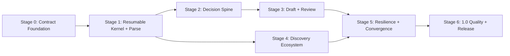

# CLI-First Workflow Optimization Execution Roadmap

**Status:** Active — Stage 1 locally accepted; Stage 2 Decision Spine in progress

**Date:** 2026-07-11

**Constraints:** Keep Python, the local file workspace, the existing CLI, and current shell-capable agent hosts. Do not
make a GUI, MCP transport, hosted service, or language migration a prerequisite for improving the application
workflow.

**Roadmap horizon:** current 0.2.0 baseline to 1.0

## Executive Decision

CanISend will optimize the workflow kernel before expanding presentation surfaces or adding many source adapters.
The next delivery path is CLI-first and contract-first:

1. make one stage resumable and safe end to end;
2. structure user decisions, criteria, evidence, and claims;
3. move application drafting behind the same candidate-validation boundary;
4. expand discovery only after lead identity and provenance are stable;
5. converge the legacy pipeline on the stage runtime;
6. prove recovery, privacy, compatibility, and usefulness before 1.0.

The existing `canisend.agent/v1` envelope remains the stable host inspection boundary. New persistent workflow,
task, result, and artifact schemas evolve independently. The current `canisend run` command remains available while
its internals are incrementally moved behind the new services.

## Baseline

Stage 0, the Agent Contract Foundation, is locally accepted:

- strict `canisend.agent/v1` responses and packaged JSON Schema;
- machine-readable capabilities, workspace context, intake, job listing, diagnostics, and package checks;
- conservative phase, readiness, consent, blocker, and next-action derivation;
- privacy-safe relative or opaque artifact references;
- self-contained workspace skill installation;
- provider-free preview behavior and untrusted-source boundaries;
- Python 3.11, 3.12, and 3.13 local suites, distribution checks, and clean-wheel smoke tests.

The only open Stage 0 release gate is remote CI on a pushed candidate. It does not block isolated Stage 1 development,
but it remains required before publishing the corresponding prerelease.

## Delivery Stages

| Stage | Priority | Objective | Main deliverables | Exit decision |
|---|---:|---|---|---|
| 0. Contract Foundation | P0, locally complete | Give agents a safe, stable inspection contract | Agent envelope, context, capabilities, privacy and error semantics | Remote candidate CI passes before release |
| 1. Resumable Kernel + Parse | P0, locally complete | Prove a resumable, validated stage with one authoritative output | Registry, state, immutable runs, fingerprints, TaskSpec/TaskResult, candidate promotion, Parse CLI | Fresh sessions resume; stale/invalid candidates cannot change `parsed_job.json` |
| 2. Decision Spine | P0 | Make requirements, evidence matching, and user decisions durable | Criterion, EvidenceRef, CriterionMatch, confirmations, apply/hold/skip decision, `application_brief.yaml` | Every essential criterion and required decision is structured and reviewable |
| 3. Evidence-Backed Draft + Review | P0/P1 | Generate only evidence-supported, reviewable application material | Claim, ReviewFinding, required-document plan, Cover Letter slice, consistency review | Strong claims resolve to evidence; unsupported claims block readiness |
| 4. Discovery Ecosystem | P1 | Expand sources on stable identity and provenance | Lead v2, merge/dedupe/ranking, CSV/JSON/email import, read-only adapters, agent-result import | Multi-source refresh is traceable, partial-failure safe, and duplicate resistant |
| 5. Resilience + Legacy Convergence | P1 | Move the remaining monolith behind the stage runtime | All stages, `run` compatibility wrapper, locking, migrations, failure injection | Any stage can resume and only true descendants become stale |
| 6. 1.0 Quality + Release | P2 | Demonstrate safe, portable, recoverable usefulness | Fixture corpus, budgets, security audit, dependency checks, recovery and privacy docs | Supported versions pass clean installs and all readiness invariants hold |

## Dependency Graph



Discovery contract work may proceed after Stage 1 while Stages 2 and 3 continue, but new adapters must not invent
their own workflow state, task execution, or promotion semantics.

## Stage 1: Resumable Kernel + Parse

**Candidate milestone:** 0.4.0a1

**Stage status:** Implemented and locally accepted on 2026-07-11. Publishing remains gated on a pushed candidate and
successful remote CI.

### Objective

Prove the complete safety and recovery loop for one single-file authoritative output:

```text
job.yaml + job_advert.md
  -> prepare Parse TaskSpec
  -> deterministic or current-host candidate
  -> TaskResult
  -> identity, freshness, scope, hash, and schema validation
  -> atomic promotion
  -> parsed_job.json + reconstructable state + immutable run evidence
```

### Deliverables

- accepted workflow-state/run and candidate-promotion ADRs;
- a validated acyclic registry for the complete logical stage graph;
- strict versioned models for workflow state, artifact fingerprints, TaskSpec, TaskResult, validation, and run
  manifests;
- `jobs/<job-id>/workflow/state.json` as a rebuildable current view;
- immutable task specifications and finalized run manifests under `workflow/runs/<run-id>/`;
- canonical Parse input projection and fingerprinting that ignores downstream metadata and profile changes;
- optimistic freshness checks and downstream invalidation;
- candidate staging separated from `parsed_job.json`;
- atomic single-file promotion with output-drift protection;
- `stage status`, `stage prepare`, `stage apply`, and deterministic `stage run` CLI operations;
- reuse of the existing Parse service and validator rather than duplicate business logic;
- compatibility tests proving the existing `run`, dry-run, text output, Typst protection, and git behavior remain
  unchanged.

### Stage Graph

The registry declares the complete logical graph but marks only Parse executable in Stage 1:

```text
intake -> parse -> confirm ----+
   |                           |
   +-----> evidence -> match --+-> decide -> brief
                                \                 \
                                 +----------------> draft -> review -> package -> verify -> render
```

Parse depends only on Intake. Evidence may proceed independently after Intake. Unimplemented stages must be reported
as unsupported; their presence in the registry is not a capability claim.

### Parse Fingerprint

The Parse fingerprint includes:

- `job_advert.md` content hash;
- a canonical projection of title, institution, department, location, deadline, and source URL;
- parser mode and parser/schema version;
- prompt hash only for a mode that actually consumes a prompt.

It excludes status, updated timestamps, notes, writing preferences, profile evidence, run files, and downstream
artifacts. Consequently, changing the advert or relevant job metadata invalidates Parse and descendants; changing a
CV or package status does not invalidate Parse.

### Exit Criteria

- a fresh process can inspect and continue an existing prepared task without chat history;
- an unchanged deterministic Parse rerun is a no-op and preserves the authoritative file hash and modification time;
- an advert or relevant metadata change makes Parse stale;
- a profile evidence or downstream status change does not make Parse stale;
- an old TaskResult, wrong task identity, wrong candidate hash, invalid schema, unsafe path, or symlink escape is
  rejected without changing `parsed_job.json`;
- a successful Parse promotion uses one atomic replacement and records a finalized immutable run manifest;
- output drift is reported for review and is not silently overwritten;
- current-host preparation does not construct or invoke an additional model provider;
- the existing full pipeline and text CLI remain compatible;
- focused, full, distribution, and clean-wheel checks pass on the supported Python range.

### Explicit Non-Goals

- MCP, GUI, web service, or a new platform adapter;
- Rust or another language migration;
- Cover Letter or other application-facing draft stages;
- final Criterion, Claim, or ReviewFinding models;
- new discovery adapters;
- direct agent writes to authoritative outputs;
- multi-file transactional promotion;
- replacing the existing orchestrator;
- automatic portal work, uploads, or submission.

## Stage 2: Decision Spine

**Stage status:** In progress on `feat/decision-spine-foundation`. ADR-009 and ADR-010 freeze semantic identity and
user-owned input boundaries; the first implementation slice targets stable criteria and resumable Confirm.

### Deliverables

- stable Criterion and EvidenceRef identifiers;
- source spans, confidence, unknown, and confirmed states for parsed requirements;
- durable CriterionMatch classifications with explicit evidence gaps;
- confirmed corrections separate from regenerable prose;
- apply, hold, or skip decision with user ownership;
- `application_brief.yaml` for language, motivation, emphasis, exclusions, and document-specific choices;
- required-document planning from the advert rather than a fixed bundle.

### Exit Criteria

- every essential criterion has one stable ID and a reviewable classification;
- all missing user decisions are explicit actions rather than inferred defaults;
- regenerating Parse or Match cannot erase an accepted user decision;
- required documents determine downstream tasks;
- corrections invalidate only declared dependent stages.

## Stage 3: Evidence-Backed Draft + Review

### Deliverables

- Claim and ReviewFinding schemas;
- claim-level evidence receipts and support strength;
- Cover Letter as the first application-facing candidate/promotion slice;
- document-specific plans for research, teaching, supporting, diversity, publication, email, and interview artifacts;
- cross-document consistency review and structured correction patches;
- package readiness based on promoted, reviewed artifacts only.

### Exit Criteria

- every strong claim resolves to current evidence;
- unsupported claims and contradictory facts are executable blockers;
- a draft candidate cannot alter user-owned or authoritative files before validation;
- the same application brief produces consistent constraints across documents;
- missing required documents prevent readiness.

## Stage 4: Discovery Ecosystem

### Deliverables

- Lead v2 with stable identity, canonical URL, source record ID, timestamps, provenance, and match reasons;
- deterministic merge, dedupe, and explainable ranking;
- atomic batches with conditional requests, retry/backoff, throttling, and partial-failure reports;
- local CSV, JSON, and exported email-alert ingestion;
- normalized host-agent search-result import;
- documented read-only Greenhouse and Lever adapters after adapter conformance fixtures exist;
- `--lead-id` selection while retaining legacy index compatibility.

### Exit Criteria

- repeated multi-source refresh does not duplicate stable leads;
- one failed source does not discard successful source batches;
- ranking and exclusion reasons remain inspectable;
- a supplied URL or PDF remains a peer intake path;
- adapters never perform account, upload, portal, or private API behavior.

## Stage 5: Resilience + Legacy Convergence

### Deliverables

- remaining logical stages implemented behind the registry;
- `canisend run` as a compatibility wrapper over stage execution;
- per-job coordination for concurrent prepare/apply attempts;
- retry, cancellation, interrupted-promotion reconciliation, and failure injection;
- workspace and persistent-schema migration/rollback behavior;
- old-workspace fixtures and output-drift repair workflows;
- one validated promotion path shared by the current orchestrator and direct host-agent work.

### Exit Criteria

- stopping after any completed stage and resuming repeats no current work;
- a crash or rejected stage cannot corrupt authoritative artifacts;
- concurrent attempts cannot promote stale results;
- legacy workspaces and command behavior remain readable and testable;
- every declared output is validated independently of process exit status.

## Stage 6: 1.0 Quality + Release

### Deliverables

- synthetic and anonymized application fixture corpus;
- contract, migration, security, failure, and cross-session conformance suites;
- typing, formatting, coverage, dependency, and security gates;
- performance budgets for status, prepare, import, validation, and selective rerun;
- installation, upgrade, privacy, recovery, and troubleshooting documentation;
- opt-in diagnostics only if they can exclude private content by construction.

### Exit Criteria

- the same workspace resumes with the same state and actions in a fresh supported shell host;
- all persistent contracts have forward/rollback tests;
- no known path exposes private bodies without declared consent;
- stale inputs, unsupported claims, unresolved candidates, and missing documents block readiness;
- supported Python versions pass clean installation, build, resource, and workflow smoke tests.

## Cross-Cutting Invariants

1. Python services and the workspace remain authoritative.
2. State is outside chat and reconstructable from immutable evidence.
3. Agents write candidates, never authoritative application artifacts directly.
4. Imported sources are untrusted data.
5. Privacy tier, trust, path safety, and consent remain separate.
6. JSON stdout stays machine-readable; diagnostics remain private-safe.
7. Text defaults and existing commands remain compatible during alpha releases.
8. Manual submission is the strongest final state CanISend may represent.

## Execution Metrics

Each stage reports evidence against these measures:

- recovery correctness after process interruption;
- cache/no-op correctness for unchanged inputs;
- invalidation precision for changed inputs;
- authoritative-file changes after rejected work: always zero;
- essential-criterion coverage and unresolved-gap count;
- unsupported strong-claim count at readiness: always zero;
- required-document recall;
- duplicate-lead rate and partial-source failure recovery;
- clean-install and cross-version compatibility.

## Change Control

If Stage 1 cannot provide a safe current-host loop through CLI and durable files, revisit transport design before
continuing. Revisit language only if installation evidence or profiling shows Python is a material product bottleneck.
Do not move platform-native work onto the critical path without that evidence.
